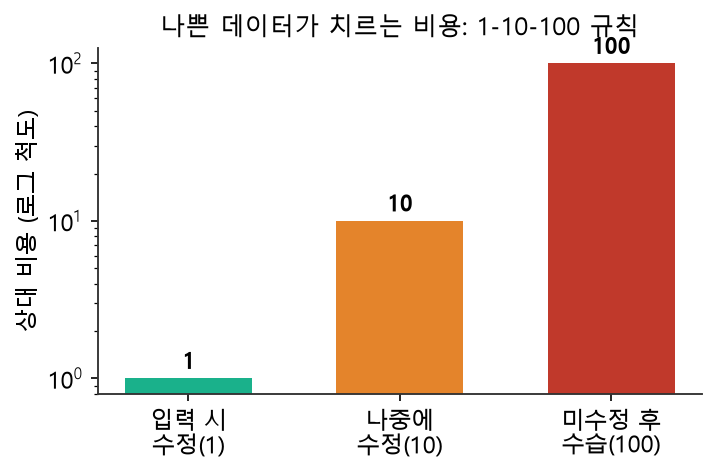

# 1주차 이론 — 데이터 파이프라인과 품질의 이해

## 왜 "데이터 구축"이 하나의 과목이 되었을까요 {#sec-w1t-why}

인공지능이 놀라운 성과를 내는 시대이지만, 정작 현장에서 인공지능 프로젝트가 실패하는 가장 흔한 원인은 알고리즘이 부족해서가 아닙니다. 대부분은 **데이터가 부족하거나, 지저분하거나, 잘못 라벨링되어 있어서** 실패합니다. 실제로 많은 기업이 값비싼 모델과 GPU를 갖추고도 성과를 내지 못하는데, 그 원인을 파고들어 가 보면 대개 데이터에 도달합니다. 학습 데이터가 현실을 제대로 담지 못했거나, 라벨이 제각각이거나, 특정 집단에 치우쳐 있는 경우가 대부분입니다.

구글 연구진이 발표한 유명한 논문에서는 이런 현상을 "데이터 캐스케이드(data cascade)"라고 불렀습니다. 초기 데이터 단계에서 생긴 작은 오류가 파이프라인을 따라 흐르며 눈덩이처럼 커져 결국 모델 전체를 망가뜨리는 현상을 말합니다 [@sambasivan2021everyone]. 처음에는 사소해 보였던 라벨 오류 하나가, 학습 → 평가 → 배포를 거치며 걷잡을 수 없는 문제로 번지는 것입니다. 흥미롭게도 이 연구는 "데이터 작업은 저평가되고, 모두가 모델 작업만 하고 싶어 한다"는 현장의 문화를 꼬집습니다. 화려한 모델링에 비해 데이터를 다듬는 일은 지루하고 눈에 띄지 않지만, 정작 성패를 가르는 것은 바로 그 지루한 일입니다.

같은 맥락에서 머신러닝 시스템을 오래 연구한 스컬리(Sculley) 등은 "머신러닝 코드는 전체 시스템에서 아주 작은 부분에 불과하며, 나머지 대부분은 데이터를 수집하고 정제하고 관리하는 배관(plumbing) 작업"이라고 지적했습니다 [@sculley2015hidden]. 그들은 이런 감춰진 작업을 방치하면 시간이 지날수록 갚아야 할 빚처럼 쌓인다는 뜻에서 **기술 부채(technical debt)**라는 표현을 썼습니다. 데이터 파이프라인을 대충 만들어 두면 당장은 굴러가지만, 나중에 데이터가 바뀌거나 규모가 커질 때 그 부채가 이자까지 붙어 되돌아옵니다.

이 과목은 바로 그 "배관 작업"을 정면으로 다룹니다. 우리는 모델을 화려하게 만드는 대신, 모델에게 먹일 **깨끗하고 신뢰할 수 있는 데이터셋을 직접 만드는 능력**을 기릅니다. 요리에 비유하면, 이 과목은 미슐랭 셰프의 플레이팅 기술을 배우는 것이 아니라, 좋은 식재료를 고르고 다듬고 손질하는 **주방 기본기**를 배우는 과목입니다. 재료가 상해 있으면 아무리 훌륭한 셰프라도 좋은 요리를 낼 수 없습니다. 인공지능도 똑같습니다. 최신 모델을 가져와도 데이터가 부실하면 그 한계를 넘지 못합니다. 반대로 데이터가 튼튼하면 평범한 모델로도 놀라운 결과가 나옵니다. 실제로 검색과 기계번역의 발전을 이끈 한 유명한 논문의 제목은 "데이터의 불합리한 효과성(The Unreasonable Effectiveness of Data)"이었는데, 알고리즘의 정교함보다 데이터의 양과 질이 성능을 더 크게 좌우한다는 관찰을 담고 있습니다 [@halevy2009unreasonable].

한 학기 동안 우리는 데이터가 세상에서 태어나 인공지능 모델의 입력이 되기까지의 여정 전체를 따라갑니다. 이 여정을 전문 용어로 [데이터 파이프라인(data pipeline)]{.imp}이라고 부릅니다. 지금부터 그 파이프라인의 지도를 하나씩 펼쳐 보겠습니다.

## 데이터 파이프라인이란 무엇일까요 {#sec-w1t-pipeline}

데이터 파이프라인은 이름 그대로 "데이터가 흐르는 관(pipe)"입니다. 상수도 파이프가 정수장에서 물을 받아 정화하고 각 가정으로 보내듯이, 데이터 파이프라인은 여러 원천에서 데이터를 받아 사용 가능한 형태로 가공한 뒤 최종 목적지로 흘려보냅니다 [@densmore2021data]. 강의 첫머리에서 이 개념을 강조하는 이유는, 이 과목의 15주 커리큘럼 자체가 하나의 데이터 파이프라인을 처음부터 끝까지 만들어 보는 여정이기 때문입니다.

```{mermaid}
flowchart LR
    S1[("원천 데이터<br/>웹·API·DB·파일·IoT")] --> E["수집/추출<br/>Extract"]
    E --> L["적재<br/>Load"]
    L --> T["정제·변환<br/>Transform"]
    T --> V["검증·라벨링<br/>Validate & Label"]
    V --> D[("학습용 데이터셋<br/>AI 모델 입력")]
    style S1 fill:#e3f2fd
    style D fill:#e8f5e9
```

한눈에 요약하면 이렇게 흐릅니다.

::: {style="text-align:center; font-size:1.05em;"}
[수집]{.pill .navy} [→]{.arrow} [적재]{.pill .navy} [→]{.arrow} [정제]{.pill .teal} [→]{.arrow} [검증]{.pill .teal} [→]{.arrow} [라벨링]{.pill}
:::

각 단계를 일상 언어로 자세히 풀어 보겠습니다.

**수집/추출(Extract)** 단계에서는 흩어져 있는 원천에서 데이터를 가져옵니다. 데이터는 한곳에 얌전히 모여 있지 않습니다. 어떤 데이터는 웹사이트의 화면에 흩어져 있고, 어떤 데이터는 공공기관이 제공하는 API 뒤에 있으며, 어떤 데이터는 회사 내부 데이터베이스나 오래된 엑셀 파일 속에 잠자고 있습니다. 이 다양한 원천에서 데이터를 꺼내 오는 것이 첫걸음입니다. 이 과목의 2~3주차에 해당합니다.

**적재(Load)** 단계에서는 가져온 데이터를 저장소에 쌓습니다. 데이터를 꺼내 오기만 하고 흘려버리면 소용이 없으니, 나중에 다룰 수 있도록 잘 정돈된 창고에 넣어야 합니다. 우리 과목에서는 이 창고로 SQLite 데이터베이스를 사용합니다. 어떤 구조로, 어떤 규칙으로 쌓느냐가 이후 작업의 편의를 크게 좌우하므로, 적재는 단순한 저장 이상의 설계가 필요한 단계입니다. 4주차에 해당합니다.

**정제·변환(Transform)** 단계에서는 쌓인 데이터를 다듬습니다. 원천에서 온 데이터는 대개 지저분합니다. 값이 비어 있거나, 같은 것이 다르게 적혀 있거나, 명백히 잘못된 값이 섞여 있습니다. 이런 데이터를 그대로 학습에 쓰면 모델이 엉뚱한 것을 배웁니다. 그래서 결측값을 채우고, 중복을 제거하고, 형식을 통일하는 작업이 필요합니다. 5~6주차에 해당합니다.

**검증(Validate)** 단계에서는 다듬은 데이터가 우리가 정한 품질 기준을 만족하는지 점검합니다. 사람이 매번 눈으로 볼 수는 없으므로, 컴퓨터가 스스로 규칙을 검사하도록 자동화합니다. 이 관문을 통과하지 못한 데이터는 다음 단계로 넘어가지 못합니다. 7~8주차에 해당합니다.

**라벨링(Label)** 단계에서는 지도학습에 필요한 정답(Ground Truth)을 부착합니다. 사진에 "고양이"라는 이름표를 붙이고, 문장에 "긍정"이라는 표시를 다는 작업입니다. 이 라벨의 품질이 곧 모델의 품질을 결정하기 때문에, 라벨링은 이 과목의 후반부를 통째로 차지할 만큼 중요합니다. 9~12주차에 해당합니다.

이처럼 파이프라인은 물이 위에서 아래로 흐르듯 한 방향으로 흐르지만, 실제로는 각 단계에서 문제가 발견되면 이전 단계로 되돌아가 고치는 순환도 자주 일어납니다. 파이프라인을 한 번 만들어 두면 매일, 매시간 새 데이터가 같은 관을 통과하며 자동으로 처리되므로, 잘 설계된 파이프라인은 데이터 팀의 가장 큰 자산이 됩니다.

## ETL과 ELT — 순서가 만드는 차이 {#sec-w1t-etl}

파이프라인을 이야기할 때 반드시 등장하는 두 약어가 **ETL**과 **ELT**입니다. 둘 다 추출(Extract)·변환(Transform)·적재(Load)의 조합인데, 순서가 다릅니다. 이름의 글자 순서가 곧 작업 순서입니다.

```{mermaid}
flowchart TB
    subgraph ETL["ETL — 전통적 방식"]
        direction LR
        E1[추출] --> T1[변환] --> L1[적재]
    end
    subgraph ELT["ELT — 현대적 방식"]
        direction LR
        E2[추출] --> L2[적재] --> T2[변환]
    end
```

**ETL**은 데이터를 저장소에 넣기 *전에* 미리 변환합니다. 저장 공간이 비싸고 컴퓨팅 자원이 제한적이던 시절에는 이것이 합리적이었습니다. 저장소가 작으니 필요한 형태로 미리 다듬어 꼭 필요한 것만 넣어야 했습니다. 마치 작은 냉장고에 넣기 전에 채소를 미리 손질해 부피를 줄이는 것과 같습니다.

반면 **ELT**는 일단 원본을 가공 없이 그대로 저장소에 넣고, 저장소 안에서 변환합니다. 클라우드 저장소가 값싸지고 데이터베이스의 처리 능력이 강력해지면서 최근에는 ELT가 대세가 되었습니다 [@densmore2021data]. 냉장고가 아주 커졌으니 일단 다 넣어 두고, 요리할 때 꺼내 손질하는 방식입니다.

ELT에는 결정적인 장점이 있습니다. **원본을 그대로 보관하면, 나중에 변환 로직이 잘못되었을 때 언제든 원본으로 돌아가 다시 시작할 수 있다**는 점입니다. ETL에서는 변환하며 버린 정보를 되살릴 수 없지만, ELT에서는 원본이 남아 있으므로 몇 번이든 다시 정제할 수 있습니다. 데이터 파이프라인에서 "원본을 보존하라"는 것은 거의 철칙에 가까운데, ELT는 이 원칙을 구조적으로 지켜 줍니다 [@kleppmann2017designing]. 이 책의 실습도 대체로 ELT 방식을 따릅니다. 즉 원천 데이터를 먼저 SQLite에 통째로 적재한 뒤, SQL 쿼리로 정제·변환합니다. 이 발상은 4주차의 "스테이징과 프로덕션" 개념으로 다시 이어집니다.

## 데이터 품질이란 무엇일까요 {#sec-w1t-quality}

파이프라인의 목적은 결국 "품질 좋은 데이터"를 만드는 것입니다. 그렇다면 데이터 품질이란 정확히 무엇일까요? 흔히 "오류가 없는 데이터"라고 생각하기 쉽지만, 데이터 품질 연구의 고전인 왕(Wang)과 스트롱(Strong)의 정의는 조금 다릅니다. 그들은 품질을 [사용하기에 적합한 정도(fitness for use)]{.imp}라고 정의했습니다 [@wang1996beyond]. 즉 같은 데이터라도 용도에 따라 품질이 좋을 수도, 나쁠 수도 있습니다.

예를 들어 소수점 첫째 자리까지만 기록된 체온 데이터를 생각해 봅시다. 감기 진단에는 충분한 정밀도이지만, 미세한 체온 변화를 추적해야 하는 정밀 의료 연구에는 부족합니다. 데이터 자체는 똑같은데, 쓰임에 따라 "충분함"과 "부족함"이 갈립니다. 그래서 품질을 논할 때는 항상 "무엇에 쓸 것인가"를 먼저 물어야 합니다. 이것은 이 과목 전체를 관통하는 태도이기도 합니다.

한국지능정보사회진흥원(NIA)이 발간하는 『AI 데이터 품질관리 가이드라인』은 인공지능 학습용 데이터의 품질을 여러 지표로 나누어 관리합니다 [@nia2026guide]. 품질을 하나의 뭉뚱그린 개념으로 두면 관리하기 어렵기 때문에, 여러 측면으로 쪼개어 각각을 측정하는 것입니다. 대표적인 품질 지표는 다음과 같습니다.

| 품질 지표 | 의미 | 나쁜 예시 |
|---|---|---|
| **완전성(Completeness)** | 있어야 할 값이 빠지지 않았는가 | 고객 나이 컬럼의 40%가 비어 있음 |
| **유효성(Validity)** | 값이 정해진 형식·범위를 지키는가 | 나이 컬럼에 `-5`, `999`가 들어 있음 |
| **정확성(Accuracy)** | 값이 현실과 일치하는가 | 실제로는 서울 거주인데 "부산"으로 기록 |
| **일관성(Consistency)** | 서로 모순되는 값이 없는가 | 생년월일 2000년, 나이 15세 |
| **유일성(Uniqueness)** | 불필요한 중복이 없는가 | 같은 주문이 3번 저장됨 |
| **다양성(Diversity)** | 편향 없이 골고루 분포하는가 | 얼굴 데이터의 95%가 20대 |

: 인공지능 학습용 데이터의 주요 품질 지표 {#tbl-w1-quality}

각 지표를 조금 더 들여다보겠습니다. **완전성**은 값이 "있는가 없는가"의 문제입니다. 설문에서 어떤 문항을 응답자들이 대거 건너뛰었다면 그 열은 완전성이 낮습니다. **유효성**은 값이 "있긴 한데 말이 되는가"의 문제입니다. 나이 칸에 음수나 300 같은 값이 있으면 유효하지 않습니다. **정확성**은 값이 "현실과 맞는가"의 문제입니다. 유효성은 형식만 보지만 정확성은 실제 사실과의 일치를 봅니다. 형식적으로 멀쩡한 "부산"이 실제로는 틀린 값일 수 있는데, 이것이 정확성 문제입니다. **일관성**은 여러 값 사이의 "모순"을 봅니다. 생년월일과 나이가 서로 맞지 않으면 개별 값은 유효해도 함께 보면 모순입니다. **유일성**은 "중복"의 문제이고, **다양성**은 데이터가 특정 집단에 쏠려 있지 않은지, 즉 "편향"의 문제입니다.

이 여섯 지표는 앞으로 매주 반복해서 등장합니다. 5주차 EDA에서는 완전성과 유효성을 점검하고, 6주차에서는 정확성과 일관성을 높이며, 7주차에서는 이 규칙들을 데이터베이스가 자동으로 지키게 만들고, 12주차에서는 다양성(편향)을 검증합니다. 지금은 "데이터 품질에는 여러 얼굴이 있다"는 점, 그리고 "각 얼굴마다 측정하고 관리하는 방법이 다르다"는 점만 기억하면 충분합니다.

NIA 가이드라인은 특히 중요한 통찰을 하나 제시합니다. **"인공지능 학습용 데이터의 전체 품질 수준은 구축 단계에서 80~90%가 좌우된다"**는 것입니다 [@nia2026guide]. 다시 말해, 모델을 아무리 정교하게 튜닝해도 데이터 구축 단계에서 이미 결정된 품질의 한계를 넘어서기 어렵습니다. 한번 구축된 데이터가 그대로 개방·배포되면 그 품질이 수많은 후속 프로젝트에 영향을 미치기 때문에, 처음 만들 때 제대로 만드는 것이 무엇보다 중요합니다. 그래서 이 과목이 존재하는 것입니다.

## 데이터의 생애주기와 품질관리 체계 {#sec-w1t-lifecycle}

데이터는 한 번 만들고 끝나는 것이 아니라 **생애주기(life cycle)**를 가집니다. 계획을 세우고, 원천을 획득·수집하고, 정제하고, 가공(라벨링)하고, 학습에 활용하고, 시간이 지나면 갱신하거나 폐기합니다. NIA 가이드라인은 이 전 과정을 준비·계획 → 구축 → 운영·활용의 큰 단계로 나누고, 각 단계마다 어떤 품질관리 활동과 산출물이 필요한지를 체계적으로 규정합니다 [@nia2026guide].

```{mermaid}
flowchart LR
    P["준비·계획<br/>임무 정의"] --> A["획득·수집"]
    A --> C["정제"]
    C --> G["가공·라벨링"]
    G --> U["학습·운영"]
    U -.->|갱신| A
```

이 체계에서 특히 눈여겨볼 두 가지 활동이 있습니다. 첫째는 **자가점검**입니다. 데이터를 만드는 기관이 스스로 초기 데이터로 전체 공정을 한 바퀴 돌려 보고("1-Cycle 자가점검"), 목표에 맞지 않으면 빠르게 방법을 바꿔 재작업하는 절차입니다. 이 과목의 8주차 통합 실습이 바로 이 자가점검을 축소해 체험하는 것입니다. 둘째는 **제3자 품질검증**입니다. 데이터를 만든 기관과 별개의 전문 기관이 객관적 지표로 품질을 검증하는 절차입니다. 다양성·구문 정확성·의미 정확성·유효성 같은 지표의 목표 달성 여부를 측정합니다. 우리가 7주차에서 만드는 자동 검증 프레임워크가 이 발상의 소형 버전입니다.

이런 체계가 필요한 이유는, 데이터를 만드는 사람의 역량과 데이터의 난이도에 따라 품질 편차가 크게 벌어지기 때문입니다. 명확한 기준과 점검 절차가 없으면, 같은 프로젝트 안에서도 작업자마다 전혀 다른 품질의 데이터가 나옵니다. 품질관리 체계는 이 편차를 줄여 "믿을 수 있는 데이터"를 안정적으로 생산하기 위한 장치입니다.

## 데이터에도 여러 형태가 있습니다 {#sec-w1t-forms}

저장소를 이야기하기 전에, 우리가 다룰 데이터가 어떤 "모양"을 하고 있는지 짚어 두겠습니다. 데이터는 구조화된 정도에 따라 크게 세 가지로 나뉩니다. 첫째는 **정형 데이터**로, 엑셀이나 관계형 테이블처럼 행과 열이 또렷하게 정해져 있어 컴퓨터가 다루기 가장 쉬운 형태입니다. 둘째는 **반정형 데이터**로, 형식은 있지만 유연해서 어떤 항목이 있을 수도 없을 수도 있는 형태입니다. 웹 서비스가 주고받는 JSON 응답이 대표적입니다. 셋째는 **비정형 데이터**로, 사진·음성·영상·자유롭게 쓴 문장처럼 정해진 격자가 없는 형태입니다.

흥미로운 점은, 인공지능 학습용 데이터 구축이 주로 다루는 것이 바로 이 비정형 데이터라는 사실입니다 [@nia2026guide]. 사진 속 사물을 알아보고, 문장의 감정을 읽고, 음성을 글자로 옮기는 능력은 모두 비정형 데이터에 사람이 정답을 붙여 만든 데이터셋에서 나옵니다. 그런데 비정형 데이터라도 이를 관리할 때는 "파일명·촬영일·해상도·라벨" 같은 정형적인 정보를 함께 붙여 대장처럼 정리합니다. 그래서 SQLite 같은 관계형 데이터베이스는 비정형 데이터 프로젝트에서도 핵심적인 **관리 대장(catalog)** 역할을 합니다. 데이터의 형태에 대한 자세한 이야기는 2주차에서 이어 가고, 여기서는 "데이터에는 여러 형태가 있으며 관계형 저장소가 그 모두를 관리하는 중심이 된다"는 점만 기억해 둡니다.

## 왜 하필 SQLite일까요 {#sec-w1t-sqlite}

데이터를 저장하고 다루려면 저장소가 필요합니다. 우리는 그 저장소로 **SQLite**를 사용합니다. SQLite를 선택한 이유는 분명합니다.

첫째, **설치가 필요 없습니다.** Python에 `sqlite3` 모듈이 기본 내장되어 있어, `import sqlite3` 한 줄이면 바로 데이터베이스를 쓸 수 있습니다. 대형 데이터베이스는 서버를 띄우고 계정을 만들고 접속 설정을 하느라 시작 전부터 지치기 쉽지만, SQLite는 그런 장벽이 없습니다. 배움에 집중할 수 있다는 것은 학습용 도구로서 큰 미덕입니다.

둘째, **파일 하나가 곧 데이터베이스입니다.** `mydata.db`라는 파일 하나에 모든 테이블이 들어갑니다. USB에 담아 다니거나 이메일로 주고받을 수 있고, 실습이 잘못되면 파일 하나만 지우고 다시 시작하면 됩니다. 데이터베이스의 상태가 눈에 보이는 파일로 존재한다는 점은 초보자가 개념을 잡는 데 큰 도움이 됩니다.

셋째, **진짜 SQL을 배웁니다.** SQLite의 문법은 표준 SQL을 충실히 따르므로, 여기서 배운 `SELECT`, `JOIN`, `GROUP BY`, `CREATE TABLE`은 현업의 PostgreSQL이나 구글 BigQuery에서도 거의 그대로 동작합니다. 작은 도구로 배우지만 큰 세계로 확장되는 지식을 얻는 셈입니다.

관계형 데이터베이스의 핵심 구조는 **테이블(table)**입니다. 테이블은 엑셀 시트처럼 **행(row)**과 **열(column)**로 이루어집니다. 하나의 행은 하나의 데이터 레코드(예: 고객 한 명)를 나타내고, 하나의 열은 하나의 속성(예: 이름, 나이)을 나타냅니다. 이 단순한 격자 구조가 관계형 데이터베이스의 힘의 원천입니다. 격자가 정해져 있으니 컴퓨터가 값을 빠르게 찾고, 걸러 내고, 합칠 수 있습니다.

```{mermaid}
flowchart LR
    subgraph DB["students.db (SQLite 파일)"]
        subgraph T["students 테이블"]
            H["id | name | age | major"]
            R1["1 | 김하늘 | 21 | AI"]
            R2["2 | 이바다 | 23 | 통계"]
        end
    end
    Py["Python<br/>sqlite3 모듈"] <-->|SQL 쿼리| DB
```

테이블에서 각 행을 고유하게 구분하는 열을 **기본 키(primary key)**라고 합니다. 학번, 주민번호처럼 겹치지 않는 값이 기본 키가 됩니다. 그리고 한 테이블이 다른 테이블을 가리킬 때 쓰는 열을 **외래 키(foreign key)**라고 합니다. 예를 들어 주문 테이블이 고객 테이블의 고객번호를 참조하는 식입니다. 이 키 개념은 4주차의 데이터 모델링과 9주차의 라벨 스키마 설계에서 핵심 도구로 다시 등장합니다.

## 데이터베이스는 어떻게 동작하는가 {#sec-w1t-howdb}

관계형 데이터베이스와 대화하는 언어가 **SQL(Structured Query Language)**입니다. SQL은 1970년대에 만들어진 이래 반세기 동안 데이터의 표준 언어로 군림해 왔습니다. 우리가 프로그램으로 데이터베이스를 다룰 때는, 프로그램이 SQL 명령을 데이터베이스에 보내고 그 결과를 돌려받는 방식으로 대화합니다.

Python의 `sqlite3` 모듈로 이 대화는 몇 가지 정해진 단계를 거칩니다. 먼저 데이터베이스에 **연결(connect)**합니다. 연결은 파일과 프로그램을 잇는 통로를 여는 일입니다. 그다음 **커서(cursor)**를 만듭니다. 커서는 데이터베이스에 명령을 전달하고 결과를 받아 오는 손잡이 같은 것입니다. 커서를 통해 SQL 명령을 **실행(execute)**하면, 데이터베이스가 그 명령을 처리합니다. 데이터를 바꾸는 명령을 실행한 뒤에는 반드시 **확정(commit)**을 해야 변경이 파일에 실제로 저장됩니다. 마지막으로 일을 마치면 연결을 **닫습니다(close)**.

여기서 특히 중요한 개념이 **트랜잭션(transaction)**입니다. 트랜잭션은 여러 작업을 "전부 성공 아니면 전부 취소"로 묶는 장치입니다. 은행 계좌 이체를 생각해 봅시다. A의 계좌에서 돈을 빼는 작업과 B의 계좌에 돈을 넣는 작업은 반드시 함께 성공하거나 함께 실패해야 합니다. 중간에 오류가 나서 "출금은 됐는데 입금은 안 된" 상태로 남으면 큰일입니다. 트랜잭션은 이런 사고를 막습니다. `commit`은 트랜잭션을 확정하는 것이고, 문제가 생겼을 때 되돌리는 것을 `rollback`이라고 합니다. 이 "전부 아니면 전무"라는 성질을 **원자성(atomicity)**이라고 하며, 데이터베이스의 신뢰성을 떠받치는 핵심 원리입니다 [@kleppmann2017designing]. 이 개념은 4주차와 7주차에서 실질적인 안전장치로 다시 활용됩니다.

또 하나 반드시 몸에 익혀야 할 습관이 있습니다. SQL에 값을 넣을 때 문자열을 직접 이어 붙이지 않고 **플레이스홀더(placeholder)**를 쓰는 것입니다. 값을 문자열로 직접 이어 붙이면 **SQL 주입(SQL Injection)**이라는 보안 취약점이 생겨, 악의적인 입력이 데이터베이스를 통째로 망가뜨릴 수 있습니다. 물음표 기호로 값이 들어갈 자리를 표시하고 값을 따로 전달하면 안전합니다. 이 습관은 앞으로 모든 실습에서 예외 없이 지킵니다. 작은 습관이지만, 실무에서 수많은 사고를 막아 주는 매우 중요한 원칙입니다.

## 나쁜 데이터가 치르는 비용 {#sec-w1t-cost}

데이터 품질을 소홀히 하면 어떤 일이 벌어질까요? 품질 문제를 방치했을 때 치르는 비용은 시간이 지날수록 기하급수적으로 커집니다. 데이터 품질 분야에는 이를 설명하는 **"1-10-100 규칙"**이라는 경험칙이 있습니다. 데이터를 입력하는 시점에 오류를 잡으면 1의 비용이 들지만, 그 오류를 그대로 두어 나중에 바로잡으려면 10의 비용이 들고, 끝내 잡지 못해 잘못된 데이터로 의사결정을 내린 뒤 그 결과를 수습하려면 100의 비용이 든다는 것입니다(@fig-w1-cost). 처음에 조금 귀찮더라도 데이터를 제대로 다듬는 것이, 결국은 가장 싸게 먹히는 길입니다.

{#fig-w1-cost width=68%}

이 비용은 단지 돈만을 뜻하지 않습니다. 잘못된 학습 데이터로 만든 의료 진단 모델이 병을 놓치거나, 편향된 데이터로 만든 채용 모델이 특정 지원자를 부당하게 탈락시킨다면, 그 대가는 사람의 건강과 기회로 치러집니다. 그래서 데이터 품질은 기술의 문제인 동시에 윤리의 문제이기도 합니다. 데이터 품질의 비밀이라는 책에서 저자들은, 데이터 문제를 사후에 허둥지둥 수습하는 대신 파이프라인 곳곳에 감시 장치를 심어 미리 발견하는 **데이터 관측성(data observability)**의 문화를 강조합니다 [@moses2022data]. 문제가 터진 뒤 끄는 것이 아니라, 터지기 전에 감지하는 사고방식입니다. 이 발상은 7주차의 자동 검증과 12주차의 편향 점검으로 구체화됩니다.

한 가지 더 기억할 것은, 데이터 품질이 **한 사람의 노력만으로는 지켜지지 않는다**는 점입니다. 데이터를 만드는 사람, 검수하는 사람, 사용하는 사람이 각자의 자리에서 책임을 나누어 져야 품질이 유지됩니다. 이렇게 조직 전체가 데이터를 자산으로 관리하는 규칙과 문화를 **데이터 거버넌스(data governance)**라고 부릅니다. 우리는 이 과목에서 그 규칙의 가장 기초적인 형태, 즉 "명확한 기준을 정하고, 그 기준을 자동으로 점검하며, 결과를 문서로 남긴다"는 원칙을 반복해서 훈련하게 됩니다.

## 데이터 구축 전문가의 자세 {#sec-w1t-attitude}

마지막으로, 기술을 배우기에 앞서 갖춰야 할 태도를 짚고 넘어가겠습니다. 데이터 구축은 단순한 기계적 작업이 아니라 **판단과 책임이 따르는 일**입니다. 어떤 데이터를 모을지, 무엇을 정답으로 볼지, 어떤 값을 버리고 어떤 값을 살릴지를 결정하는 매 순간에 사람의 판단이 개입합니다. 그리고 그 판단은 나중에 그 데이터로 학습한 모델의 행동에 그대로 반영됩니다. 편향된 데이터로 학습한 모델은 편향된 결정을 내리고, 그 결정은 실제 사람들의 삶에 영향을 미칩니다.

그래서 데이터 구축 전문가에게는 세 가지 자세가 필요합니다. 첫째는 **꼼꼼함**입니다. 사소해 보이는 오류 하나가 데이터 캐스케이드로 번질 수 있으므로, 데이터의 상태를 세심하게 관찰하고 기록해야 합니다. 둘째는 **투명함**입니다. 데이터를 어떻게 만들었고 어떤 한계가 있는지를 숨기지 않고 문서로 남겨야 합니다. 이 문서화의 대표적인 형식이 데이터의 출처·수집방법·용도·한계를 표준 양식으로 기록하는 **데이터시트(Datasheet for Datasets)**로, 2주차와 15주차에서 자세히 다룹니다 [@gebru2021datasheets]. 셋째는 **책임감**입니다. 법과 윤리를 지키고, 데이터가 미칠 영향을 늘 염두에 두는 자세입니다.

이 과목은 이 세 가지 자세를 기술과 함께 기르는 것을 목표로 합니다. 도구와 문법은 시간이 지나면 바뀌지만, "믿을 수 있는 데이터를 책임 있게 만든다"는 태도는 어떤 시대에도 변하지 않는 전문가의 자질입니다. 앞으로 15주 동안 우리는 이 자세를 손끝의 기술과 함께 몸에 새기게 될 것입니다.

## 참고문헌 {#sec-w1t-refs}

1. Densmore, J. (2021). *Data Pipelines Pocket Reference*. O'Reilly Media. (한국어판: 『데이터 파이프라인 핵심 가이드』, 위키북스, 2022)
2. Moses, B., Gavish, L., & Vorwerck, M. (2022). *Data Quality Fundamentals*. O'Reilly Media. (한국어판: 『데이터 품질의 비밀』, 한빛미디어, 2023)
3. Reis, J., & Housley, M. (2022). *Fundamentals of Data Engineering*. O'Reilly Media.
4. Kleppmann, M. (2017). *Designing Data-Intensive Applications*. O'Reilly Media.
5. Kimball, R., & Ross, M. (2013). *The Data Warehouse Toolkit* (3rd ed.). Wiley.
6. Sculley, D., et al. (2015). Hidden Technical Debt in Machine Learning Systems. *NeurIPS*, 28.
7. Sambasivan, N., et al. (2021). "Everyone wants to do the model work, not the data work": Data Cascades in High-Stakes AI. *ACM CHI*.
8. Wang, R. Y., & Strong, D. M. (1996). Beyond Accuracy: What Data Quality Means to Data Consumers. *Journal of Management Information Systems*, 12(4), 5–33.
9. Gebru, T., et al. (2021). Datasheets for Datasets. *Communications of the ACM*, 64(12), 86–92.
10. Batini, C., & Scannapieco, M. (2016). *Data and Information Quality: Dimensions, Principles and Techniques*. Springer.
11. Redman, T. C. (2016). *Getting in Front on Data: Who Does What*. Technics Publications.
12. ISO/IEC 25012:2008. *Software product Quality Requirements and Evaluation (SQuaRE) — Data quality model*. ISO.
13. ISO 8000-8:2015. *Data quality — Part 8: Information and data quality: Concepts and measuring*. ISO.
14. 한국지능정보사회진흥원(NIA). (2026). *인공지능 학습용 데이터 품질관리 가이드 v4.0 — 제1권 품질관리 프레임워크*.
15. 한국지능정보사회진흥원(NIA). (2026). *인공지능 학습용 데이터 구축 가이드 v4.0 — 제2권 구축 사례*.
16. Ereth, J. (2018). DataOps — Towards a Definition. *LWDA*, 104–112.
17. Atwal, H. (2020). *Practical DataOps: Delivering Agile Data Science at Scale*. Apress.
18. Halevy, A., Norvig, P., & Pereira, F. (2009). The Unreasonable Effectiveness of Data. *IEEE Intelligent Systems*, 24(2), 8–12.
19. Paleyes, A., Urma, R. G., & Lawrence, N. D. (2022). Challenges in Deploying Machine Learning: A Survey of Case Studies. *ACM Computing Surveys*, 55(6).
20. Northcutt, C. G., Athalye, A., & Mueller, J. (2021). Pervasive Label Errors in Test Sets Destabilize ML Benchmarks. *NeurIPS Datasets and Benchmarks*.
21. SQLite Consortium. *SQLite Documentation*. <https://www.sqlite.org/docs.html>
22. Python Software Foundation. *sqlite3 — DB-API 2.0 interface for SQLite databases*. <https://docs.python.org/3/library/sqlite3.html>
23. 과학기술정보통신부·한국지능정보사회진흥원. *AI 허브(AI Hub) 데이터 구축·활용 안내*. <https://www.aihub.or.kr>
