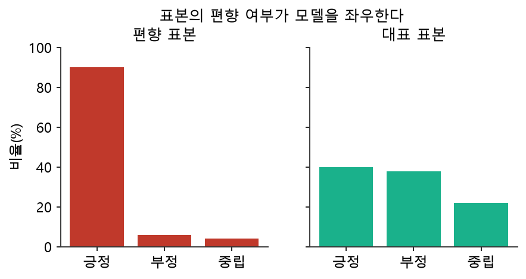

# 2주차 이론 — 데이터 수집 전략과 데이터 소스

## 데이터는 어디에서 오는가 {#sec-w2t-intro}

1주차에서 데이터 파이프라인의 첫 단계가 "수집"이라는 것을 배웠습니다. 그런데 막상 데이터를 모으려고 하면 곧바로 벽에 부딪힙니다. "그래서, 어디서 가져오지?"라는 질문입니다. 많은 초보자가 이 질문 앞에서 아무 데이터나 손에 잡히는 대로 긁어모으는 실수를 저지릅니다. 하지만 그렇게 모은 데이터는 대개 정작 필요할 때 쓸모가 없습니다. 인공지능 프로젝트에서 데이터 수집은 요리로 치면 장을 보는 일입니다. 어떤 시장에서, 어떤 재료를, 얼마나, 어떤 기준으로 살지를 미리 정해야 합니다. 무엇을 만들지 정하지 않고 장을 보면, 냉장고는 가득 찼는데 정작 만들려던 요리는 만들 수 없는 상황이 벌어집니다.

그래서 수집에 앞서 **수집 전략(collection strategy)**을 세우는 것이 이번 주의 핵심입니다. 좋은 수집 전략은 항상 "무엇을 만들 것인가"라는 목적에서 출발합니다. NIA의 데이터 구축 가이드라인은 이를 **임무 정의(task definition)**라고 부르며, 데이터 구축의 가장 앞 단계에 둡니다. 임무 정의란 "이 데이터로 어떤 문제를 풀 것인가"를 구체적으로 못 박는 일입니다. 예를 들어 "고양이와 개를 구분하는 모델"을 만들려면 고양이 사진과 개 사진이 골고루 필요하고, "영화 리뷰의 긍정·부정을 판별하는 모델"을 만들려면 다양한 감정의 리뷰 문장이 필요합니다. 목적이 데이터의 종류·양·분포를 결정합니다.

임무 정의가 흐릿하면 그 흐릿함이 데이터에 그대로 새겨집니다. "감정을 분석한다"고만 정하면, 어떤 감정을 몇 가지로 나눌지, 애매한 문장은 어떻게 처리할지가 정해지지 않아 작업자마다 제각각으로 모읍니다. 반대로 "리뷰를 긍정·부정·중립 세 가지로 분류하되, 칭찬과 불만이 섞이면 부정으로 본다"처럼 임무를 또렷이 정하면, 수집과 라벨링이 일관되게 흘러갑니다. 이처럼 좋은 데이터 구축은 코드를 짜기 전에 목적을 벼리는 데서 시작합니다.

## 데이터의 세 가지 유형 {#sec-w2t-types}

데이터를 수집하기 전에 데이터가 어떤 "모양"을 하고 있는지 알아야 합니다. 데이터는 구조화 정도에 따라 크게 세 가지로 나뉩니다. 1주차에서 잠깐 소개했던 이 분류를 이번에는 자세히 들여다봅니다.

```{mermaid}
flowchart TB
    D["데이터"] --> S["정형 데이터<br/>Structured"]
    D --> SS["반정형 데이터<br/>Semi-structured"]
    D --> U["비정형 데이터<br/>Unstructured"]
    S --> S1["행·열이 명확<br/>예: 관계형 DB, CSV, 엑셀"]
    SS --> SS1["형식은 있으나 유연<br/>예: JSON, XML, 로그"]
    U --> U1["고정 구조 없음<br/>예: 이미지, 음성, 자유 텍스트"]
    style S fill:#e8f5e9
    style SS fill:#fff3e0
    style U fill:#fce4ec
```

**정형 데이터(Structured)**는 행과 열이 명확하게 정의된 데이터입니다. 관계형 데이터베이스의 테이블, CSV 파일, 엑셀 시트가 대표적입니다. "이름은 문자, 나이는 정수"처럼 각 열의 의미와 형식이 고정되어 있어 SQL로 다루기 가장 쉽습니다. 은행 거래 내역, 학생 성적표, 상품 재고표처럼 우리 주변의 많은 업무 데이터가 정형입니다. 정형 데이터는 구조가 정해져 있으므로 컴퓨터가 값을 빠르게 찾고 집계할 수 있다는 큰 장점이 있습니다.

**반정형 데이터(Semi-structured)**는 구조가 있긴 하지만 유연합니다. JSON이나 XML이 대표적입니다. 어떤 레코드에는 전화번호 항목이 있고 다른 레코드에는 없을 수 있으며, 항목 안에 또 다른 항목이 중첩되어 들어가기도 합니다. 웹 API가 돌려주는 응답이 대부분 이 형태입니다. 반정형 데이터는 유연한 만큼 다루기가 조금 까다로운데, 리스트나 중첩 구조를 관계형 테이블에 담으려면 문자열로 변환하거나 여러 테이블로 나누는 등의 손질이 필요합니다.

**비정형 데이터(Unstructured)**는 고정된 구조가 없는 데이터입니다. 사진, 동영상, 음성, 그리고 사람이 자유롭게 쓴 문장이 여기에 속합니다. 세상에 존재하는 데이터의 대부분이 사실은 비정형이라고 알려져 있습니다. NIA 가이드라인이 지적하듯 인공지능 학습용 데이터 구축 사업은 대부분 이 비정형 데이터를 수집해 정답(Ground Truth)을 붙이는 작업입니다. 정형 데이터는 이미 구조가 잡혀 있어 곧바로 분석할 수 있지만, 비정형 데이터는 사람이 그 안의 의미를 읽어 정답을 붙여 주어야 비로소 학습에 쓸 수 있습니다. 그만큼 손이 많이 가지만, 그렇기에 데이터 구축자의 역할이 더욱 중요한 영역이기도 합니다. 사진 속 사물을 알아보고 문장의 감정을 읽는 능력은 모두 비정형 데이터에 사람이 정답을 부착해 만든 데이터셋에서 나옵니다.

흥미로운 점은, 비정형 데이터라도 결국 저장하고 관리할 때는 정형적인 메타데이터를 함께 붙인다는 것입니다. 예를 들어 고양이 사진 1만 장을 모았다면, 사진 자체는 비정형이지만 "파일명, 촬영일, 해상도, 라벨"은 정형 테이블로 관리합니다. 그래서 SQLite 같은 관계형 DB는 비정형 데이터 프로젝트에서도 **관리 대장(catalog)** 역할로 매우 자주 쓰입니다. 데이터의 형태를 구분하는 안목은, 그 데이터를 어떤 도구로 어떻게 수집하고 저장할지를 결정하는 첫걸음입니다.

## 데이터 소스: 내부와 외부 {#sec-w2t-source}

데이터의 출처는 크게 내부 소스와 외부 소스로 나뉩니다. NIA 가이드라인은 이를 각각 "내부 획득 가능한 학습데이터"와 "외부 획득 가능한 학습데이터"로 구분합니다.

| 구분 | 내부 소스 | 외부 소스 |
|---|---|---|
| **예시** | 사내 DB, 로그, 고객 기록 | 공공데이터포털, 웹, 오픈 데이터셋, API |
| **장점** | 통제 가능, 즉시 접근, 우리 상황에 딱 맞음 | 규모가 크고 다양함 |
| **주의점** | 개인정보·보안, 양이 한정적 | 저작권·이용약관·품질 편차 |

: 내부 소스와 외부 소스의 비교 {#tbl-w2-source}

**내부 소스**는 우리 조직이 이미 가지고 있는 데이터입니다. 회사의 고객 데이터베이스, 서비스 이용 로그, 판매 기록 등이 여기에 속합니다. 내부 소스의 가장 큰 장점은 우리가 통제할 수 있다는 점입니다. 우리 상황에 딱 맞는 데이터이고, 필요하면 더 많이 쌓을 수도 있습니다. 다만 개인정보가 포함되기 쉬워 보안과 법적 책임에 각별히 유의해야 하고, 양이 한정적이라는 한계가 있습니다.

**외부 소스**는 조직 밖에서 가져오는 데이터입니다. 규모가 크고 다양하다는 큰 장점이 있지만, 저작권과 이용약관을 반드시 확인해야 하고 품질이 들쭉날쭉하다는 단점이 있습니다. 외부 소스는 다시 여러 갈래로 나뉩니다.

첫째, **공공데이터**입니다. 정부와 공공기관이 개방한 데이터로, 한국의 공공데이터포털과 AI 허브가 대표적입니다. 대부분 무료이고 이용 약관이 명확해서 안심하고 쓸 수 있습니다. 둘째, **웹 크롤링**입니다. 웹페이지에서 직접 데이터를 긁어오는 방법으로, 방대한 데이터를 얻을 수 있지만 저작권과 크롤링 허용 규칙을 반드시 확인해야 합니다. 셋째, **오픈 데이터셋**입니다. 연구 목적으로 공개된 데이터셋으로, 이미지 분야의 ImageNet과 사물 검출 분야의 COCO가 유명합니다. 이런 데이터셋은 잘 정제되고 라벨링되어 있어 학습과 벤치마크에 널리 쓰입니다. 넷째, **API**입니다. 서비스가 제공하는 정식 데이터 창구로, 3주차에서 직접 다룹니다.

어떤 소스를 고를지는 임무 정의에 달려 있습니다. 우리 서비스 사용자의 행동을 예측하려면 내부 로그가 최선이지만, 세상의 일반적인 이미지를 인식하려면 대규모 오픈 데이터셋이 필요합니다. 좋은 데이터 구축자는 여러 소스의 장단점을 저울질해 목적에 맞는 조합을 찾습니다.

## 수집할 때 반드시 지켜야 할 것 {#sec-w2t-legal}

데이터를 모을 때 기술만큼 중요한 것이 **법과 윤리**입니다. NIA 가이드라인은 수집 단계에서 "관련 법·제도적 규정을 반드시 준수하여야 한다"고 못 박습니다. 데이터를 잘못 수집하면 좋은 모델을 만들기는커녕 법적 분쟁에 휘말릴 수 있습니다. 실무에서 특히 자주 문제가 되는 세 가지를 살펴보겠습니다.

첫째, **개인정보**입니다. 이름, 주민등록번호, 전화번호, 얼굴 사진처럼 개인을 식별할 수 있는 정보는 개인정보보호법의 적용을 받습니다. 함부로 수집하거나 저장하면 법적 책임이 따르고, 유출 사고라도 나면 큰 피해로 이어집니다. 부득이하게 개인정보를 다뤄야 한다면 **가명처리**나 **익명처리**가 필요합니다. 가명처리는 이름을 코드로 바꾸는 것처럼 추가 정보 없이는 개인을 알아볼 수 없게 하는 것이고, 익명처리는 아예 개인을 특정할 수 없게 만드는 것입니다.

둘째, **저작권**입니다. 웹에 올라온 글·사진·음악은 대부분 저작권이 있습니다. 여기서 흔히 저지르는 오해가 "인터넷에 공개되어 있으니 마음대로 써도 된다"는 생각입니다. 공개되어 있다는 것과 자유롭게 이용할 수 있다는 것은 전혀 다른 문제입니다. 저작물을 학습 데이터로 쓰려면 저작권자의 허락이나 적법한 이용 근거가 필요합니다.

셋째, **이용약관과 크롤링 규칙**입니다. 많은 웹사이트가 자동화된 크롤링을 금지하거나 제한합니다. 이런 규칙은 `robots.txt`라는 파일과 서비스 이용약관에 명시되어 있으며, 이를 어기면 서비스 차단은 물론 법적 분쟁으로 이어질 수 있습니다. 3주차에서 이 규칙을 자세히 다룹니다.

이러한 이유로 수업 실습에서는 **공개적으로 이용이 허용된 데이터**와 **직접 생성한 예제 데이터**만 사용합니다. 그리고 데이터의 출처와 라이선스를 문서로 남기는 습관도 중요합니다. 게브루(Gebru) 등이 제안한 **데이터시트(Datasheet for Datasets)**는 데이터의 출처, 수집 방법, 용도, 한계를 표준 양식으로 기록하자는 제안으로, 오늘날 데이터 문서화의 기본이 되었습니다. 전자 부품에 사양서가 붙어 있듯이, 데이터셋에도 그 내력을 밝히는 문서를 붙이자는 발상입니다. 이 문서는 나중에 데이터의 한계를 파악하고 문제의 원인을 추적하는 데 결정적인 역할을 합니다.

## 얼마나, 어떻게 뽑을 것인가 — 표본 설계 {#sec-w2t-sampling}

세상의 모든 데이터를 다 모을 수는 없습니다. 그래서 우리는 전체(모집단) 중 일부인 **표본(sample)**을 뽑습니다. 이때 가장 중요한 것은, 표본이 전체를 잘 대표하도록 뽑는 것입니다. 표본이 한쪽으로 치우치면 모델도 그 편향을 그대로 학습합니다. 예를 들어 20대 얼굴만 모아 학습한 얼굴 인식 모델은 노년층 얼굴을 잘 인식하지 못합니다. 이것이 1주차에서 배운 **다양성(diversity)** 지표와 직결됩니다.

{#fig-w2-sampling width=82%}

표본이 왜 이렇게 중요한지는 역사적인 사례로 이해할 수 있습니다. 과거 한 여론조사가 전화번호부에서 표본을 뽑아 선거 결과를 예측했다가 크게 틀린 적이 있습니다. 당시 전화를 가진 사람은 부유층에 치우쳐 있어서, 그 표본이 전체 유권자를 대표하지 못했기 때문입니다. 데이터가 아무리 많아도, 그 데이터가 치우쳐 있으면 잘못된 결론에 이릅니다. "많은 데이터"보다 "대표성 있는 데이터"가 중요하다는 교훈입니다.

대표적인 표본추출 방법은 다음과 같습니다. **단순 무작위 추출**은 모든 대상에게 동등한 뽑힐 확률을 부여하는 가장 기본적인 방법입니다. **층화 추출(stratified sampling)**은 집단(예: 연령대, 지역)별로 미리 비율을 정해 각 집단에서 골고루 뽑는 방법입니다. 균형 잡힌 데이터셋을 만들 때 매우 유용합니다. 예를 들어 연령대별로 같은 수의 얼굴을 뽑으면, 특정 세대에 치우치지 않은 데이터를 얻을 수 있습니다. **군집 추출(cluster sampling)**은 지역이나 기관 단위로 묶어 뽑는 방법으로, 전국을 다 조사하기 어려울 때 몇 개 지역을 골라 그 안을 조사하는 식입니다. 어떤 방법을 쓰든 핵심은 "우리가 만들려는 모델이 실제로 마주할 세상을, 표본이 얼마나 잘 닮았는가"를 늘 자문하는 것입니다.

## 수집 방식의 여러 갈래 {#sec-w2t-methods}

같은 데이터라도 어떤 방식으로 모으느냐에 따라 작업의 성격이 크게 달라집니다. 수집 방식은 몇 가지 축으로 나누어 이해할 수 있습니다.

첫 번째 축은 **자동 수집과 수동 수집**입니다. 자동 수집은 프로그램이 크롤러나 API를 통해 사람 손을 거의 거치지 않고 데이터를 모으는 방식입니다. 대량의 데이터를 빠르게 모을 수 있어 효율적이지만, 원하지 않는 데이터까지 섞여 들어오기 쉽습니다. 수동 수집은 사람이 직접 데이터를 고르고 입력하는 방식으로, 느리고 비용이 크지만 정교하게 통제할 수 있습니다. 실무에서는 자동으로 대량을 모은 뒤 사람이 걸러 내는 혼합 방식을 많이 씁니다.

두 번째 축은 **실시간 수집과 배치 수집**입니다. 실시간 수집은 데이터가 생기는 즉시 흘려보내 처리하는 방식으로, 주가나 센서 값처럼 시시각각 변하는 데이터에 적합합니다. 배치 수집은 일정 시간 동안 데이터를 모아 두었다가 한꺼번에 처리하는 방식으로, 하루치 매출을 밤에 몰아서 집계하는 식입니다. 대부분의 학습용 데이터 구축은 배치 방식으로 이루어지며, 이 과목의 실습도 배치 수집을 기본으로 합니다.

세 번째 축은 **직접 생성과 기존 확보**입니다. 세상에 없는 데이터를 실험이나 촬영으로 새로 만들어 내는 것이 직접 생성이고, 이미 어딘가에 존재하는 데이터를 확보해 오는 것이 기존 확보입니다. 예를 들어 특정 손동작을 인식하는 모델을 만들려면, 그런 데이터가 세상에 없으므로 직접 촬영해 생성해야 합니다. NIA 가이드라인은 원시데이터를 "인위적인 환경에서 획득해야 하는 경우, 사실적인 획득 환경을 현실적 가능성에 맞게 계획하라"고 안내하는데, 이는 직접 생성 시 현실과 동떨어진 데이터를 만들지 않도록 주의하라는 뜻입니다.

## 원시데이터와 가공데이터 {#sec-w2t-raw}

수집 단계에서 반드시 구분해야 할 두 개념이 **원시데이터(raw data)**와 **가공데이터(processed data)**입니다. 원시데이터는 세상에서 갓 가져온, 아직 손대지 않은 날것의 데이터입니다. 웹에서 긁어온 HTML, 촬영한 원본 사진, 녹음한 음성 파일이 원시데이터입니다. 가공데이터는 이 원시데이터를 정제하고 라벨을 붙여 학습에 쓸 수 있게 만든 데이터입니다.

이 둘을 구분하는 것이 왜 중요할까요? 1주차에서 배운 ELT의 원칙, 즉 "원본을 보존하라"와 직결되기 때문입니다. 원시데이터를 잘 보관해 두면, 나중에 가공 기준이 바뀌거나 라벨링에 실수가 있었을 때 언제든 원시데이터로 돌아가 다시 시작할 수 있습니다. 반대로 원시데이터를 버리고 가공데이터만 남기면, 한 번의 실수가 되돌릴 수 없는 손실이 됩니다. 그래서 수집 단계에서는 원시데이터를 안전하게 보관하는 창고를 따로 마련하는 것이 좋습니다. 이 발상은 4주차의 "스테이징 테이블"로 구체화됩니다.

NIA 가이드라인은 데이터 구축 공정을 "획득/수집 → 정제 → 가공 → 학습"의 순서로 정의하는데, 이 중 획득/수집 단계에서 확보하는 것이 바로 원시데이터입니다. 그리고 이 단계의 품질이 전체 데이터 품질의 상당 부분을 좌우합니다. 원시데이터가 부실하면, 아무리 정성껏 가공해도 좋은 데이터셋이 나올 수 없기 때문입니다. "쓰레기를 넣으면 쓰레기가 나온다(Garbage In, Garbage Out)"는 오래된 격언은 바로 이 지점을 가리킵니다.

## 대표적인 데이터 소스 자세히 보기 {#sec-w2t-sources-detail}

외부 데이터 소스 중 학습에 실제로 자주 쓰이는 것들을 조금 더 자세히 살펴보겠습니다. 국내에서 가장 접근하기 좋은 소스는 정부가 운영하는 **공공데이터포털**과 **AI 허브**입니다. 공공데이터포털은 날씨·교통·의료·행정 등 방대한 공공 데이터를 파일 내려받기와 Open API 두 가지 방식으로 제공하며, 이용 약관이 명확해 안심하고 쓸 수 있습니다. AI 허브는 인공지능 학습에 특화된 데이터셋을 라벨과 함께 제공하는데, 이미 품질 검증을 거친 데이터가 많아 학습을 바로 시작하기에 좋습니다.

국제적으로는 연구용 오픈 데이터셋이 널리 쓰입니다. 앞서 언급한 ImageNet은 수백만 장의 이미지에 라벨을 붙인 대규모 데이터셋으로, 이미지 인식 연구의 발전을 이끌었습니다. COCO는 사물의 위치와 종류, 그리고 상황 정보까지 담아 사물 검출과 이미지 설명 연구에 널리 쓰입니다. 이런 데이터셋은 대개 명확한 라이선스와 함께 배포되므로, 라이선스가 허용하는 범위 안에서 자유롭게 활용할 수 있습니다.

또 하나 알아 둘 방식이 **크라우드소싱(crowdsourcing)**입니다. 이는 많은 사람에게 소액을 지급하고 데이터 수집이나 라벨링을 맡기는 방식으로, 대규모 데이터를 비교적 빠르게 모을 수 있습니다. 다만 작업자마다 품질이 달라 검수가 필수이며, 작업 지침을 명확히 주지 않으면 일관성이 무너집니다. 이 품질 편차의 문제는 12주차의 작업자 간 일치도 검증으로 이어집니다. 어떤 소스를 쓰든, 그 소스의 특성과 한계를 이해하고 목적에 맞게 조합하는 안목이 데이터 구축자의 핵심 역량입니다.

## 하나의 예시로 따라가 보기 {#sec-w2t-example}

지금까지의 개념을 하나의 구체적인 상황으로 엮어 보겠습니다. 여러분이 "배달 음식 리뷰의 만족도를 예측하는 모델"을 위한 데이터를 구축한다고 가정해 봅시다. 이 상황에서 수집 전략이 어떻게 짜이는지 단계별로 따라가 보면, 앞서 배운 개념들이 어떻게 맞물리는지 한눈에 보입니다.

먼저 **임무 정의**입니다. "리뷰 문장을 만족·불만족 두 가지로 분류한다"고 목적을 못 박습니다. 그러면 필요한 데이터가 자연스럽게 정해집니다. 다양한 만족도의 리뷰 문장과, 각 문장의 정답 라벨입니다. 다음으로 **데이터 유형**을 확인합니다. 리뷰 문장은 사람이 자유롭게 쓴 글이므로 비정형 데이터이고, 여기에 붙일 만족/불만족 라벨은 정형 데이터입니다. 그래서 문장 자체는 텍스트로, 라벨과 메타데이터는 관계형 테이블로 관리하기로 합니다.

이어서 **소스**를 고릅니다. 우리 서비스의 내부 리뷰 데이터가 있다면 그것이 가장 목적에 맞습니다. 부족하다면 공개된 리뷰 데이터셋으로 보충합니다. 이때 **법과 윤리**를 반드시 검토합니다. 리뷰에 작성자의 이름이나 전화번호가 섞여 있다면 가명처리하고, 외부 데이터는 라이선스를 확인합니다. 그다음 **표본 설계**를 합니다. 만족 리뷰만 잔뜩 모으면 편향되므로, 만족과 불만족을 균형 있게 뽑고, 음식 종류·지역·작성 시간대도 골고루 담기도록 층화 추출을 고려합니다. 마지막으로 이 모든 결정을 **문서**로 남깁니다. 어디서 몇 건을, 어떤 기준으로 모았는지를 데이터시트에 기록해 두면, 나중에 모델이 특정 상황에서 부정확할 때 그 원인을 데이터에서 찾을 수 있습니다.

이처럼 수집 전략은 추상적인 이론이 아니라, 실제 프로젝트에서 매 순간 내려야 하는 구체적인 판단의 연속입니다. 그리고 이 판단의 품질이 곧 데이터의 품질, 나아가 모델의 품질을 결정합니다.

## 수집을 시작하기 전에 — 구축 계획서 {#sec-w2t-plan}

체계적인 데이터 구축은 코드를 짜기 전에 **구축 계획서**를 작성하는 데서 출발합니다. NIA 가이드라인은 준비·계획 단계에서 사업수행계획서, 구축계획서, 품질관리계획서를 필수 산출물로 요구합니다. 이 문서들이 담아야 할 핵심 항목을 학생 수준에서 간추리면 다음과 같습니다.

첫째, **구축 목적과 범위**입니다. 어떤 모델을 위해, 어떤 데이터를, 얼마나 만들 것인지를 못 박습니다. 목적이 명확해야 이후의 모든 결정에 일관성이 생깁니다. 둘째, **데이터 명세**입니다. 각 데이터가 어떤 항목으로 이루어지고, 각 항목의 형식과 허용 범위는 무엇인지를 정의합니다. 예를 들어 "나이는 0~120 사이의 정수"처럼 미리 규격을 정해 두면, 나중에 이 규격이 그대로 품질 검증의 기준이 됩니다. 셋째, **수집 방법과 출처**입니다. 어디서 어떤 방식으로 모을지, 그 출처가 법적으로 문제없는지를 검토합니다. 넷째, **품질 목표**입니다. 완전성·유효성·다양성 등 어떤 지표를 얼마나 달성할 것인지 수치 목표를 세웁니다.

이런 계획서가 왜 필요할까요? 계획 없이 데이터를 모으기 시작하면, 한참 모은 뒤에야 "이 데이터로는 목적을 이룰 수 없다"는 것을 깨닫는 낭패를 겪기 때문입니다. 미리 계획을 세우면 시행착오를 크게 줄일 수 있고, 여러 사람이 협업할 때도 같은 기준으로 움직일 수 있습니다. 계획서는 한 번 쓰고 덮어 두는 문서가 아니라, 구축이 진행되는 동안 계속 참조하고 갱신하는 살아 있는 지침입니다. 이 과목의 실습에서도 우리는 매번 "무엇을, 어떤 규격으로 만들 것인가"를 먼저 정한 뒤 코드를 작성하는 습관을 들이게 됩니다.

## 수집 단계에서 흔히 저지르는 실수 {#sec-w2t-mistakes}

마지막으로, 수집 단계에서 초보자가 자주 저지르는 실수를 짚어 두겠습니다. 이런 함정을 미리 알아 두면 값진 시간과 노력을 아낄 수 있습니다.

가장 흔한 실수는 **목적 없이 데이터부터 모으는 것**입니다. "일단 많이 모아 두면 언젠가 쓰겠지"라는 생각으로 데이터를 쌓지만, 목적이 없으니 어떤 것도 제대로 쓰지 못합니다. 데이터는 목적이라는 그릇에 담길 때 비로소 의미가 생깁니다.

두 번째 실수는 **편향을 인식하지 못하는 것**입니다. 자기도 모르게 구하기 쉬운 데이터만 모으다 보면, 표본이 한쪽으로 치우칩니다. 예를 들어 낮 시간에만 데이터를 수집하면 밤의 상황이 빠지고, 특정 지역에서만 모으면 다른 지역이 빠집니다. 수집 내내 "빠진 집단은 없는가"를 의식적으로 물어야 합니다.

세 번째 실수는 **법과 윤리를 뒤늦게 확인하는 것**입니다. 데이터를 다 모은 뒤에야 저작권이나 개인정보 문제를 발견하면, 그동안의 노력이 물거품이 됩니다. 법적 검토는 수집을 시작하기 전에 끝내야 합니다.

네 번째 실수는 **문서를 남기지 않는 것**입니다. 나중에 "이 데이터를 어디서 어떻게 모았더라?"라는 질문에 답하지 못하면, 문제가 생겨도 원인을 추적할 수 없고 데이터를 신뢰할 수도 없습니다. 수집하는 그 순간에 출처와 방법을 기록하는 것이, 나중에 몇 배의 시간을 아껴 줍니다. 이런 실수들은 모두 "서두르다가" 생깁니다. 좋은 데이터 구축은 처음에 천천히 계획하고, 그다음 꼼꼼히 실행하는 데서 나옵니다. 이 네 가지 실수를 점검표처럼 곁에 두고, 수집을 시작하기 전에 하나씩 확인하는 습관을 들이면 값비싼 시행착오를 크게 줄일 수 있습니다.

## 데이터의 양과 질, 그리고 문서화 {#sec-w2t-quantity}

수집 전략에서 자주 던지는 질문이 "데이터가 얼마나 있어야 충분한가"입니다. 안타깝게도 정해진 답은 없습니다. 문제가 단순하면 적은 데이터로도 충분하고, 복잡하면 훨씬 많이 필요합니다. 다만 분명한 것은, 무작정 양을 늘리는 것보다 **다양하고 대표성 있는 데이터를 균형 있게 모으는 것**이 더 중요하다는 점입니다. 같은 장면을 찍은 사진 1만 장보다, 다양한 상황을 담은 사진 1천 장이 모델 학습에 더 유용할 때가 많습니다.

또한 수집 단계에서 반드시 함께 남겨야 하는 것이 **메타데이터**와 **문서**입니다. 각 데이터가 언제, 어디서, 어떻게 수집되었는지를 기록해 두어야, 나중에 문제가 생겼을 때 원인을 추적할 수 있습니다. 앞서 말한 데이터시트가 그 대표적인 형식입니다. 문서화는 귀찮은 부수 작업처럼 보이지만, 데이터를 신뢰할 수 있게 만들고 여러 사람이 협업할 수 있게 하는 핵심 장치입니다. 잘 문서화된 데이터는 시간이 지나도, 만든 사람이 바뀌어도 계속 쓸 수 있는 자산이 됩니다.

데이터의 양을 이야기할 때 함께 기억할 개념이 **능동학습(active learning)**입니다. 이는 무작정 데이터를 많이 모으는 대신, 모델이 특히 어려워하고 헷갈려하는 사례를 골라 집중적으로 모으고 라벨링하는 전략입니다. 예를 들어 만족과 불만족의 경계에 있는 애매한 리뷰를 우선 모으면, 같은 양이라도 모델 성능을 훨씬 크게 끌어올릴 수 있습니다. 이는 "모든 데이터가 똑같이 가치 있는 것은 아니다"라는 통찰에서 나온 방법으로, 수집 비용이 큰 현장에서 특히 유용합니다. 아직 초보 단계에서는 균형 있게 골고루 모으는 것에 집중하되, 이런 발상이 있다는 것을 알아 두면 나중에 큰 도움이 됩니다.

정리하면, 좋은 수집은 세 가지 질문에 답하는 데서 시작합니다. "무엇을 만들 것인가(임무 정의)", "어디서 어떤 형태의 데이터를 가져올 것인가(소스와 유형)", 그리고 "어떻게 편향 없이, 법과 윤리를 지키며 모을 것인가(표본과 규칙)"입니다. 이 세 질문에 또렷이 답할 수 있다면, 그다음의 기술적인 수집 작업은 오히려 쉬운 편입니다. 반대로 이 질문들을 건너뛰고 곧장 코드부터 짜면, 아무리 정교한 크롤러를 만들어도 쓸모없는 데이터의 산더미만 쌓게 됩니다. 데이터 구축에서 가장 값진 시간은 키보드 앞이 아니라, 무엇을 왜 모을지 고민하는 순간에 있다는 것을 기억하기 바랍니다. 3주차에서는 이렇게 세운 전략을 실제 웹 크롤링과 API 수집으로 옮겨, 원천에서 데이터를 꺼내 SQLite에 담는 과정을 손으로 익혀 봅니다.
