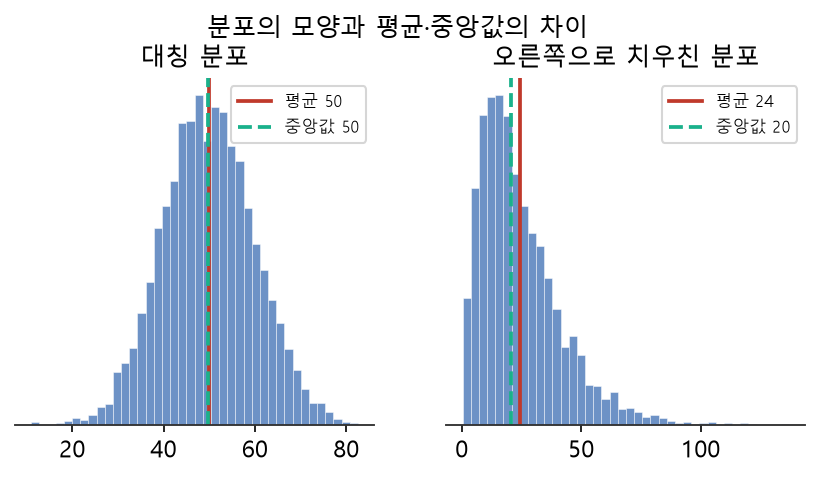
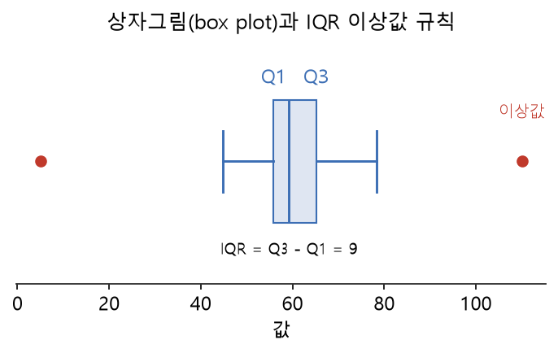

# 5주차 이론 — 탐색적 데이터 분석(EDA)과 품질 점검

## 데이터를 만나면 가장 먼저 하는 일 {#sec-w5t-intro}

이제 우리는 데이터를 수집하고 적재하는 앞부분을 지나, 데이터를 다듬는 정제의 세계로 들어섭니다. 그런데 다듬기에 앞서 반드시 해야 할 일이 있습니다. 바로 "이 데이터가 대체 어떻게 생겼는지 살펴보는 것"입니다. 병원에서 수술 전에 반드시 진단을 하듯, 데이터를 정제하기 전에 데이터의 상태를 진단해야 합니다. 무엇이 잘못되었는지 모른 채 손을 대면, 멀쩡한 데이터를 망치거나 정작 중요한 문제를 놓치기 때문입니다. 이 진단 과정을 **탐색적 데이터 분석(EDA, Exploratory Data Analysis)**이라고 부릅니다.

EDA라는 개념은 통계학자 존 튜키(John Tukey)가 1977년에 제안했습니다. 그는 "데이터를 미리 정해 둔 가설로 재단하기 전에, 데이터가 스스로 이야기하도록 열린 마음으로 들여다보라"고 말했습니다 [@tukey1977eda]. 이는 당시로서는 새로운 태도였습니다. 그때까지 통계학은 "이 데이터가 내 가설을 지지하는가"를 확인하는 데 집중했지만, 튜키는 그에 앞서 "이 데이터가 무엇을 말하고 있는가"를 편견 없이 듣는 단계가 필요하다고 보았습니다.

EDA를 요리로 비유하면, 장 봐 온 재료를 도마에 올려놓고 하나하나 살펴보며 "이 채소는 시들었네", "이 고기는 양이 부족하네", "이건 상했으니 버려야겠다"라고 판단하는 과정입니다. 이 판단이 있어야 그다음에 무엇을 어떻게 손질할지가 정해집니다. 판단 없이 무작정 칼을 대면 좋은 요리가 나올 수 없습니다.

EDA에서 우리가 던지는 질문은 대략 이렇습니다. 데이터가 몇 건이나 있는가(규모)? 각 열에는 어떤 값들이 들어 있는가(분포)? 빠진 값(결측)은 얼마나 되는가(완전성)? 말이 안 되는 값(이상값)은 없는가(유효성)? 열들 사이에 어떤 관계가 있는가(상관)? 눈치챘겠지만, 이 질문들은 1주차에서 배운 데이터 품질 지표와 정확히 맞닿아 있습니다. 그래서 EDA는 곧 품질 점검의 첫 단계입니다 [@moses2022data]. 데이터를 진단하는 이 과정에서 우리는 정제해야 할 문제들의 목록을 얻고, 그 목록이 6주차 정제 작업의 지침이 됩니다.

## 왜 요약이 필요한가 {#sec-w5t-why}

숫자가 수천, 수만 개 있으면 사람은 그것을 한눈에 이해할 수 없습니다. 만 명의 나이를 하나씩 들여다본다고 데이터의 성격을 파악할 수 있는 것은 아닙니다. 오히려 숫자에 파묻혀 아무것도 보지 못하게 됩니다. 그래서 우리는 데이터를 **요약(summary)**합니다. 수많은 값을 몇 개의 대표적인 수치로 압축해, 데이터의 성격을 한눈에 파악하는 것입니다.

이것은 마치 넓은 숲을 이해하기 위해 하늘에서 내려다보는 것과 같습니다. 나무 한 그루씩 들여다보면 전체 숲의 모양을 볼 수 없지만, 높은 곳에서 내려다보면 숲의 윤곽과 밀도가 한눈에 들어옵니다. 요약 통계량은 데이터라는 숲을 조망하는 높은 전망대인 셈입니다.

요약은 정보를 잃는 대신 이해를 얻는 거래입니다. "만 명의 나이 평균이 34세"라는 한 문장은 만 개의 값을 잃지만, 대신 "이 집단이 대체로 30대 중반이구나"라는 이해를 줍니다. 물론 요약만으로는 놓치는 것이 있습니다. 평균이 34세라도 실제로는 20대와 50대만 있고 30대는 없을 수도 있습니다. 그래서 좋은 EDA는 여러 각도의 요약을 함께 보며, 하나의 수치에 속지 않도록 경계합니다. 요약 수치와 함께 그림(그래프)을 그려 보는 것도 이 때문입니다. 숫자로는 안 보이던 패턴이 그림으로는 한눈에 드러나기 때문입니다.

## 데이터를 요약하는 세 가지 관점 {#sec-w5t-stats}

요약에는 크게 세 가지 관점이 있습니다.

```{mermaid}
flowchart TB
    D["수많은 데이터 값"] --> C["중심<br/>Center"]
    D --> S["퍼짐<br/>Spread"]
    D --> H["모양<br/>Shape"]
    C --> C1["평균 · 중앙값 · 최빈값"]
    S --> S1["최솟값·최댓값 · 범위 · 표준편차"]
    H --> H1["분포 · 치우침 · 이상값"]
```

**중심(center)**은 데이터가 대체로 어디쯤 모여 있는가를 나타냅니다. 대표적으로 평균과 중앙값이 있습니다. 평균은 모든 값을 더해 개수로 나눈 것이고, 중앙값은 값들을 순서대로 늘어놓았을 때 한가운데 있는 값입니다. 이 둘은 비슷해 보이지만 중요한 차이가 있습니다. 평균은 이상값에 크게 흔들리지만, 중앙값은 흔들리지 않아 더 튼튼합니다. 예를 들어 한 반의 용돈이 대부분 5만 원인데 한 명이 500만 원이면, 평균은 확 올라가 실제 상황을 왜곡하지만 중앙값은 5만 원 근처에 그대로 있어 현실을 더 잘 반영합니다. 그래서 이상값이 있을 만한 데이터에서는 평균과 중앙값을 함께 보는 것이 지혜입니다.

**퍼짐(spread)**은 데이터가 얼마나 흩어져 있는가를 나타냅니다. 가장 단순한 것은 최솟값과 최댓값, 그리고 그 차이인 범위입니다. 더 정교하게는 표준편차를 씁니다. 표준편차가 크면 값들이 넓게 흩어져 있고, 작으면 값들이 중심 가까이 옹기종기 모여 있습니다. 같은 평균이라도 퍼짐이 다르면 전혀 다른 데이터입니다. 평균 점수가 70점인 두 반이 있어도, 한 반은 모두 65~75점에 몰려 있고 다른 반은 40점과 100점이 뒤섞여 있을 수 있습니다. 퍼짐을 봐야 이런 차이를 알 수 있습니다.

**모양(shape)**은 데이터의 분포가 어떻게 생겼는가를 나타냅니다. 좌우 대칭인지, 한쪽으로 치우쳤는지, 봉우리가 하나인지 여럿인지, 튀는 값이 있는지를 봅니다. 분포의 모양은 데이터의 성격을 깊이 이해하게 해 줍니다. 예를 들어 소득 데이터는 대개 오른쪽으로 길게 꼬리를 끄는 모양인데, 이는 소수의 고소득자가 있기 때문입니다. @fig-w5-dist 에서 보듯, 대칭 분포에서는 평균과 중앙값이 거의 겹치지만 오른쪽으로 치우친 분포에서는 평균이 중앙값보다 오른쪽으로 끌려갑니다. 이런 모양을 알면 평균보다 중앙값이 더 대표성 있다는 것도 자연스럽게 이해됩니다.

{#fig-w5-dist width=88%}

이 세 관점은 서로를 보완합니다. 중심만 보면 데이터가 어디에 모여 있는지는 알지만 얼마나 흩어졌는지는 모르고, 퍼짐만 보면 흩어짐은 알지만 어디를 중심으로 흩어졌는지는 모릅니다. 모양까지 함께 보아야 비로소 데이터의 온전한 초상이 그려집니다. 그래서 EDA에서는 이 세 관점을 늘 함께 살피며, 어느 하나에 치우쳐 성급한 결론을 내리지 않도록 조심합니다.

SQL에서는 이 요약 통계량을 집계 함수로 바로 구할 수 있습니다. 개수를 세는 `COUNT`, 평균을 구하는 `AVG`, 최소·최대를 구하는 `MIN`·`MAX`, 합계를 구하는 `SUM`이 기본이고, 이들을 `GROUP BY`와 결합하면 집단별로 나누어 볼 수 있습니다. 4주차까지 배운 SQL이 여기서 데이터 진단의 도구로 다시 쓰이는 것입니다.

## 결측값 — 비어 있는 자리 {#sec-w5t-missing}

EDA에서 가장 자주 발견하는 문제 중 하나가 **결측값(missing value)**입니다. 결측값은 있어야 할 값이 비어 있는 것으로, 1주차의 완전성 문제입니다. SQL에서 결측은 `NULL`로 표현되며, `WHERE 열 IS NULL`이라는 조건으로 찾습니다.

결측이 생기는 이유는 다양합니다. 설문에서 응답자가 어떤 문항에 답하지 않았을 수도 있고, 센서가 고장 나 특정 시간의 값이 빠졌을 수도 있으며, 2주차에서 배운 여러 소스의 데이터를 합치는 과정에서 짝이 맞지 않아 생겼을 수도 있습니다. 결측의 원인을 아는 것은 중요합니다. 왜냐하면 원인에 따라 처리 방법이 달라지기 때문입니다. 단순히 우연히 빠진 결측과, 특정 조건에서 체계적으로 빠지는 결측은 성격이 전혀 다릅니다.

예를 들어 소득 조사에서 고소득자들이 유독 소득을 밝히지 않아 결측이 생겼다면, 이 결측을 무시하고 남은 데이터만 쓰면 평균 소득이 실제보다 낮게 나옵니다. 결측 자체가 편향을 담고 있는 것입니다. 그래서 EDA 단계에서는 단순히 "결측이 몇 개인가"뿐 아니라 "어떤 특징을 가진 데이터에서 결측이 많은가"까지 살펴보는 것이 좋습니다. 결측을 어떻게 처리할지는 6주차에서 본격적으로 다루지만, EDA 단계에서는 어느 열에 결측이 얼마나 많은지를 파악하는 것이 목표입니다.

## 이상값 — 동떨어진 값 {#sec-w5t-outlier}

EDA에서 자주 만나는 또 다른 문제가 **이상값(outlier)**입니다. 이상값은 다른 값들과 동떨어진 튀는 값입니다. 이상값에는 두 종류가 있습니다. 하나는 나이가 `-5`이거나 `999`인 경우처럼 명백히 잘못된 값(1주차의 유효성 문제)이고, 다른 하나는 정말로 존재하지만 아주 드문 값입니다. 이 둘을 구분하는 것이 중요합니다.

명백히 잘못된 값은 정해진 유효 범위를 벗어났는지로 쉽게 찾을 수 있습니다. 나이라면 0에서 120 사이여야 하고, 시험 점수라면 0에서 100 사이여야 합니다. 이 범위를 벗어나면 오류입니다. 반면 "정말 존재하는 드문 값"을 찾으려면 통계적인 방법이 필요합니다. 그 고전적인 방법이 **IQR(사분위 범위) 규칙**입니다.

IQR 규칙은 이렇게 작동합니다. 먼저 데이터를 크기순으로 정렬해, 하위 25% 지점의 값(1사분위수 $Q_1$)과 상위 25% 지점의 값(3사분위수 $Q_3$)을 구합니다. 사분위 범위 $\mathrm{IQR}$과 이상값 판정 경계는 다음과 같이 정의됩니다.

$$
\mathrm{IQR} = Q_3 - Q_1, \qquad
\text{정상 범위} = \bigl[\,Q_1 - 1.5\,\mathrm{IQR},\;\; Q_3 + 1.5\,\mathrm{IQR}\,\bigr]
$$ {#eq-iqr}

::: {.eqnote}
- $Q_1$: **1사분위수** — 데이터를 정렬했을 때 하위 25% 지점의 값
- $Q_3$: **3사분위수** — 상위 25%(=하위 75%) 지점의 값
- $\mathrm{IQR}$: 가운데 절반이 퍼진 폭. 여기에 $1.5$를 곱한 만큼을 위아래로 벗어나면 이상값으로 봅니다.
:::

@eq-iqr 의 경계를 벗어난 값이 이상값 후보입니다. 즉 데이터의 가운데 절반이 퍼진 정도($\mathrm{IQR}$)를 기준 삼아, 그로부터 지나치게 멀리 떨어진 값을 찾는 것입니다. @fig-w5-box 의 상자그림은 이 규칙을 시각적으로 보여 줍니다. 상자는 $Q_1$부터 $Q_3$까지를, 상자 밖의 점은 이상값을 나타냅니다.

{#fig-w5-box width=82%} 이 방법은 데이터의 가운데 절반이 퍼진 정도를 기준 삼아, 그로부터 지나치게 멀리 떨어진 값을 찾는 것입니다. 평균과 표준편차를 쓰는 방법도 있지만, IQR 규칙은 이상값 자체에 덜 흔들려 더 안정적입니다.

주의할 점은, 이상값이라고 무조건 버리면 안 된다는 것입니다. 부정 거래 탐지에서는 오히려 그 "튀는 값"이 우리가 찾는 정답일 수 있습니다. 희귀 질병 진단에서도 드문 값이 가장 중요한 신호입니다. 그래서 EDA에서는 이상값을 발견하고 기록하되, 처리 여부는 데이터의 목적을 보고 신중히 결정합니다 [@moses2022data]. 이상값을 지우는 것이 정답인지, 살리는 것이 정답인지는 언제나 "무엇에 쓸 것인가"에 달려 있습니다.

## 열들 사이의 관계 — 상관 {#sec-w5t-corr}

EDA는 각 열을 따로 보는 것에서 그치지 않고, 열들 사이의 **관계**도 살핍니다. 두 값이 함께 움직이는 경향을 **상관(correlation)**이라고 합니다. 예를 들어 공부 시간이 늘면 성적이 오르는 경향이 있다면, 둘 사이에 양의 상관이 있는 것입니다. 반대로 하나가 늘 때 다른 하나가 줄면 음의 상관입니다.

상관의 세기는 보통 −1에서 +1 사이의 숫자로 나타냅니다. +1에 가까우면 두 값이 함께 강하게 오르는 관계이고, −1에 가까우면 하나가 오를 때 다른 하나가 강하게 내리는 관계이며, 0에 가까우면 두 값 사이에 뚜렷한 직선 관계가 없다는 뜻입니다. 다만 이 숫자는 직선 형태의 관계만 잡아낸다는 한계가 있습니다. 두 값이 곡선 형태로 뚜렷이 관련되어 있어도, 이 상관 수치는 0에 가깝게 나올 수 있습니다. 그래서 상관 수치와 함께 산점도 같은 그림을 그려 실제 관계의 모양을 눈으로 확인하는 것이 안전합니다.

상관을 살피는 것은 여러모로 유용합니다. 어떤 특성이 우리가 예측하려는 대상과 관련이 깊은지 미리 짐작할 수 있고, 이는 13주차의 특성 공학으로 이어집니다. 또한 서로 매우 강하게 상관된 두 열이 있다면, 사실상 같은 정보를 중복해서 담고 있는 것일 수 있어 하나를 정리할 후보가 됩니다. 다만 상관을 볼 때 반드시 명심할 것이 있습니다. **상관은 인과가 아니다**라는 원칙입니다. 두 값이 함께 움직인다고 해서 하나가 다른 하나의 원인이라는 뜻은 아닙니다. 아이스크림 판매량과 익사 사고가 함께 늘어난다고 아이스크림이 익사를 일으키는 것은 아닙니다. 둘 다 여름이라는 공통 원인 때문에 함께 늘어나는 것입니다. 데이터를 다룰 때 이 함정에 빠지지 않는 것이 매우 중요합니다.

## 데이터 프로파일링 — 자동 건강검진 {#sec-w5t-profiling}

지금까지 배운 진단들을 한꺼번에 수행해 표로 정리하는 것을 **데이터 프로파일링(data profiling)**이라고 합니다 [@abedjan2015profiling]. 건강검진표가 키·몸무게·혈압·혈당을 한 장에 정리해 보여 주듯, 데이터 프로파일링은 각 열의 결측률, 고유값 개수, 최솟값, 최댓값, 평균을 한꺼번에 계산해 데이터의 상태를 한눈에 보여 줍니다.

SQL로 프로파일링의 핵심은 간단합니다. 결측 개수는 `IS NULL`을 세고, 분포는 `GROUP BY`로 집계하며, 범위는 `MIN`·`MAX`로 봅니다.

```sql
-- 열별 결측 개수와 값의 범위를 한 번에 프로파일링
SELECT
  COUNT(*)                         AS 전체건수,
  SUM(age IS NULL)                 AS age_결측,
  MIN(age)  AS age_최소,  MAX(age) AS age_최대,
  ROUND(AVG(age), 1)               AS age_평균
FROM customers;
```

프로파일링은 새로운 데이터를 처음 만났을 때 가장 먼저 하는 작업입니다. 이 한 장의 표만 보아도 "어느 열에 결측이 많은지", "어느 열에 이상값이 있는지", "어떤 열이 사실상 하나의 값만 가져 쓸모없는지"를 파악할 수 있습니다. 프로파일링 표를 잘 만들면, 수백만 건의 데이터도 몇 초 만에 그 성격을 파악할 수 있습니다. 이것이 프로파일링의 힘입니다. 사람이 데이터를 한 건씩 볼 수는 없지만, 잘 요약된 프로파일링 표는 데이터 전체의 초상화를 그려 줍니다. NIA 가이드라인도 구축 초기에 데이터의 분포와 품질을 점검하는 자가점검을 필수 절차로 규정하는데 [@nia2026guide], 데이터 프로파일링이 바로 그 실질적인 방법입니다. 우리는 이 프로파일링을 SQL로 직접 구현해, 화려한 도구 없이도 데이터의 상태를 진단하는 능력을 기릅니다.

## 데이터의 규모와 구조 파악하기 {#sec-w5t-shape}

EDA의 가장 첫걸음은 화려한 통계가 아니라, 데이터의 기본적인 생김새를 파악하는 것입니다. 이 데이터가 몇 개의 행과 몇 개의 열로 이루어졌는지, 각 열의 이름과 자료형은 무엇인지, 대략 어떤 값들이 들어 있는지를 먼저 봅니다. 이것은 낯선 도시에 도착해 지도를 펼쳐 보는 것과 같습니다. 전체 규모를 모른 채 세부로 뛰어들면 길을 잃기 쉽습니다.

행의 개수는 데이터의 양을, 열의 개수는 데이터의 차원을 알려 줍니다. 행이 너무 적으면 통계적으로 믿을 만한 결론을 내리기 어렵고, 열이 지나치게 많으면 분석이 복잡해집니다. 각 열이 어떤 자료형인지도 중요합니다. 숫자여야 할 열이 문자로 저장되어 있다면, 이는 6주차에서 타입 변환으로 바로잡아야 할 문제입니다. 이렇게 데이터의 겉모습을 훑는 것만으로도 앞으로 할 일의 윤곽이 잡힙니다.

또한 각 열이 실제로 의미 있는 정보를 담고 있는지도 살핍니다. 예를 들어 어떤 열의 모든 값이 똑같다면, 그 열은 아무런 구별 정보를 주지 못하므로 분석에서 제외해도 됩니다. 반대로 모든 값이 제각각인 열(예: 일련번호)은 식별자로는 유용하지만 패턴 분석에는 쓸모가 없습니다. 이런 판단이 EDA의 초반에 이루어져야, 이후 작업에서 헛수고를 줄일 수 있습니다.

## 범주형 데이터의 탐색 {#sec-w5t-categorical}

지금까지는 주로 숫자 데이터를 이야기했지만, 데이터에는 숫자가 아닌 **범주형 데이터**도 많습니다. 성별, 지역, 등급, 상품 종류처럼 몇 가지 정해진 값 중 하나를 갖는 데이터입니다. 범주형 데이터는 평균이나 표준편차를 구할 수 없으므로, 다른 방식으로 탐색합니다.

범주형 데이터에서 가장 기본적인 탐색은 **빈도 분석**입니다. 각 범주가 몇 번씩 나타나는지를 세는 것입니다. SQL의 `GROUP BY`와 `COUNT`가 바로 이 일을 합니다. 빈도를 보면 어떤 범주가 흔하고 어떤 범주가 드문지 알 수 있습니다. 가장 자주 나타나는 값을 **최빈값(mode)**이라고 하는데, 범주형 데이터에서는 이 최빈값이 중심을 나타내는 대표값이 됩니다.

범주형 데이터에서 특히 눈여겨볼 것이 **고유값의 개수(cardinality)**입니다. 성별처럼 값의 종류가 두세 개뿐인 열도 있고, 도시 이름처럼 수백 개인 열도 있습니다. 고유값이 적으면 원-핫 인코딩으로 다루기 쉽지만(13주차), 고유값이 지나치게 많으면 다른 방법을 고민해야 합니다. 예를 들어 고유값이 수천 개인 열을 원-핫 인코딩하면 열이 수천 개로 폭발해 다루기 어려워지므로, 자주 나오는 몇 개만 남기고 나머지는 하나로 묶는 등의 처리가 필요합니다. 이런 판단의 출발점이 바로 EDA에서 고유값 개수를 세어 보는 것입니다. 또한 빈도 분석을 하다 보면 6주차에서 정제할 문제도 드러납니다. "서울", "서울시", "서울특별시"가 따로 집계된다면, 같은 지역이 여러 표기로 나뉘어 있는 것입니다. 이런 표기 불일치는 EDA에서 발견하고 정제에서 통일합니다.

## 분포를 그림으로 보기 {#sec-w5t-viz}

숫자로 된 요약 통계량은 유용하지만, 때로는 그림 한 장이 백 개의 숫자보다 많은 것을 말해 줍니다. 데이터의 분포를 눈으로 보는 대표적인 그림이 **히스토그램(histogram)**입니다. 히스토그램은 값의 범위를 여러 구간으로 나누고, 각 구간에 몇 개의 데이터가 들어가는지를 막대 높이로 나타냅니다. 이 그림을 보면 데이터가 어디에 몰려 있는지, 봉우리가 몇 개인지, 한쪽으로 치우쳤는지가 한눈에 보입니다.

그림의 힘을 보여 주는 유명한 사례가 있습니다. 통계학자 앤스컴(Anscombe)은 평균·분산·상관이 모두 똑같은데도 실제 모양은 전혀 다른 네 개의 데이터 묶음을 만들어 보였습니다 [@anscombe1973graphs]. 숫자 요약만 보면 네 데이터가 같아 보이지만, 그림을 그리면 완전히 다른 패턴이 드러납니다. 이 사례는 "숫자만 믿지 말고 반드시 그림도 그려 보라"는 교훈을 강렬하게 전합니다. 요약과 시각화는 서로를 보완하는 짝이며, 어느 하나도 빠뜨려서는 안 됩니다.

이상값을 그림으로 보는 데는 **상자 그림(box plot)**이 유용합니다. 상자 그림은 앞서 배운 사분위수(Q1, 중앙값, Q3)를 상자로 그리고, IQR 규칙을 벗어난 이상값을 점으로 표시합니다. 여러 집단의 분포를 나란히 비교할 때 특히 강력합니다. Python에서는 matplotlib 같은 도구로 이런 그림을 손쉽게 그릴 수 있으며, 실습에서 데이터를 SQL로 뽑아 그림으로 확인하는 방법을 익힙니다.

## 시간에 따른 데이터 살피기 {#sec-w5t-time}

데이터에 시간 정보가 있다면, 시간에 따른 변화를 살피는 것도 EDA의 중요한 부분입니다. 매출이 계절에 따라 오르내리는지, 특정 시점에 급격한 변화가 있었는지, 시간이 지나며 꾸준히 증가하거나 감소하는 추세가 있는지를 봅니다. 이런 시간적 패턴은 데이터의 성격을 깊이 이해하게 해 줍니다.

시간에 따른 EDA에서 특히 주의할 것이 데이터의 **일관성**입니다. 예를 들어 어느 날 갑자기 데이터 건수가 평소의 10분의 1로 줄었다면, 그날 수집에 문제가 있었을 가능성이 큽니다. 이런 이상을 발견하면 그 원인을 추적해야 합니다. 이는 7주차에서 배울 "알려지지 않은 문제 탐지"와 데이터 관측성의 출발점입니다. 시간축을 따라 데이터를 훑어보는 것만으로도, 수집 과정의 사고를 발견할 수 있습니다.

시간에 따른 데이터에서는 반복되는 패턴, 즉 주기성도 흥미로운 관찰 대상입니다. 요일에 따라, 계절에 따라 규칙적으로 오르내리는 패턴이 있다면, 그것은 데이터의 중요한 성질입니다. 이런 주기성을 알면 특정 시점의 값이 이상한지 아닌지를 더 정확히 판단할 수 있습니다. 예를 들어 주말마다 매출이 오르는 패턴이 있다면, 어느 주말의 낮은 매출은 그 자체로 이상 신호가 됩니다.

시계열 데이터를 다룰 때는 시간 단위를 바꿔 가며 보는 것도 유용합니다. 하루 단위로는 들쭉날쭉해 보이던 데이터가 주 단위나 월 단위로 묶으면 뚜렷한 추세를 드러내기도 합니다. SQL에서는 날짜를 기준으로 `GROUP BY`를 하여 이런 집계를 손쉽게 구할 수 있습니다. 시간이라는 축을 더하면, 같은 데이터에서도 훨씬 풍부한 이야기를 읽어 낼 수 있습니다.

## EDA와 품질 지표의 연결 {#sec-w5t-quality-link}

EDA에서 우리가 하는 진단들은 1주차에서 배운 여섯 가지 품질 지표와 하나하나 대응됩니다. 이 대응을 명확히 이해하면, EDA가 왜 "품질 점검의 첫 단계"인지 분명해집니다.

결측을 세는 것은 **완전성**을 점검하는 것이고, 유효 범위를 벗어난 값을 찾는 것은 **유효성**을 점검하는 것입니다. 중복된 행이 있는지 보는 것은 **유일성**을, 생년월일과 나이가 서로 맞는지 보는 것은 **일관성**을 점검하는 것입니다. 그리고 특정 범주에 데이터가 쏠려 있는지 보는 것은 **다양성**을 점검하는 것입니다. **정확성**만은 EDA로 완전히 확인하기 어려운데, 값이 현실과 일치하는지는 외부 사실과 대조해야 알 수 있기 때문입니다. 그럼에도 명백히 비현실적인 값은 EDA로 상당 부분 걸러 낼 수 있습니다.

이처럼 EDA는 여섯 품질 지표를 데이터에서 실제로 측정하는 작업입니다. 진단 결과는 자연스럽게 정제의 우선순위를 정해 줍니다. 결측이 심한 열은 결측 처리를, 이상값이 많은 열은 이상값 처리를, 표기가 뒤섞인 열은 표준화를 우선하는 식입니다. EDA 없이 정제하는 것은 검사 결과 없이 처방을 내리는 것과 같습니다. 진단이 정확할수록 치료도 정확해집니다.

## SQL과 파이썬, 두 도구의 협업 {#sec-w5t-tools}

EDA를 수행하는 방법에는 크게 두 갈래가 있습니다. 하나는 SQL로 데이터베이스 안에서 직접 집계하는 것이고, 다른 하나는 데이터를 파이썬으로 가져와 분석 도구로 다루는 것입니다. 이 둘은 경쟁 관계가 아니라 협업 관계입니다.

SQL의 장점은 데이터를 옮기지 않고 저장소 안에서 바로 요약할 수 있다는 것입니다. 데이터가 아주 크더라도, 필요한 요약 수치만 SQL로 계산해 가져오면 되므로 효율적입니다. 결측 개수, 집단별 평균, 빈도 분포 같은 기본 진단은 SQL만으로 충분히 할 수 있습니다. 그래서 EDA의 1차 진단은 대개 SQL로 이루어집니다.

반면 파이썬은 더 정교한 통계 계산과 시각화에 강합니다. 사분위수를 구하거나 히스토그램을 그리거나 상관관계를 계산하는 일은 파이썬 도구가 편리합니다. 파이썬의 데이터 분석 라이브러리에는 데이터의 요약 통계량을 한 번에 계산해 주는 기능이 있어, 몇 줄의 코드로 프로파일링 표를 얻을 수 있습니다. 실무에서는 SQL로 큰 데이터를 요약해 필요한 부분만 가져온 뒤, 파이썬으로 정밀하게 분석하고 시각화하는 방식을 자주 씁니다. 이 과목의 실습도 이 두 도구를 상황에 맞게 오가며 활용합니다.

## 발견한 문제를 기록으로 남기기 {#sec-w5t-record}

EDA에서 발견한 문제들은 반드시 기록으로 남겨야 합니다. 머릿속으로만 "이 열에 결측이 많더라"라고 기억하면, 시간이 지나거나 사람이 바뀌면 그 진단이 사라집니다. 그래서 EDA의 결과를 **데이터 품질 보고서** 형태로 정리하는 것이 좋습니다.

이 보고서에는 각 열의 결측률, 발견된 이상값, 표기 불일치, 의심스러운 값 등을 정리하고, 각 문제를 어떻게 처리할지에 대한 계획을 함께 적습니다. 예를 들어 "나이 열에 결측 12%, 이상값(250) 3건 발견 → 이상값은 결측 처리 후 중앙값으로 대치"처럼 문제와 처리 방침을 짝지어 기록합니다. 이 기록이 곧 6주차 정제의 설계도가 됩니다.

이런 문서화는 2주차에서 배운 데이터시트의 정신과 이어집니다. 데이터가 어떤 상태였고 어떻게 처리했는지를 남기면, 나중에 데이터의 한계를 이해하고 문제의 원인을 추적할 수 있습니다. 또한 여러 사람이 협업할 때 같은 기준으로 일할 수 있게 해 줍니다. 좋은 EDA는 진단으로 끝나지 않고, 그 진단을 다음 사람이 활용할 수 있는 형태로 남기는 데까지 나아갑니다. 진단하고 기록하는 이 습관이, 데이터 구축을 개인의 재능이 아니라 팀의 자산으로 만듭니다.

## EDA의 태도 — 편견 없이, 그러나 꼼꼼하게 {#sec-w5t-attitude}

EDA를 잘하려면 두 가지 태도가 필요합니다. 하나는 편견 없이 데이터를 대하는 열린 마음이고, 다른 하나는 사소한 이상 신호도 놓치지 않는 꼼꼼함입니다. 이 둘은 언뜻 상충하는 것 같지만 실은 함께 가야 합니다. "이럴 것이다"라는 선입견을 내려놓되, 눈앞의 데이터가 보내는 신호는 하나도 흘려보내지 않는 태도입니다.

이 두 태도가 함께 필요한 이유는, EDA가 발견의 과정이기 때문입니다. 우리가 미리 아는 문제만 찾으려 하면, 예상치 못한 문제는 영영 발견하지 못합니다. 그래서 "무엇이 있을지 모른다"는 열린 자세로 데이터를 두루 살피되, 조금이라도 이상한 신호가 보이면 그것을 끝까지 파고드는 꼼꼼함이 필요합니다. 훌륭한 데이터 분석가는 데이터가 보내는 작은 신호를 놓치지 않는 예민한 감각을 가지고 있으며, 그 감각은 수많은 데이터를 직접 들여다본 경험에서 자랍니다.

초보자는 흔히 EDA를 건너뛰고 곧장 정제나 모델링으로 달려가려 합니다. 하지만 진단 없는 치료가 위험하듯, EDA 없는 정제는 방향을 잃기 쉽습니다. 어떤 문제가 있는지 모르는 채 정제하면, 있지도 않은 문제를 고치느라 시간을 쓰거나 정작 심각한 문제를 놓칩니다. 노련한 데이터 구축자일수록 EDA에 충분한 시간을 들입니다. 데이터를 깊이 이해하는 데 쓴 시간은, 뒤따르는 모든 작업에서 몇 배로 되돌아오기 때문입니다.

EDA에 들이는 시간은 결코 낭비가 아닙니다. 오히려 전체 데이터 구축 과정에서 가장 값진 투자 중 하나입니다. 데이터를 깊이 이해하면 정제의 방향이 분명해지고, 라벨링의 기준이 또렷해지며, 나중에 모델의 성능이 낮게 나왔을 때 그 원인을 데이터에서 찾을 수 있는 안목이 생깁니다. 데이터를 모르고 다루는 것과, 데이터를 훤히 꿰고 다루는 것은 결과에서 큰 차이를 냅니다.

정리하면, EDA는 데이터를 정제하기 전에 반드시 거쳐야 할 진단입니다. 데이터의 중심·퍼짐·모양을 요약 통계량으로 압축하고, 결측값과 이상값을 찾아내며, 열들 사이의 관계를 살핍니다. 이 모든 진단을 SQL의 집계 함수와 `GROUP BY`로 구현하는 데이터 프로파일링을 익히고, 그 결과를 다음 단계인 정제의 작업 지시서로 삼습니다. 데이터를 아는 만큼 잘 다룰 수 있다는 것이, EDA가 우리에게 주는 가장 큰 교훈입니다.

## 참고문헌 {#sec-w5t-refs}

1. Tukey, J. W. (1977). *Exploratory Data Analysis*. Addison-Wesley.
2. Moses, B., Gavish, L., & Vorwerck, M. (2022). *Data Quality Fundamentals*. O'Reilly Media.
3. Géron, A. (2022). *Hands-On Machine Learning* (3rd ed.). O'Reilly Media.
4. Wickham, H., & Grolemund, G. (2017). *R for Data Science*. O'Reilly Media.
5. McKinney, W. (2022). *Python for Data Analysis* (3rd ed.). O'Reilly Media.
6. Tufte, E. R. (2001). *The Visual Display of Quantitative Information* (2nd ed.). Graphics Press.
7. Cleveland, W. S. (1993). *Visualizing Data*. Hobart Press.
8. Hawkins, D. M. (1980). *Identification of Outliers*. Chapman and Hall.
9. Aggarwal, C. C. (2017). *Outlier Analysis* (2nd ed.). Springer.
10. Little, R. J. A., & Rubin, D. B. (2019). *Statistical Analysis with Missing Data* (3rd ed.). Wiley.
11. Rubin, D. B. (1976). Inference and Missing Data. *Biometrika*, 63(3), 581–592.
12. Tukey, J. W. (1962). The Future of Data Analysis. *The Annals of Mathematical Statistics*, 33(1).
13. Abedjan, Z., Golab, L., & Naumann, F. (2015). Profiling Relational Data: A Survey. *The VLDB Journal*, 24(4), 557–581.
14. Naumann, F. (2014). Data Profiling Revisited. *ACM SIGMOD Record*, 42(4), 40–49.
15. 한국지능정보사회진흥원(NIA). (2026). *인공지능 학습용 데이터 품질관리 가이드 v4.0 — 제1권*.
16. Wang, R. Y., & Strong, D. M. (1996). Beyond Accuracy. *JMIS*, 12(4).
17. Hunter, J. D. (2007). Matplotlib: A 2D Graphics Environment. *Computing in Science & Engineering*, 9(3).
18. Waskom, M. (2021). seaborn: Statistical Data Visualization. *JOSS*, 6(60), 3021.
19. Iglewicz, B., & Hoaglin, D. C. (1993). *How to Detect and Handle Outliers*. ASQC Quality Press.
20. Dasu, T., & Johnson, T. (2003). *Exploratory Data Mining and Data Cleaning*. Wiley.
21. Batini, C., & Scannapieco, M. (2016). *Data and Information Quality*. Springer.
22. Anscombe, F. J. (1973). Graphs in Statistical Analysis. *The American Statistician*, 27(1).
23. SQLite Consortium. *Aggregate Functions*. <https://www.sqlite.org/lang_aggfunc.html>
