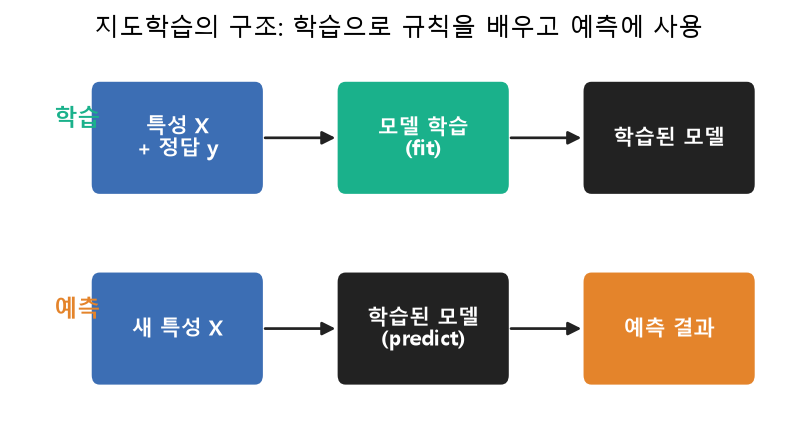

# 9주차 이론 — 학습데이터 구축과 라벨링의 개념

## 정답이 있어야 배웁니다 {#sec-w9t-intro}

이제 우리는 이 과목의 후반부, 라벨링(labeling)의 세계로 들어섭니다. 지금까지 우리는 데이터를 수집하고 깨끗하게 다듬었습니다. 하지만 깨끗한 데이터만으로는 인공지능이 무언가를 배우지 못합니다. 왜냐하면 인공지능 학습의 큰 축인 지도학습(supervised learning)은 "문제와 정답을 함께" 주어야 배우기 때문입니다. 학생이 문제집만 있고 해답지가 없으면 스스로 채점을 할 수 없듯이, 인공지능도 각 데이터에 "이것의 정답은 무엇이다"라는 표시가 붙어 있어야 학습할 수 있습니다.

@fig-w9-sup 은 이 구조를 보여 줍니다. 학습 단계에서는 특성 $X$와 정답 $y$를 함께 주어 모델이 규칙을 배우고, 예측 단계에서는 새 특성만 주어 정답을 예측합니다. 정답 $y$가 없으면 학습 자체가 시작되지 않습니다.

{#fig-w9-sup width=86%}

이 "정답을 붙이는 작업"이 바로 [라벨링]{.imp} 또는 [어노테이션(annotation)]{.imp}입니다. 그리고 그렇게 붙인 정답을 정답값 또는 [참값(Ground Truth, GT)]{.imp}이라고 부릅니다 [@nia2026guide]. 예를 들어 고양이 사진에 "고양이"라는 이름표를 붙이고, 영화 리뷰에 "긍정"이라는 표시를 하고, 엑스레이 사진에 "폐렴 있음"이라는 진단을 다는 것이 모두 라벨링입니다. 이 참값이 있어야 모델은 "이런 사진은 고양이", "이런 문장은 긍정"이라는 규칙을 데이터로부터 스스로 배웁니다.

NIA 가이드라인은 인공지능 학습용 데이터 구축의 본질을 "비정형·반정형 데이터를 수집하여 참값(GT) 어노테이션을 통해 가공하는 것"이라고 정의합니다 [@nia2026guide]. 즉 라벨링은 데이터 구축의 심장입니다. 앞의 수집과 정제가 좋은 재료를 준비하는 것이었다면, 라벨링은 그 재료에 인공지능이 배울 수 있는 정답을 새겨 넣는 일입니다. 흥미롭게도, 인공지능이 세상을 인식하는 능력의 상당 부분은 이렇게 사람이 하나하나 붙인 라벨에서 비롯됩니다. 인공지능이 고양이를 알아보는 것은, 수많은 사람이 수많은 고양이 사진에 "고양이"라고 표시해 주었기 때문입니다. 즉 인공지능의 지능 뒤에는 이름 없는 라벨링 작업자들의 방대한 수고가 숨어 있습니다. 이 사실을 이해하면, 라벨링이라는 작업의 의미와 무게를 새롭게 보게 됩니다.

## 라벨의 품질이 곧 모델의 품질입니다 {#sec-w9t-quality}

라벨링에서 반드시 기억해야 할 핵심 진실이 있습니다. **라벨의 품질이 곧 모델의 품질을 결정한다**는 것입니다. 모델은 우리가 준 라벨을 정답으로 믿고 배웁니다. 그래서 라벨이 잘못되어 있으면, 모델은 잘못된 것을 정답으로 배웁니다. 고양이 사진에 실수로 "강아지"라고 라벨을 붙이면, 모델은 그 고양이의 특징을 강아지의 특징으로 학습합니다.

유명한 연구에 따르면, 널리 쓰이는 대형 데이터셋조차 상당한 라벨 오류를 포함하고 있으며, 이 오류가 모델 평가를 왜곡한다는 것이 밝혀졌습니다 [@northcutt2021pervasive]. 전문가들이 만든 유명한 데이터셋에도 오류가 있다는 것은, 라벨링이 그만큼 어렵고 세심함을 요구하는 작업이라는 뜻입니다. 그래서 라벨링은 "아무나 빨리 하면 되는 단순 작업"이 결코 아닙니다.

라벨 오류가 왜 그렇게 위험한지 조금 더 생각해 보겠습니다. 라벨은 모델이 배우는 정답 그 자체입니다. 데이터에 약간의 잡음이 있어도 모델은 대체로 견디지만, 정답인 라벨이 틀리면 모델은 방향을 잃습니다. 나침반이 고장 난 배가 아무리 열심히 항해해도 엉뚱한 곳에 도착하듯, 잘못된 라벨로 학습한 모델은 아무리 정교해도 잘못된 것을 배웁니다. 게다가 라벨 오류는 눈에 잘 띄지 않습니다. 데이터가 지저분한 것은 EDA로 발견되지만, 라벨이 틀린 것은 그 분야를 잘 아는 사람이 하나하나 검토해야 드러납니다. 그래서 라벨 품질은 데이터 품질 중에서도 특히 관리하기 어렵고 중요한 부분입니다.

이 사실은 데이터 중심 인공지능이라는 최근의 흐름과 이어집니다. 모델을 개선하는 데 쏟는 노력만큼, 아니 그 이상으로 데이터와 라벨의 품질을 높이는 데 노력해야 한다는 관점입니다. 모델은 최신 기술을 가져다 쓰면 되지만, 좋은 라벨은 오직 정성 들인 사람의 작업에서만 나옵니다. 그래서 라벨링 능력은 인공지능 시대에 점점 더 중요해지는 핵심 역량입니다.

## 라벨링의 여러 종류 {#sec-w9t-types}

라벨링은 데이터의 종류와 풀려는 문제에 따라 여러 형태를 띱니다.

```{mermaid}
flowchart TB
    L["라벨링"] --> C["분류<br/>Classification"]
    L --> D["검출<br/>Detection"]
    L --> S["분할<br/>Segmentation"]
    L --> SP["구간·개체 표시<br/>Span/NER"]
    C --> C1["데이터 전체에 범주 하나<br/>예: 이 사진=고양이"]
    D --> D1["대상의 위치를 사각형으로<br/>예: 여기에 자동차"]
    S --> S1["픽셀 단위로 영역을 칠함<br/>예: 도로 vs 인도"]
    SP --> SP1["텍스트 구간에 표시<br/>예: '서울'=지명"]
```

라벨링의 형태를 정하는 것도 임무 정의에서 나옵니다. "이 사진에 무엇이 있는가"만 알면 되는 문제라면 분류로 충분하지만, "그것이 어디에 있는가"까지 알아야 한다면 검출이 필요하고, "그 경계가 정확히 어디까지인가"까지 알아야 한다면 분할이 필요합니다. 정보를 더 정밀하게 표시할수록 작업의 비용도 커지므로, 목적에 꼭 필요한 만큼의 정밀도를 고르는 것이 중요합니다. 과하게 정밀한 라벨링은 비용만 늘리고, 부족한 라벨링은 목적을 이루지 못합니다.

가장 기본은 **분류(classification)**입니다. 데이터 하나에 하나의 범주를 붙이는 것입니다. "이 리뷰는 긍정", "이 메일은 스팸", "이 사진은 고양이"처럼요. 분류는 라벨링의 가장 단순하면서도 널리 쓰이는 형태입니다. **검출(detection)**은 이미지 속에서 대상이 어디에 있는지를 사각형으로 표시하는 것입니다. 분류가 "무엇이 있는가"를 답한다면, 검출은 "무엇이 어디에 있는가"를 답합니다. 10주차에서 자세히 다룹니다.

**분할(segmentation)**은 검출보다 정밀하게, 픽셀 단위로 영역을 구분하는 것입니다. 자율주행에서 도로·인도·보행자를 정확히 구분할 때 씁니다. **구간 표시(span)**는 텍스트에서 특정 구간에 의미를 붙이는 것입니다. "삼성전자는 서울에 있다"에서 '삼성전자'는 회사, '서울'은 지명으로 표시하는 개체명 인식(NER)이 대표적이며, 11주차에서 다룹니다. 이 밖에도 값을 매기는 회귀 라벨링, 순서를 매기는 랭킹, 관계를 잇는 관계 라벨링 등이 있습니다. 어떤 형태든 공통점은 "사람의 판단을 데이터로 남긴다"는 것입니다.

## 라벨 체계를 설계하기 {#sec-w9t-taxonomy}

라벨링을 시작하기 전에 반드시 정해야 할 것이 **라벨 체계(taxonomy)**입니다. 라벨 체계란 "어떤 라벨들을 쓸 것인가"의 목록과 각 라벨의 정의입니다. 예를 들어 감정 분류라면 "긍정·부정·중립" 세 가지로 할지, "긍정·부정" 두 가지로 할지, 아니면 "매우 긍정·긍정·중립·부정·매우 부정" 다섯 가지로 할지를 정해야 합니다.

라벨 체계의 설계는 생각보다 중요하고 어렵습니다. 라벨을 너무 잘게 나누면 작업자가 구분하기 어려워 일관성이 떨어지고, 너무 뭉뚱그리면 필요한 정보를 담지 못합니다. 예를 들어 감정을 스무 가지로 잘게 나누면, "약간 기쁨"과 "꽤 기쁨"을 작업자마다 다르게 판단해 라벨이 뒤죽박죽이 됩니다. 반대로 "좋음"과 "나쁨" 둘로만 나누면, 미묘한 감정의 차이를 전혀 담지 못합니다. 그래서 라벨의 개수와 세분화 정도는 "작업자가 일관되게 구분할 수 있으면서, 목적에 필요한 정보를 담을 수 있는" 지점에서 정해야 합니다. 이 균형점을 찾는 것이 라벨 체계 설계의 핵심입니다. 또한 라벨들이 서로 겹치지 않고, 빠짐없이 모든 경우를 덮어야 합니다. 어느 라벨에도 속하지 않는 데이터가 있으면 작업자가 곤란해지고, 여러 라벨에 동시에 속하는 데이터가 있으면 판단이 갈립니다.

라벨 체계는 2주차에서 배운 임무 정의에서 나옵니다. 무엇을 예측하는 모델을 만들 것인지가 정해지면, 그에 맞는 라벨 체계가 따라옵니다. 그래서 라벨 체계를 설계할 때는 "이 라벨로 학습한 모델이 무엇을 할 수 있어야 하는가"를 늘 염두에 두어야 합니다. 잘 설계된 라벨 체계는 라벨링 작업 전체를 순조롭게 만들고, 부실한 라벨 체계는 작업 내내 혼란을 일으킵니다.

## 라벨링 가이드라인 — 일관성의 열쇠 {#sec-w9t-guideline}

라벨링에서 가장 어려운 문제는 사람마다 판단이 다르다는 것입니다. 같은 리뷰를 보고 누구는 긍정, 누구는 중립이라고 할 수 있습니다. "이 정도면 웃는 얼굴인가"에 대한 기준도 사람마다 다릅니다. 이런 불일치를 그대로 두면, 모델은 서로 모순되는 정답을 배우게 되어 혼란에 빠집니다.

그래서 라벨링에는 반드시 **라벨링 가이드라인(annotation guideline)**이 필요합니다. 가이드라인은 "무엇을, 어떤 기준으로, 어떻게 표시할지"를 명문화한 규칙서입니다. NIA 가이드라인은 라벨링 작업을 "라벨링 가이드라인을 준수하여 수행하고, 그 결과를 가이드라인에 따라 검사"하도록 규정합니다 [@nia2026guide]. 좋은 가이드라인은 라벨 체계, 애매한 경우의 판단 기준, 각 범주의 대표 예시와 반례, 그리고 작업 절차를 담습니다.

특히 중요한 것이 **경계 사례(edge case)에 대한 규칙**입니다. 명확한 경우는 누가 봐도 판단이 같지만, 애매한 경우에서 판단이 갈립니다. "칭찬과 불만이 섞인 리뷰는 어떻게 볼 것인가", "얼굴이 반쯤 가려진 사진은 얼굴로 볼 것인가" 같은 경계 사례에 대한 규칙을 미리 정해 두어야, 작업자들이 일관되게 판단할 수 있습니다. 가이드라인의 품질은 대개 이 경계 사례를 얼마나 촘촘히 다루었는가로 결정됩니다.

## 단일 정답이라는 환상 {#sec-w9t-truth}

라벨링에 대한 흔한 오해 하나는 "모든 데이터에는 하나의 명확한 정답이 있다"는 생각입니다. 하지만 현실은 그렇지 않습니다. 많은 경우, 정답은 사람에 따라, 관점에 따라 다를 수 있습니다. 라벨링 연구의 고전은 "완벽한 하나의 정답(single truth)은 환상일 수 있으며, 여러 작업자의 판단을 모아 신뢰도를 높여야 한다"고 지적합니다 [@aroyo2015truth].

예를 들어 어떤 문장이 비꼬는 것인지 진심인지, 어떤 표정이 기쁨인지 놀람인지는 사람마다 다르게 볼 수 있습니다. 이런 주관적인 판단이 필요한 데이터에서는, 한 사람의 라벨을 절대적 정답으로 삼기보다 여러 사람의 판단을 모으는 것이 더 신뢰할 만합니다. 여러 작업자가 같은 데이터를 라벨링하고, 그들의 판단을 종합해 최종 라벨을 정하는 방식입니다.

이 관점은 라벨링을 대하는 태도를 바꿉니다. 라벨링을 "정해진 정답을 찾아 적는 기계적 작업"이 아니라, "여러 판단을 신중히 모아 신뢰할 만한 정답을 만들어 가는 과정"으로 보는 것입니다. 그래서 한 데이터에 여러 작업자가 라벨을 달 수 있게 설계하는 것이 중요하며, 이는 12주차에서 배울 작업자 간 일치도 계산의 전제가 됩니다. 라벨은 발견하는 것이라기보다 만들어 가는 것에 가깝습니다.

## 라벨을 어떻게 저장할까 {#sec-w9t-schema}

라벨을 어떻게 저장할까요? 여기서 4주차에서 배운 데이터 설계 원리가 다시 등장합니다. 핵심 원칙은 데이터(원본)와 라벨(정답)을 분리해서 관리하는 것입니다. 팩트와 디멘션을 나누던 발상을 그대로 적용합니다.

```{mermaid}
erDiagram
    LABEL_SCHEMA ||--o{ ANNOTATIONS : "정의된 범주 사용"
    SAMPLES ||--o{ ANNOTATIONS : "하나의 샘플에 라벨"
    SAMPLES { int sample_id  text content  text data_type }
    LABEL_SCHEMA { int label_id  text label_name  text description }
    ANNOTATIONS { int anno_id  int sample_id  int label_id  text annotator }
```

이 설계는 세 부분으로 이루어집니다. **SAMPLES**는 라벨을 붙일 원본 데이터(문장·이미지 경로 등)를 담습니다. **LABEL_SCHEMA**는 허용되는 라벨의 목록과 정의, 즉 라벨 체계를 담습니다. **ANNOTATIONS**는 "어떤 샘플에 어떤 라벨을, 누가 붙였는가"를 담습니다.

이렇게 나누면 여러 이점이 있습니다. 첫째, 한 샘플에 여러 작업자가 라벨을 달 수 있습니다. 앞서 말한 여러 판단 종합에 필수입니다. 둘째, 라벨 체계가 바뀌어도 스키마 테이블만 고치면 됩니다. 셋째, 7주차에서 배운 외래 키로 "정의되지 않은 라벨"이 들어오는 것을 막을 수 있습니다. 넷째, 원본과 라벨이 분리되어 있어 각각을 독립적으로 관리하고 검증할 수 있습니다. 이 구조는 실제 라벨링 도구들이 데이터를 저장하는 방식이기도 합니다. 예를 들어 이미지 라벨링의 국제 표준 형식인 COCO도 이미지·범주·어노테이션의 세 부분으로 나뉘어 있는데, 이는 우리가 배우는 구조와 정확히 같은 발상입니다. 원본과 라벨 체계와 라벨을 분리하는 이 세 갈래 구조는, 라벨링 데이터를 다루는 사실상의 표준 설계라 할 수 있습니다. 그래서 이 구조를 이해하면 다양한 라벨링 형식과 도구를 훨씬 쉽게 파악할 수 있습니다.

## 라벨링 작업의 실제 {#sec-w9t-work}

라벨링은 실제로 어떻게 이루어질까요? 대규모 라벨링은 대개 여러 사람이 함께 합니다. 이때 작업의 품질을 지키기 위한 몇 가지 장치가 있습니다. 먼저 작업자를 교육합니다. 가이드라인을 숙지시키고, 연습 데이터로 훈련한 뒤, 일정 수준에 도달한 작업자만 본 작업에 투입합니다. 이는 라벨의 일관성을 높이는 첫걸음입니다.

작업 중에는 품질을 지속적으로 점검합니다. 정답이 이미 알려진 데이터를 몰래 섞어 작업자의 정확도를 확인하거나, 여러 작업자에게 같은 데이터를 주어 일치도를 측정합니다. 일치도가 낮으면 가이드라인이 모호하거나 작업이 너무 주관적이라는 신호이므로, 가이드라인을 보완하거나 작업자를 재교육합니다. 이렇게 라벨링은 한 번 하고 끝나는 것이 아니라, 품질을 점검하고 개선하는 순환을 통해 완성됩니다.

여러 작업자의 라벨을 종합해 최종 라벨을 정하는 방법으로는 다수결이 흔히 쓰입니다. 같은 데이터에 대해 여러 작업자가 붙인 라벨 중 가장 많은 것을 최종 라벨로 삼는 것입니다. 다수결은 개별 작업자의 실수나 편향을 상쇄해, 한 사람의 판단보다 신뢰할 만한 결과를 만듭니다. 다만 다수가 같은 오해를 하는 경우에는 다수결도 틀릴 수 있으므로, 판단이 크게 갈리는 데이터는 전문가가 다시 검토하는 것이 안전합니다.

2주차에서 배운 크라우드소싱도 라벨링에 널리 쓰입니다. 많은 사람에게 소액을 지급하고 라벨링을 맡기면 대규모 작업을 빠르게 할 수 있지만, 작업자의 품질이 제각각이라 검수가 특히 중요합니다. 어떤 방식으로 라벨링하든, 핵심은 명확한 가이드라인과 지속적인 품질 관리입니다. 이 두 가지가 신뢰할 만한 라벨을 만드는 열쇠입니다.

## 라벨링이 어려운 이유 {#sec-w9t-hard}

라벨링은 단순 반복 작업처럼 보이지만, 실제로는 여러 어려움이 도사리고 있습니다. 첫째는 주관성입니다. 앞서 말했듯 많은 판단이 사람에 따라 다릅니다. 감정, 의도, 미묘한 뉘앙스처럼 명확한 기준을 세우기 어려운 것들이 특히 그렇습니다. 이런 주관성은 가이드라인으로 줄일 수 있지만 완전히 없앨 수는 없습니다.

둘째는 모호성입니다. 세상의 많은 것이 딱 잘라 나뉘지 않습니다. 개와 늑대의 중간처럼 보이는 동물, 긍정도 부정도 아닌 미묘한 문장은 어느 범주에 넣어야 할지 애매합니다. 이런 모호한 경계에서 판단이 흔들립니다. 셋째는 지루함과 피로입니다. 수천, 수만 건을 반복해 라벨링하다 보면 집중력이 떨어지고 실수가 늘어납니다. 그래서 대규모 라벨링에서는 작업자의 피로를 관리하고, 중간중간 품질을 점검하는 것이 중요합니다.

넷째는 전문성의 문제입니다. 어떤 라벨링은 전문 지식이 있어야 정확히 할 수 있습니다. 의료 영상에 병변을 표시하려면 의학 지식이, 법률 문서를 분류하려면 법률 지식이 필요합니다. 전문성이 없는 사람이 이런 데이터를 라벨링하면 오류가 생깁니다. 그래서 라벨링 작업의 난이도와 필요한 전문성을 미리 파악해, 적절한 작업자를 배치하는 것이 중요합니다. 이런 어려움들 때문에 라벨링은 세심한 설계와 관리를 요구하는 전문적인 작업입니다.

## 라벨링을 돕는 도구들 {#sec-w9t-tools}

대규모 라벨링을 손으로만 하기는 어렵기 때문에, 다양한 라벨링 도구가 개발되어 있습니다. 이미지에 사각형을 그리거나 영역을 칠하는 도구, 텍스트의 특정 구간을 표시하는 도구, 음성이나 영상에 구간을 표시하는 도구 등이 있습니다. 이런 도구들은 작업을 빠르고 정확하게 만들어 줍니다.

좋은 라벨링 도구는 몇 가지 특징을 갖춥니다. 작업이 편리해 피로를 줄여 주고, 가이드라인을 작업 화면에 함께 보여 주어 일관성을 돕고, 여러 작업자의 결과를 모아 관리하며, 라벨의 형식을 표준화해 저장합니다. 도구가 저장하는 데이터는 대개 우리가 배운 것과 비슷한 구조, 즉 샘플과 라벨을 분리한 형태입니다. 그래서 라벨링 도구의 내부를 이해하려면, 이번 주에 배우는 라벨 스키마 설계를 아는 것이 도움이 됩니다.

최근에는 인공지능이 라벨링을 돕기도 합니다. 모델이 먼저 대략의 라벨을 제안하고, 사람이 그것을 검토해 고치는 방식입니다. 이렇게 하면 작업 속도가 크게 빨라집니다. 다만 모델의 제안을 무비판적으로 받아들이면 모델의 편향이 라벨에 그대로 스며들 수 있으므로, 사람의 검토가 반드시 필요합니다. 도구는 라벨링을 돕는 수단일 뿐, 최종 판단의 책임은 여전히 사람에게 있습니다.

## 라벨링에서 사람을 돕는 여러 방법 {#sec-w9t-weak}

모든 데이터를 사람이 일일이 라벨링하는 것은 비용이 많이 듭니다. 그래서 사람의 수고를 줄이는 여러 방법이 연구되어 왔습니다. 하나는 2주차에서도 언급한 능동학습입니다. 모델이 특히 헷갈려하는 데이터를 골라 그것부터 라벨링하면, 적은 라벨로도 큰 효과를 얻을 수 있습니다. 모든 데이터가 똑같이 가치 있는 것은 아니므로, 가치가 높은 데이터에 라벨링을 집중하는 전략입니다.

다른 방법은 규칙이나 기존 지식으로 대략의 라벨을 자동 생성한 뒤, 그것을 학습에 활용하는 것입니다. 이런 라벨은 사람이 붙인 것만큼 정확하지는 않지만, 대량으로 빠르게 만들 수 있다는 장점이 있습니다. 완벽하지 않은 대량의 라벨과 정확한 소량의 라벨을 함께 쓰는 방식도 있습니다. 이런 접근들은 라벨링 비용을 줄이려는 노력에서 나왔습니다.

다만 이런 방법들도 결국 사람의 판단을 완전히 대체하지는 못합니다. 자동 생성한 라벨은 사람의 검증을 거쳐야 믿을 수 있고, 능동학습도 어떤 데이터를 우선할지에 사람의 판단이 개입합니다. 그래서 현대의 라벨링은 "사람과 기계의 협업"이라는 방향으로 발전하고 있습니다. 기계가 반복적이고 단순한 부분을 돕고, 사람이 어렵고 중요한 판단을 맡는 것입니다. 이 협업을 잘 설계하는 것이 효율적인 라벨링의 핵심입니다.

## 라벨링과 편향 {#sec-w9t-bias}

라벨링에서 특히 조심해야 할 것이 편향입니다. 라벨은 사람의 판단이 담긴 것이므로, 작업자의 편견이 라벨에 스며들 수 있습니다. 예를 들어 특정 집단에 대한 무의식적 편견이 있으면, 같은 행동을 다른 집단에 대해 다르게 라벨링할 수 있습니다. 이런 편향된 라벨로 학습한 모델은 그 편향을 그대로 배워, 실제 사람들에게 불공정한 결정을 내리게 됩니다.

편향은 라벨 체계 자체에도 숨어 있을 수 있습니다. 어떤 범주를 두고 어떤 범주를 두지 않을지, 무엇을 정상으로 보고 무엇을 예외로 볼지에 이미 특정 관점이 담깁니다. 그래서 라벨 체계를 설계할 때부터 다양한 관점을 고려하고, 특정 집단이나 시각에 치우치지 않았는지 점검해야 합니다. 이는 1주차에서 배운 다양성 지표, 그리고 12주차에서 배울 편향 점검과 이어집니다.

편향을 줄이는 한 방법은 작업자를 다양하게 구성하는 것입니다. 배경과 관점이 다른 여러 사람이 함께 라벨링하면, 한 사람의 편견이 전체를 지배하는 것을 막을 수 있습니다. 또한 라벨링 결과를 집단별로 나누어 살펴, 특정 집단에 대한 라벨이 체계적으로 다르지 않은지 점검합니다. 편향 없는 라벨을 만드는 것은 기술의 문제인 동시에 윤리의 문제이며, 책임 있는 인공지능을 위한 필수 과제입니다. 라벨링 작업자는 자신의 판단이 결국 인공지능의 행동이 되어 실제 사람들에게 영향을 미친다는 사실을 늘 의식해야 합니다.

## 라벨링의 비용과 계획 {#sec-w9t-cost}

라벨링은 비용이 많이 드는 작업입니다. 사람의 시간과 노력이 들어가고, 전문성이 필요할수록 비용이 커집니다. 그래서 라벨링을 시작하기 전에 계획을 세우는 것이 중요합니다. 얼마나 많은 데이터를 라벨링할 것인지, 어떤 품질을 목표로 할 것인지, 몇 명의 작업자가 얼마의 기간에 할 것인지를 미리 정합니다.

계획에서 특히 고민할 것이 양과 질의 균형입니다. 같은 예산으로 많은 데이터를 대충 라벨링할 수도 있고, 적은 데이터를 정성껏 라벨링할 수도 있습니다. 일반적으로는 어느 정도의 양이 확보된 뒤에는, 양을 더 늘리기보다 질을 높이는 것이 모델 성능에 더 도움이 됩니다. 잘못된 라벨이 섞인 대량의 데이터보다, 정확한 라벨의 적당한 데이터가 낫기 때문입니다. 이는 데이터 중심 인공지능의 핵심 통찰이기도 합니다.

또한 라벨링은 한 번에 완성되지 않고 반복을 통해 개선됩니다. 처음에는 소량을 라벨링해 가이드라인의 문제를 발견하고, 그것을 보완한 뒤 본격적인 작업에 들어갑니다. 작업 중에도 품질을 점검하며 가이드라인을 다듬습니다. 이렇게 라벨링을 점진적으로 개선하는 것이, 처음부터 완벽하려 애쓰는 것보다 효과적입니다. NIA 가이드라인의 1-Cycle 자가점검도 이런 반복 개선의 정신을 담고 있습니다. 소량으로 전체를 한 번 돌려 보고, 문제를 발견해 고친 뒤 확대하는 것입니다.

## 왜 라벨을 SQL로 다루는가 {#sec-w9t-sql}

이 과목에서는 라벨을 SQLite로 저장하고 관리합니다. 그런데 라벨링이라고 하면 이미지에 사각형을 그리는 화려한 도구를 떠올리기 쉬운데, 왜 데이터베이스를 배울까요? 그 이유는, 라벨링의 본질이 화려한 도구가 아니라 데이터의 구조적 관리에 있기 때문입니다.

라벨링 도구가 만들어 내는 것은 결국 구조화된 데이터입니다. "어떤 샘플에, 어떤 라벨을, 누가, 언제 붙였는가"라는 정보입니다. 이 정보를 잘 저장하고, 조회하고, 검증하고, 집계하는 것이 라벨링 작업의 핵심입니다. 그리고 이것은 정확히 관계형 데이터베이스가 잘하는 일입니다. 라벨의 분포를 집계하고, 작업자 간 일치도를 계산하고, 정의되지 않은 라벨을 걸러 내는 것은 모두 SQL로 할 수 있습니다.

그래서 라벨을 SQL로 다루는 법을 배우면, 어떤 라벨링 도구를 쓰든 그 결과를 이해하고 관리할 수 있습니다. 도구는 바뀌어도 라벨 데이터의 구조와 관리 원리는 변하지 않기 때문입니다. 화려한 라벨링 화면 뒤에서 실제로 무슨 일이 일어나는지를 이해하는 것, 그것이 이 과목이 라벨을 데이터베이스로 다루는 이유입니다. 10주차와 11주차에서 이미지·텍스트·시계열 라벨을 SQLite로 관리하며, 이 원리를 손으로 익히게 됩니다.

## 라벨링과 앞 절반의 연결 {#sec-w9t-connect}

라벨링은 앞 절반에서 배운 원칙들 위에 세워집니다. 라벨을 붙이려면 먼저 깨끗한 데이터가 있어야 합니다. 지저분한 데이터에 라벨을 붙이면, 정제 과정에서 그 데이터가 바뀌거나 삭제될 때 라벨도 함께 흔들립니다. 그래서 대개 정제를 마친 데이터에 라벨을 붙입니다. 앞 절반의 수집·정제·검증이 라벨링의 토대가 되는 것입니다.

또한 라벨링에도 검증이 필요합니다. 7주차에서 배운 검증의 정신이 라벨에도 그대로 적용됩니다. 라벨이 정의된 범주 안에 있는지, 필수 라벨이 빠지지 않았는지, 여러 작업자의 판단이 일치하는지를 점검합니다. 이것이 12주차의 라벨 검증입니다. 그리고 라벨링 과정도 문서로 남깁니다. 어떤 가이드라인으로, 누가, 어떻게 라벨을 붙였는지를 기록하는 것은 2주차의 데이터시트 정신입니다.

이처럼 라벨링은 앞 절반과 단절된 새로운 주제가 아니라, 앞서 배운 원칙들을 정답을 붙이는 작업에 적용하는 것입니다. 원본을 보존하고, 품질을 검증하고, 목적에 맞게 작업하고, 과정을 기록하는 원칙은 라벨링에서도 변함없이 지켜집니다. 그래서 앞 절반을 잘 익힌 사람은 라벨링도 자연스럽게 잘할 수 있습니다.

## 정리 — 라벨링은 데이터 구축의 심장입니다 {#sec-w9t-summary}

9주차에서는 라벨링의 개념을 세웠습니다. 지도학습은 정답(참값, Ground Truth)이 있어야 배우며, 그 정답을 붙이는 작업이 라벨링입니다. 라벨의 품질이 곧 모델의 품질을 결정하므로, 라벨링은 세심함과 정성을 요구하는 핵심 작업입니다. 라벨링은 분류·검출·분할·구간표시 등 여러 형태를 띠고, 시작 전에 라벨 체계를 잘 설계해야 합니다.

사람마다 판단이 다르기 때문에 반드시 라벨링 가이드라인으로 일관성을 확보해야 하며, 단일 정답이 환상일 수 있음을 이해하고 여러 작업자의 판단을 모으는 것이 신뢰도를 높입니다. 라벨은 원본과 분리하여 라벨 체계·샘플·어노테이션 테이블로 설계하고, 외래 키로 무결성을 지킵니다. 무엇보다 라벨링은 앞 절반에서 배운 원칙들 위에 세워지며, 라벨의 품질이 곧 모델의 품질임을 기억하는 것이 후반부 전체를 관통하는 핵심입니다.

## 참고문헌 {#sec-w9t-refs}

1. 한국지능정보사회진흥원(NIA). (2026). *인공지능 학습용 데이터 구축 가이드 v4.0 — 제2권*.
2. 한국지능정보사회진흥원(NIA). (2026). *인공지능 학습용 데이터 품질관리 가이드 v4.0 — 제1권*.
3. Aroyo, L., & Welty, C. (2015). Truth Is a Lie: Crowd Truth and the Seven Myths of Human Annotation. *AI Magazine*, 36(1), 15–24.
4. Northcutt, C. G., Athalye, A., & Mueller, J. (2021). Pervasive Label Errors in Test Sets Destabilize ML Benchmarks. *NeurIPS Datasets and Benchmarks*.
5. Monarch, R. (2021). *Human-in-the-Loop Machine Learning*. Manning.
6. Pustejovsky, J., & Stubbs, A. (2012). *Natural Language Annotation for Machine Learning*. O'Reilly Media.
7. Sorokin, A., & Forsyth, D. (2008). Utility Data Annotation with Amazon Mechanical Turk. *IEEE CVPR Workshops*.
8. Snow, R., et al. (2008). Cheap and Fast — But Is It Good? *EMNLP*.
9. Sambasivan, N., et al. (2021). Data Cascades in High-Stakes AI. *ACM CHI*.
10. Gebru, T., et al. (2021). Datasheets for Datasets. *Communications of the ACM*, 64(12).
11. Deng, J., et al. (2009). ImageNet. *IEEE CVPR*.
12. Lin, T.-Y., et al. (2014). Microsoft COCO. *ECCV*.
13. Russakovsky, O., et al. (2015). ImageNet Large Scale Visual Recognition Challenge. *IJCV*, 115(3).
14. Kovashka, A., et al. (2016). Crowdsourcing in Computer Vision. *Foundations and Trends in CGV*.
15. Sheng, V. S., & Zhang, J. (2019). Machine Learning with Crowdsourcing: A Brief Summary. *AAAI*.
16. Vaughan, J. W. (2018). Making Better Use of the Crowd. *JMLR*, 18.
17. Paullada, A., et al. (2021). Data and Its (Dis)contents. *Patterns*, 2(11).
18. Denton, E., et al. (2021). On the Genealogy of Machine Learning Datasets. *Big Data & Society*.
19. Aroyo, L., et al. (2023). The Reasonable Effectiveness of Diverse Evaluation Data. *NeurIPS*.
20. 과학기술정보통신부·NIA. *AI 허브 데이터 라벨링 작업 가이드*. <https://www.aihub.or.kr>
21. Klie, J.-C., et al. (2018). INCEpTION: A Flexible Semantic Annotation Platform. *COLING*.
22. Ng, A. (2021). *From Model-centric to Data-centric AI*. DeepLearning.AI.
23. SQLite Consortium. *Foreign Key Support*. <https://www.sqlite.org/foreignkeys.html>
