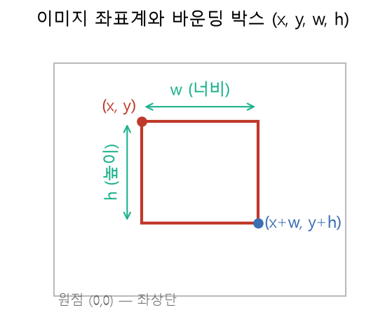
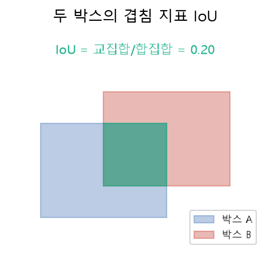

# 10주차 이론 — 이미지 라벨링

## 컴퓨터에게 "여기에 무엇이 있다"를 가르치기 {#sec-w10t-intro}

9주차에서 라벨링의 개념을 세웠습니다. 이번 주에는 그중에서도 이미지 라벨링을 깊이 다룹니다. 이미지 라벨링은 인공지능 학습용 데이터 구축에서 가장 규모가 크고 중요한 영역입니다. 자율주행차가 보행자를 알아보고, 의료 인공지능이 엑스레이에서 병변을 찾고, 스마트폰이 얼굴로 잠금을 푸는 것은 모두 방대한 이미지 라벨링의 결과입니다.

이미지 라벨링은 한마디로 "컴퓨터에게 그림을 설명해 주는 일"입니다. 사람은 사진을 보면 한눈에 "고양이가 소파 위에 있네"라고 압니다. 하지만 컴퓨터에게 이미지는 그저 숫자의 나열일 뿐입니다. 그림 속에 무엇이 있는지, 그것이 어디에 있는지를 컴퓨터는 스스로 알지 못합니다. 그래서 우리는 "이 사진에는 고양이가 있고, 그 고양이는 이 위치에 있다"를 사람이 하나하나 표시해 주어야 합니다. 이 표시가 곧 참값(Ground Truth)이 되고, 모델은 그것을 보고 배웁니다.

이미지 라벨링은 규모의 작업이기도 합니다. 하나의 쓸 만한 이미지 인식 모델을 만들려면 수만, 수십만 장의 이미지에 라벨을 붙여야 합니다. 이 방대한 작업을 여러 사람이 나누어 하다 보니, 앞서 배운 일관성과 품질 관리가 특히 중요해집니다. 한 사람이 다르게 라벨링한 이미지 몇 장은 큰 문제가 아니지만, 수만 장에 걸쳐 작업자마다 기준이 다르면 데이터셋 전체가 흔들립니다. 그래서 이미지 라벨링은 개인의 작업이면서 동시에 대규모 협업이며, 이 협업을 잘 조직하는 것이 좋은 이미지 데이터셋을 만드는 열쇠입니다.

이미지 라벨링이 중요한 만큼, 그 방법과 원리를 정확히 이해하는 것이 필요합니다. 이번 주에는 이미지 라벨링의 여러 형태, 위치를 표시하는 바운딩 박스, 그것을 저장하고 관리하는 스키마, 그리고 라벨의 품질을 점검하는 방법을 배웁니다. 그리고 이 모든 것을 SQLite로 다루며, 이미지 라벨링이 결국 구조화된 데이터의 관리임을 확인합니다.

## 컴퓨터에게 이미지란 무엇인가 {#sec-w10t-image}

이미지 라벨링을 이해하려면, 먼저 컴퓨터가 이미지를 어떻게 보는지 알아야 합니다. 컴퓨터에게 이미지는 작은 점들의 격자입니다. 각 점을 **화소(픽셀)**라고 하며, 각 픽셀은 색을 나타내는 숫자를 가집니다. 예를 들어 가로 640개, 세로 480개의 픽셀로 이루어진 이미지는, 30만 개가 넘는 숫자의 모음입니다. 컬러 이미지라면 각 픽셀이 빨강·초록·파랑 세 숫자를 가지므로 그 세 배가 됩니다.

컴퓨터는 이 숫자들만 볼 뿐, 그 숫자들이 모여 무엇을 이루는지는 알지 못합니다. 사람에게는 명백한 "고양이"가, 컴퓨터에게는 그저 특정한 패턴의 숫자 배열입니다. 그래서 사람이 "이 숫자 배열이 나타내는 것은 고양이"라고 알려 주는 라벨링이 필요합니다. 인공지능이 이미지를 인식하는 능력은, 이렇게 사람이 붙인 라벨로부터 "이런 패턴의 숫자는 고양이"라는 규칙을 배운 결과입니다.

이 사실은 이미지 라벨링에서 위치가 왜 숫자로 표현되는지도 설명해 줍니다. 이미지가 픽셀의 격자이므로, 그 안의 위치도 격자 위의 좌표, 즉 숫자로 나타냅니다. 어떤 대상이 이미지의 어디에 있는지를 컴퓨터가 이해하려면, 그 위치를 픽셀 좌표로 정확히 표시해 주어야 합니다. 이것이 곧 바운딩 박스의 개념으로 이어집니다.

## 이미지 라벨링의 세 가지 수준 {#sec-w10t-levels}

9주차에서 본 라벨링 형태를 이미지에 적용하면, 정보의 정밀도에 따라 세 수준으로 나뉩니다.

```{mermaid}
flowchart LR
    A["이미지 분류<br/>Classification"] --> A1["사진 전체에 범주 1개<br/>'이건 고양이 사진'"]
    B["객체 검출<br/>Detection"] --> B1["대상마다 사각형+범주<br/>'여기 고양이, 저기 강아지'"]
    C["의미 분할<br/>Segmentation"] --> C1["픽셀마다 범주<br/>'이 픽셀들은 고양이'"]
    A1 -.정밀도 증가.-> B1 -.정밀도 증가.-> C1
```

**이미지 분류**는 사진 한 장에 라벨 하나를 붙이는 것입니다. "이 사진은 고양이 사진"처럼요. 가장 간단하지만, "무엇이 어디에" 있는지는 알려 주지 못합니다. 사진에 고양이가 여러 마리 있어도, 강아지가 함께 있어도, 그저 하나의 라벨만 붙습니다. **객체 검출**은 대상마다 사각형을 그리고 범주를 붙이는 것입니다. "여기에 고양이, 저기에 강아지"처럼 각 대상의 위치와 종류를 표시합니다. 이번 주 실습의 중심입니다.

**의미 분할**은 픽셀 단위로 어느 대상에 속하는지 칠하는 것입니다. 객체 검출이 대상을 사각형으로 대략 감싼다면, 분할은 대상의 정확한 윤곽을 픽셀 하나하나 표시합니다. 가장 정밀하지만 작업 비용이 가장 큽니다. 자율주행처럼 정확한 경계가 필요한 분야에서 씁니다. 이 세 수준의 관계를 지도로 비유하면 이해가 쉽습니다. 이미지 분류는 "이 지역에 도시가 있다"고 말하는 것, 객체 검출은 "도시가 이 사각형 범위에 있다"고 표시하는 것, 의미 분할은 "도시의 경계가 정확히 여기까지"라고 그리는 것과 같습니다. 목적이 "있는지 없는지"만 알면 되는지, "어디쯤 있는지"까지 알아야 하는지, "정확한 경계"까지 알아야 하는지에 따라 필요한 수준이 달라집니다. 이 세 수준은 정밀도가 높아질수록 담는 정보도 많고 작업 비용도 커지므로, 목적에 맞는 수준을 고르는 것이 중요합니다.

## 바운딩 박스 — 사각형으로 위치 표시하기 {#sec-w10t-bbox}

객체 검출의 핵심은 **바운딩 박스(bounding box)**입니다. 바운딩 박스는 대상을 감싸는 가장 작은 사각형이며, 보통 네 개의 숫자로 표현합니다. 가장 널리 쓰이는 COCO 형식은 `(x, y, w, h)`를 씁니다. 여기서 `x`와 `y`는 박스의 위치를, `w`와 `h`는 박스의 크기를 나타냅니다.

바운딩 박스의 발상은 단순합니다. 대상의 정확한 윤곽을 따라 그리는 것은 어렵고 시간이 오래 걸리지만, 대상을 감싸는 사각형 하나를 그리는 것은 빠르고 쉽습니다. 사각형은 정확한 윤곽보다 정보가 적지만, 대상이 "대략 어디에, 어느 크기로" 있는지를 충분히 표현합니다. 그래서 객체 검출에서는 이 사각형이 위치 표시의 표준이 되었습니다. 정밀함과 작업 효율 사이의 실용적인 타협인 셈입니다.

바운딩 박스를 잘 그리는 데도 요령이 있습니다. 박스는 대상을 감싸는 "가장 작은" 사각형이어야 합니다. 대상보다 너무 크게 그리면 배경이 많이 섞여 들어가 모델이 배경을 대상의 특징으로 오해할 수 있고, 너무 작게 그려 대상의 일부가 잘리면 중요한 특징이 빠집니다. 그래서 대상의 가장자리에 딱 맞게, 그러나 대상을 빠짐없이 포함하도록 그리는 것이 좋은 박스의 기준입니다. 이 기준을 가이드라인에 명확히 정해 두어야 작업자들이 일관되게 박스를 그릴 수 있습니다.

한 이미지에는 여러 개의 바운딩 박스가 있을 수 있습니다. 사진에 고양이 두 마리와 강아지 한 마리가 있으면, 세 개의 박스를 그리고 각각에 범주를 붙입니다. 이렇게 하나의 이미지에 여러 대상을 표시할 수 있다는 것이 객체 검출의 강점입니다. 이미지 분류가 한 장에 한 라벨만 붙이는 것과 대조됩니다.

## 이미지 좌표계 이해하기 {#sec-w10t-coord}

바운딩 박스의 좌표를 정확히 이해하려면 이미지 좌표계를 알아야 합니다. 이미지 좌표계는 수학 시간에 배운 좌표계와 조금 다릅니다.

{#fig-w10-bbox width=68%}

@fig-w10-bbox 에서 보듯, 가장 중요한 차이는 원점의 위치입니다. 수학에서는 보통 왼쪽 아래가 원점이고 위로 갈수록 y가 커지지만, 이미지에서는 **왼쪽 위 모서리가 원점(0,0)**이고 아래로 갈수록 y가 커집니다. x는 오른쪽으로 갈수록 커지는 것이 같지만, y의 방향이 반대인 것입니다. 이것은 화면에 픽셀을 그리는 방식에서 유래한 관례입니다.

그래서 바운딩 박스에서 `(x, y)`는 박스의 왼쪽 위 꼭짓점이고, 거기서 오른쪽으로 너비 `w`, 아래로 높이 `h`만큼 뻗은 사각형이 대상을 감쌉니다. 박스의 오른쪽 아래 꼭짓점은 자연히 `(x+w, y+h)`가 됩니다. 이 좌표 관계를 정확히 이해해야, 박스를 올바르게 그리고 계산할 수 있습니다. 좌표를 헷갈리면 박스가 엉뚱한 곳에 그려지거나, 이미지 밖으로 벗어나는 오류가 생깁니다.

## 박스에서 계산하는 값들 {#sec-w10t-calc}

바운딩 박스에서 우리가 자주 계산하는 값이 몇 가지 있습니다. 첫째는 **면적(area)**입니다. 박스의 면적은 너비와 높이를 곱한 값입니다.

$$
\text{면적} = w \times h
$$ {#eq-area}

면적은 여러모로 유용합니다. 너무 작은 박스는 작업자가 실수로 클릭한 오류일 수 있고, 너무 큰 박스는 이미지 전체를 잘못 감싼 것일 수 있습니다. 그래서 면적을 점검하면 이런 라벨 오류를 걸러 낼 수 있습니다.

둘째는 두 박스의 **겹침**입니다. 두 박스가 얼마나 겹치는지를 재는 지표를 **IoU(Intersection over Union)**라고 합니다. 두 박스 $A$, $B$에 대해 겹치는 넓이(교집합)를 두 박스가 차지하는 전체 넓이(합집합)로 나눈 값입니다.

$$
\mathrm{IoU}(A, B) = \frac{|A \cap B|}{|A \cup B|}
$$ {#eq-iou}

::: {.eqnote}
- $A, B$: 비교할 두 바운딩 박스(예: 두 작업자가 같은 대상에 그린 박스)
- $|A \cap B|$: **교집합** — 두 박스가 겹치는 부분의 넓이
- $|A \cup B|$: **합집합** — 두 박스가 차지하는 전체 넓이($=|A|+|B|-|A\cap B|$)
:::

@eq-iou 의 IoU는 0에서 1 사이의 값을 가지며, 1에 가까울수록 두 박스가 완벽히 겹칩니다. @fig-w10-iou 는 두 박스의 교집합(초록)과 합집합의 관계를 보여 줍니다.

{#fig-w10-iou width=62%} IoU는 여러 곳에 쓰입니다. 같은 대상을 실수로 두 번 표시한 중복을 찾을 때, 그리고 두 작업자가 같은 대상을 표시한 결과가 얼마나 일치하는지 잴 때 씁니다.

IoU는 12주차에서 배울 작업자 간 일치도의 이미지 버전이기도 합니다. 두 작업자가 같은 자동차에 그린 박스의 IoU가 높으면 두 사람의 판단이 일치하는 것이고, 낮으면 불일치입니다. 이렇게 박스에서 계산하는 값들은 단순한 산수처럼 보이지만, 라벨의 품질을 점검하고 작업자 간 일치를 재는 데 꼭 필요한 도구입니다.

## 이미지 라벨을 어떻게 저장할까 {#sec-w10t-schema}

9주차의 스키마 설계를 이미지 검출에 맞게 확장합니다. 한 이미지에 여러 객체가 있을 수 있으므로, 이미지 테이블과 박스 테이블을 1대다 관계로 둡니다.

```{mermaid}
erDiagram
    IMAGES ||--o{ BBOX : "한 이미지에 여러 박스"
    CATEGORIES ||--o{ BBOX : "박스마다 범주"
    IMAGES { int image_id  text file_name  int width  int height }
    CATEGORIES { int cat_id  text cat_name }
    BBOX { int box_id  int image_id  int cat_id  int x  int y  int w  int h }
```

이 구조는 세 부분으로 이루어집니다. **IMAGES**는 각 이미지의 메타데이터(파일명, 너비, 높이)를 담습니다. **CATEGORIES**는 라벨 체계, 즉 표시할 대상의 종류(사람·자동차·신호등 등)를 담습니다. **BBOX**는 각 바운딩 박스의 정보(어느 이미지의, 어떤 범주가, 어느 위치에 어떤 크기로 있는가)를 담습니다.

이 구조는 실제 COCO 데이터셋의 구조를 단순화한 것입니다. COCO도 `images`, `categories`, `annotations` 세 부분으로 이루어져 있습니다. 이렇게 나누면 한 이미지에 여러 박스를 표현할 수 있고, 외래 키로 무결성을 지킬 수 있으며, 범주 종류가 바뀌어도 범주 테이블만 고치면 됩니다. 9주차에서 배운 라벨 스키마 설계 원리가 이미지에 그대로 적용되는 것입니다.

## 라벨의 유효성 점검 {#sec-w10t-valid}

이미지 라벨에도 7주차에서 배운 검증이 필요합니다. 바운딩 박스에서 흔히 발생하는 오류들을 SQL로 점검할 수 있습니다. 가장 기본적인 것이 박스의 크기 점검입니다. 너비나 높이가 0이거나 음수인 박스는 잘못된 것이므로, 제약 조건으로 이를 막습니다. `CHECK(w > 0 AND h > 0)`처럼 테이블을 만들 때 규칙을 걸어 두면, 잘못된 박스가 아예 들어오지 못합니다.

또 다른 흔한 오류가 **경계 이탈**입니다. 박스의 오른쪽 끝(`x + w`)이 이미지의 너비를 넘거나, 아래 끝(`y + h`)이 이미지의 높이를 넘으면, 박스가 이미지 밖으로 벗어난 것입니다. 이는 작업자가 실수로 이미지 경계를 넘어 박스를 그렸을 때 생깁니다. 이런 박스는 SQL로 "박스의 끝이 이미지 크기를 넘는" 조건을 검색해 찾아낼 수 있습니다. 이것이 7주차의 검증을 이미지 라벨에 적용한 예입니다.

이 밖에도 앞서 말한 면적이 지나치게 작거나 큰 박스, 두 박스의 IoU가 너무 높은(중복 의심) 경우 등을 점검합니다. 이런 유효성 점검은 라벨의 품질을 지키는 첫 번째 방어선입니다. 라벨이 아무리 많아도 유효하지 않은 박스가 섞여 있으면 모델이 잘못 배우므로, 이런 자동 점검으로 오류를 걸러 내는 것이 중요합니다.

## 이미지 라벨링의 품질과 어려움 {#sec-w10t-quality}

이미지 라벨링에도 9주차에서 배운 여러 어려움이 그대로 나타납니다. 박스를 얼마나 딱 맞게 그릴 것인지, 대상의 어디까지를 포함할 것인지에서 작업자마다 판단이 갈립니다. 예를 들어 사람의 바운딩 박스에 뻗은 팔을 포함할지, 가려진 부분을 어떻게 처리할지가 애매합니다. 그래서 이미지 라벨링에도 명확한 가이드라인이 필요합니다.

특히 어려운 것이 가려진 대상과 잘린 대상입니다. 다른 물체에 반쯤 가려진 자동차, 이미지 경계에서 잘린 사람을 어떻게 표시할지에 대한 규칙이 필요합니다. 이런 경계 사례를 가이드라인에서 명확히 다루지 않으면, 작업자마다 다르게 처리해 라벨이 뒤죽박죽이 됩니다. 좋은 이미지 라벨링 가이드라인은 이런 애매한 상황들을 예시와 함께 촘촘히 규정합니다.

또한 이미지 라벨링은 클래스 불균형이 생기기 쉽습니다. 거리 사진에서 자동차는 아주 많이 나타나지만 특정 표지판은 드물게 나타납니다. 이렇게 특정 범주의 박스가 지나치게 적으면, 모델이 그 범주를 잘 배우지 못합니다. 그래서 범주별 박스 개수를 집계해 불균형을 점검하는 것이 중요하며, 이는 SQL의 집계로 손쉽게 할 수 있습니다. 이 점검은 12주차의 편향·불균형 점검으로 이어집니다.

## 의미 분할 자세히 보기 {#sec-w10t-seg}

객체 검출이 대상을 사각형으로 감싼다면, 의미 분할은 대상의 정확한 모양을 픽셀 단위로 표시합니다. 그런데 픽셀 하나하나를 일일이 칠하는 것은 엄청난 시간이 걸리므로, 실제로는 대상의 윤곽을 따라 여러 점을 찍어 다각형으로 표현하는 방식을 많이 씁니다. 이 다각형 안쪽이 그 대상의 영역이 됩니다.

의미 분할이 필요한 경우는 대상의 정확한 경계가 중요할 때입니다. 예를 들어 의료 영상에서 종양의 정확한 크기와 모양을 알아야 하거나, 자율주행에서 도로와 인도의 경계를 정밀하게 구분해야 할 때입니다. 이런 경우 사각형으로는 부족하고, 대상의 실제 윤곽을 따라 영역을 표시해야 합니다. 그만큼 작업이 정밀하고 비용이 크므로, 정말 필요한 경우에만 사용합니다.

분할에는 두 종류가 있습니다. 같은 종류의 대상을 하나로 묶어 "이 픽셀들은 사람"이라고만 표시하는 방식과, 각 개체를 구분해 "이 픽셀들은 첫 번째 사람, 저 픽셀들은 두 번째 사람"이라고 표시하는 방식입니다. 후자가 더 정밀하고 어렵습니다. 어떤 방식을 쓸지는 역시 목적에 달려 있습니다. 대상의 종류만 알면 되는지, 각 개체를 세어야 하는지에 따라 방식이 달라집니다. 분할 라벨도 결국 다각형의 좌표들로 이루어지므로, 이 좌표들을 저장하고 관리하는 것은 바운딩 박스와 같은 원리로 데이터베이스에서 다룰 수 있습니다.

## 영상과 3차원 데이터의 라벨링 {#sec-w10t-video}

이미지 라벨링의 원리는 정지 영상을 넘어 동영상과 3차원 데이터로도 확장됩니다. 동영상은 사실 연속된 이미지의 나열이므로, 각 장면(프레임)에 이미지 라벨링을 하는 것과 같습니다. 다만 동영상에서는 대상이 시간에 따라 움직이므로, 프레임마다 박스를 다시 그려야 하고 같은 대상을 프레임 간에 이어 추적해야 합니다. 그래서 동영상 라벨링은 이미지 라벨링보다 훨씬 많은 작업을 요구합니다.

자율주행 같은 분야에서는 3차원 공간의 데이터도 라벨링합니다. 라이다 같은 센서가 만드는 3차원 점들의 모임에, 대상을 감싸는 3차원 상자를 그리는 것입니다. 이는 바운딩 박스를 3차원으로 확장한 것으로, `(x, y, w, h)` 대신 깊이까지 포함한 여러 숫자로 표현합니다. 원리는 2차원 박스와 같지만, 다루는 좌표가 늘어나 더 복잡합니다.

이렇게 라벨링의 대상은 정지 영상에서 동영상, 3차원 공간으로 넓어지지만, 그 바탕에 흐르는 원리는 하나입니다. "대상의 위치와 종류를 좌표와 범주로 표시한다"는 것입니다. 2차원 박스를 이해하면 그 확장인 동영상과 3차원 라벨링도 어렵지 않게 이해할 수 있습니다. 그래서 가장 기본인 2차원 바운딩 박스를 정확히 익히는 것이 이번 주의 목표입니다.

## 이미지 라벨링 도구와 작업 흐름 {#sec-w10t-tools}

이미지 라벨링은 전용 도구로 이루어집니다. 이런 도구는 이미지를 화면에 띄우고, 마우스로 사각형을 그리거나 다각형의 점을 찍을 수 있게 해 주며, 각 라벨에 범주를 지정하게 합니다. 작업자가 그린 박스는 도구가 자동으로 `(x, y, w, h)` 같은 좌표로 변환해 저장합니다. 우리가 배우는 스키마가 바로 이 저장 형식의 바탕입니다.

좋은 이미지 라벨링 도구는 작업 효율을 크게 높입니다. 자주 쓰는 범주를 단축키로 지정하게 하거나, 앞서 말한 것처럼 모델이 먼저 박스를 제안하고 사람이 수정하게 하기도 합니다. 또한 여러 작업자의 결과를 모아 관리하고, 같은 이미지를 여러 명이 라벨링한 결과를 비교해 일치도를 확인하게 해 줍니다. 도구가 이런 기능을 잘 갖출수록 대규모 라벨링이 수월해집니다.

이미지 라벨링의 전형적인 작업 흐름은 이렇습니다. 먼저 가이드라인을 만들고 작업자를 교육합니다. 소량을 라벨링해 가이드라인의 문제를 찾아 보완합니다. 그다음 본격적으로 라벨링하며, 중간중간 품질을 점검합니다. 완료된 라벨은 유효성 검증을 거쳐 오류를 걸러 내고, 최종적으로 데이터셋으로 정리합니다. 이 흐름은 9주차에서 배운 라벨링의 반복 개선, 그리고 8주차에서 배운 1-Cycle 자가점검의 정신을 담고 있습니다.

## COCO 형식이 표준이 된 이유 {#sec-w10t-coco}

앞서 여러 번 언급한 COCO는 이미지 라벨링의 사실상 표준 형식입니다. COCO가 널리 쓰이게 된 데는 이유가 있습니다. COCO는 이미지·범주·어노테이션을 명확히 분리한 구조를 제시했고, 바운딩 박스뿐 아니라 분할, 이미지 설명 등 여러 종류의 라벨을 하나의 일관된 형식으로 담을 수 있게 했습니다. 그래서 많은 연구와 도구가 COCO 형식을 채택했고, 이제는 이미지 라벨을 주고받는 공통 언어처럼 쓰입니다.

표준 형식이 있다는 것은 큰 이점입니다. 한 도구로 만든 라벨을 다른 도구에서 그대로 쓸 수 있고, 공개된 데이터셋을 손쉽게 활용할 수 있으며, 여러 프로젝트가 같은 방식으로 데이터를 다룰 수 있습니다. 이는 2주차에서 배운 데이터 문서화의 정신과도 이어집니다. 정해진 형식으로 데이터를 정리하면, 그 데이터를 이해하고 활용하기가 훨씬 쉬워집니다.

우리가 SQLite로 만드는 이미지·범주·박스 스키마는 이 COCO 구조를 관계형 데이터베이스로 옮긴 것입니다. 형식의 세부는 다르지만, "원본과 범주와 라벨을 분리한다"는 핵심 발상은 같습니다. 그래서 우리의 실습을 이해하면 COCO 형식도 자연스럽게 이해할 수 있고, 반대로 COCO를 알면 우리 스키마의 설계 의도도 분명해집니다. 표준을 이해하는 것은 그 분야의 공통 언어를 익히는 것과 같습니다.

## 이미지 라벨과 데이터 증강 {#sec-w10t-augment}

이미지 라벨링과 밀접한 개념이 데이터 증강입니다. 데이터 증강이란 원본 이미지를 조금씩 변형해 새로운 학습 데이터를 만드는 것입니다. 이미지를 좌우로 뒤집거나, 조금 회전하거나, 밝기를 바꾸면 사람 눈에는 같은 대상이지만 컴퓨터에게는 새로운 데이터가 됩니다. 이렇게 하면 적은 원본으로도 많은 학습 데이터를 얻을 수 있습니다.

그런데 이미지 증강에서 주의할 점이 있습니다. 이미지를 변형하면 그 안의 바운딩 박스도 함께 변형해야 한다는 것입니다. 이미지를 좌우로 뒤집으면 박스의 위치도 좌우로 바뀌어야 하고, 회전하면 박스도 회전해야 합니다. 이미지만 바꾸고 박스를 그대로 두면, 박스가 엉뚱한 곳을 가리키게 되어 라벨이 망가집니다. 그래서 이미지 증강 도구는 이미지와 라벨을 함께 변형합니다.

이 사실은 라벨이 원본과 얼마나 밀접하게 얽혀 있는지를 보여 줍니다. 라벨은 원본 위의 특정 위치를 가리키므로, 원본이 바뀌면 라벨도 함께 바뀌어야 합니다. 데이터 증강은 13주차에서 자세히 다루지만, 이미지 라벨링을 배우는 지금 그 연결을 이해해 두면 좋습니다. 이미지와 라벨은 한 몸처럼 움직인다는 것, 이것이 이미지 라벨을 다룰 때 늘 염두에 두어야 할 원칙입니다.

## 여러 가지 박스 표현 형식 {#sec-w10t-formats}

바운딩 박스를 표현하는 방식은 COCO의 `(x, y, w, h)` 하나만 있는 것이 아닙니다. 다른 형식들도 널리 쓰이므로 알아 두면 좋습니다. 하나는 박스의 왼쪽 위 꼭짓점과 오른쪽 아래 꼭짓점의 좌표, 즉 `(x1, y1, x2, y2)`로 표현하는 방식입니다. 이는 두 대각 모서리로 박스를 정의합니다. COCO 형식과는 `x2 = x + w`, `y2 = y + h`의 관계로 서로 변환할 수 있습니다.

또 다른 방식은 좌표를 이미지 크기로 나누어 0에서 1 사이의 값으로 표현하는 정규화 좌표입니다. 이 방식은 이미지 크기가 달라도 같은 상대적 위치를 나타낼 수 있어, 크기가 제각각인 이미지들을 다룰 때 편리합니다. 어떤 형식을 쓰든 표현하는 대상은 같은 사각형이므로, 형식 사이의 변환 관계만 알면 자유롭게 오갈 수 있습니다.

여러 형식이 있다는 것은 데이터를 주고받을 때 형식을 확인해야 한다는 뜻이기도 합니다. 한 도구가 `(x, y, w, h)`로 저장했는데 다른 도구가 `(x1, y1, x2, y2)`로 읽으면, 박스가 완전히 엉뚱하게 해석됩니다. 그래서 라벨 데이터를 다룰 때는 그 좌표가 어떤 형식인지를 반드시 확인하고, 필요하면 변환해야 합니다. 이는 2주차와 6주차에서 배운 형식 통일의 이미지 버전입니다. 형식을 명확히 하는 것이 데이터를 안전하게 주고받는 기본입니다.

## 이미지 라벨링과 개인정보 {#sec-w10t-privacy}

이미지 라벨링에서 특별히 조심해야 할 것이 개인정보입니다. 이미지에는 사람의 얼굴, 자동차 번호판, 신분증 같은 개인을 식별할 수 있는 정보가 담기기 쉽습니다. 2주차에서 배운 개인정보 보호 원칙이 이미지 데이터에서 특히 중요해지는 이유입니다.

거리 사진이나 CCTV 영상을 라벨링할 때는 그 안에 담긴 사람들의 얼굴과 번호판을 어떻게 처리할지 미리 정해야 합니다. 흔한 방법은 이런 정보를 흐리게 처리하거나 가리는 것입니다. 얼굴을 인식하는 모델을 만드는 경우처럼 얼굴 자체가 필요하다면, 촬영과 활용에 대한 동의를 얻고 관련 법규를 철저히 지켜야 합니다. NIA 가이드라인도 데이터 구축의 전 과정에서 개인정보 보호를 강조합니다.

이미지에 담긴 개인정보는 텍스트보다 놓치기 쉬워 더 주의해야 합니다. 배경에 우연히 찍힌 사람의 얼굴, 멀리 보이는 간판의 전화번호까지도 개인정보가 될 수 있습니다. 그래서 이미지 데이터를 다룰 때는 "이 안에 누군가를 식별할 수 있는 정보가 없는가"를 늘 살펴야 합니다. 좋은 데이터를 만드는 것만큼, 그 과정에서 사람들의 사생활을 지키는 것이 데이터 구축자의 중요한 책임입니다.

## 이미지 품질과 라벨 품질 {#sec-w10t-imgquality}

라벨의 품질은 원본 이미지의 품질과도 관련이 깊습니다. 흐릿하거나, 너무 어둡거나, 대상이 잘 보이지 않는 이미지는 정확하게 라벨링하기 어렵습니다. 작업자가 대상을 제대로 알아볼 수 없으면, 박스를 정확히 그릴 수도 없습니다. 그래서 이미지 라벨링에 앞서, 5주차에서 배운 것처럼 원본 이미지의 품질을 먼저 점검하는 것이 좋습니다.

이미지의 품질을 점검할 때는 해상도, 밝기, 선명도, 그리고 대상이 잘 보이는지를 봅니다. 품질이 너무 낮은 이미지는 라벨링에서 제외하거나, 별도로 표시해 두어 나중에 그 영향을 파악할 수 있게 합니다. 또한 이미지의 다양성도 점검합니다. 비슷한 장면만 잔뜩 있으면, 아무리 많이 라벨링해도 모델이 다양한 상황에 대응하지 못합니다. 이는 1주차의 다양성 지표를 이미지에 적용한 것입니다.

결국 좋은 이미지 라벨은 좋은 이미지에서 시작합니다. 앞 절반에서 배운 수집·정제·검증의 원칙이 이미지 데이터에도 그대로 적용되는 것입니다. 목적에 맞는 다양한 이미지를 모으고, 품질이 낮은 것을 걸러 내고, 그 위에 정확한 라벨을 붙이는 것이 좋은 이미지 데이터셋을 만드는 길입니다. 라벨링은 이 전체 과정의 한 부분이며, 앞뒤 단계와 맞물려야 제 가치를 발휘합니다.

## 정리 — 이미지 라벨링은 위치의 데이터화입니다 {#sec-w10t-summary}

10주차에서는 이미지 라벨링을 배웠습니다. 컴퓨터에게 이미지는 픽셀 숫자의 격자일 뿐이므로, 사람이 "무엇이 어디에 있는가"를 표시해 주어야 합니다. 이미지 라벨링은 분류·검출·분할의 세 수준으로 나뉘며, 그중 객체 검출은 대상을 `(x, y, w, h)` 바운딩 박스로 표시합니다. 이미지 좌표계는 왼쪽 위가 원점이며, 박스의 오른쪽 아래는 `(x+w, y+h)`입니다.

박스에서는 면적(`w×h`)과 겹침(IoU)을 계산해 라벨 품질을 점검하고 작업자 일치도를 잽니다. 라벨은 이미지·범주·박스 세 테이블로 분리해 저장하며, `CHECK` 제약으로 잘못된 박스를 막고, 경계 이탈 같은 오류를 SQL로 점검합니다. 이미지 라벨링에도 가이드라인과 클래스 균형 점검이 필요합니다. 이 모든 관리를 SQLite로 구현함으로써, 이미지 라벨링이 결국 위치와 범주를 구조화된 데이터로 다루는 일임을 확인했습니다.
