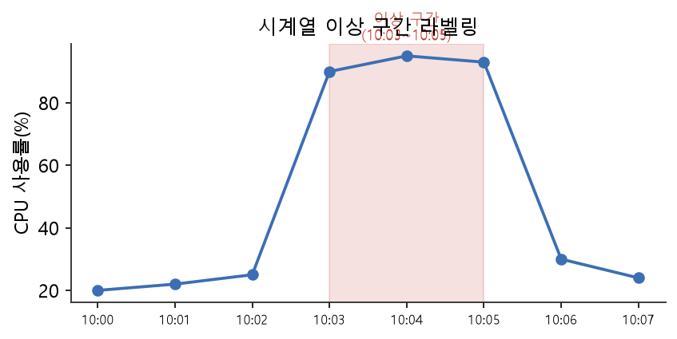

# 11주차 이론 — 텍스트·시계열 라벨링

## 글과 시간에도 정답을 붙입니다 {#sec-w11t-intro}

10주차에서 이미지에 라벨을 붙였다면, 이번 주에는 텍스트와 시계열에 라벨을 붙입니다. 이 둘은 이미지와 달리 "순서"가 중요한 데이터입니다. 글자는 왼쪽에서 오른쪽으로 이어지고, 시계열은 과거에서 미래로 흐릅니다. 이미지가 2차원 평면 위에 펼쳐진 데이터라면, 텍스트와 시계열은 하나의 선을 따라 이어지는 1차원 데이터입니다.

순서가 중요하다는 것은 단순히 데이터가 일렬로 늘어서 있다는 뜻을 넘어, 앞뒤의 맥락이 의미를 만든다는 뜻입니다. 같은 단어라도 앞뒤에 어떤 말이 오는지에 따라 뜻이 달라지고, 같은 값이라도 그 앞에 어떤 흐름이 있었는지에 따라 정상일 수도 이상일 수도 있습니다. 그래서 텍스트와 시계열을 다룰 때는 개별 요소가 아니라 그것이 놓인 맥락을 함께 보아야 합니다. 이 맥락의 중요성이 순서 데이터를 이미지와 구별 짓는 근본적인 특징입니다.

이 순서의 특성 때문에, 텍스트와 시계열의 라벨도 "몇 번째 글자부터 몇 번째 글자까지", "몇 시부터 몇 시까지"처럼 **구간(span)**으로 표시하는 경우가 많습니다. 이것이 이번 주의 핵심 개념입니다. 10주차에서 배운 이미지의 바운딩 박스가 2차원 위의 사각형이었다면, 텍스트와 시계열의 구간은 1차원 위의 선분입니다. 원리는 같지만 차원이 하나 줄어든 것입니다.

챗봇, 번역기, 뉴스 요약, 이상 거래 탐지, 심전도 분석은 모두 텍스트·시계열 라벨링의 결과물입니다. NIA 가이드라인도 텍스트 데이터와 음성·시계열 데이터를 인공지능 학습용 데이터의 주요 유형으로 다룹니다. 이번 주에는 텍스트와 시계열 라벨링의 개념, 구간을 표시하는 방법, 그것을 저장하고 검증하는 스키마를 배우고 SQLite로 구현합니다.

## 텍스트 라벨링의 두 층위 {#sec-w11t-text}

텍스트 라벨링은 크게 두 층위로 나뉩니다.

```{mermaid}
flowchart TB
    T["텍스트 라벨링"] --> D["문서 수준<br/>Document-level"]
    T --> S["구간 수준<br/>Span-level"]
    D --> D1["문장·문서 전체에 라벨<br/>예: 감정=긍정, 주제=스포츠"]
    S --> S1["특정 글자 구간에 라벨<br/>예: 개체명 인식(NER), '서울'=지명"]
```

**문서 수준(document-level)** 라벨링은 문장이나 문서 전체에 라벨 하나를 붙이는 것입니다. 9주차의 분류와 같으며, 10주차의 이미지 분류에 대응합니다. 감정 분석("이 리뷰는 긍정"), 주제 분류("이 기사는 스포츠"), 스팸 판별("이 메일은 스팸")이 여기에 속합니다. 문서 수준 라벨링은 텍스트 전체를 하나의 단위로 보므로 비교적 단순합니다.

**구간 수준(span-level)** 라벨링은 텍스트 안의 특정 구간에 라벨을 붙이는 것입니다. 대표가 **개체명 인식(NER, Named Entity Recognition)**입니다. "삼성전자는 서울에 본사가 있다"라는 문장에서 '삼성전자'는 기관, '서울'은 지명으로 표시합니다. 문서 수준이 "이 문장 전체가 무엇에 관한 것인가"를 답한다면, 구간 수준은 "이 문장의 어느 부분이 무엇인가"를 답합니다. 10주차의 이미지 분류와 객체 검출의 관계와 정확히 같습니다.

## 문자 오프셋 — 텍스트의 좌표 {#sec-w11t-offset}

구간 수준 라벨은 텍스트에서 구간의 **시작 위치와 끝 위치**를 숫자로 기록합니다. 이 위치를 **문자 오프셋(character offset)**이라고 합니다. 문자 오프셋은 "문장의 처음부터 몇 번째 글자인가"를 나타내는 번호입니다. 보통 첫 글자를 0번으로 세기 시작합니다.

예를 들어 "삼성전자는 서울에"라는 문장에서 '삼성전자'는 0번째 글자부터 시작해 4번째 글자 직전까지이므로 `(0, 4)`로 표시하고, '서울'은 6번째부터 8번째 직전까지이므로 `(6, 8)`로 표시합니다. 이렇게 두 숫자로 구간을 정확히 지정할 수 있습니다. 10주차의 바운딩 박스가 이미지의 `(x, y, w, h)`였다면, 텍스트의 구간은 `(start, end)`인 셈입니다. 텍스트는 1차원이라 좌표가 두 개면 충분합니다.

문자 오프셋을 이해하는 것은 텍스트 라벨링의 핵심입니다. 오프셋이 정확해야 라벨이 올바른 글자를 가리키기 때문입니다. 만약 오프셋이 한 글자라도 어긋나면, 라벨이 '서울'이 아니라 '서울에'나 '울'을 가리키게 되어 라벨이 망가집니다. 그래서 텍스트 라벨링에서는 오프셋을 정확히 다루는 것이 무엇보다 중요합니다. 오프셋은 사람이 눈으로 확인하기 어려운 숫자라, 이미지의 박스처럼 화면에서 한눈에 틀렸는지 보이지 않습니다. 박스는 엉뚱한 곳에 그려지면 사람이 바로 알아채지만, 오프셋이 하나 어긋난 것은 숫자만 봐서는 알 수 없습니다. 이 눈에 보이지 않는 특성 때문에, 텍스트 라벨링에서는 오프셋을 자동으로 검증하는 장치가 특히 중요합니다.

## 시계열 라벨링 — 시간 구간에 표시하기 {#sec-w11t-timeseries}

시계열(time series)은 시간에 따라 값이 변하는 데이터입니다. 심박수, 주가, 서버 CPU 사용률, 공장 센서 값이 모두 시계열입니다. 시계열은 시간이라는 하나의 축을 따라 값이 이어지므로, 텍스트처럼 1차원 데이터입니다.

{#fig-w11-ts width=86%}

시계열 라벨링에서 가장 흔한 것은 **이벤트·이상 구간 표시**입니다. "몇 시 몇 분부터 몇 시 몇 분까지 이상이 있었다"를 시간 구간으로 기록합니다. 예를 들어 서버 CPU 사용률이 특정 시간대에 비정상적으로 치솟았다면, 그 구간을 "이상"으로 표시합니다. 심전도에서 부정맥이 나타난 구간, 주가가 급변한 구간을 표시하는 것도 같은 방식입니다.

텍스트의 `(start, end)`가 글자 위치였다면, 시계열의 구간은 **시작 시각과 끝 시각**입니다. 발상은 완전히 동일합니다. "구간에 라벨을 붙인다"는 원리가 텍스트와 시계열을 관통합니다. 이런 시간 구간 라벨은 이상 탐지 모델의 정답이 됩니다. 모델은 이 라벨을 보고 "이런 패턴이 나타나면 이상"이라는 규칙을 배웁니다.

## 하나의 원리, 세 가지 데이터 {#sec-w11t-unified}

지금까지 배운 것을 종합하면, 라벨링에는 하나의 통일된 원리가 흐릅니다. 바로 "구간에 라벨을 붙인다"는 것입니다. 이미지에서는 2차원 사각형 구간(바운딩 박스)에, 텍스트에서는 1차원 글자 구간(오프셋)에, 시계열에서는 1차원 시간 구간(시각)에 라벨을 붙입니다. 데이터의 종류는 다르지만 원리는 하나입니다.

이 통일된 관점은 라벨링을 훨씬 쉽게 이해하게 해 줍니다. 새로운 종류의 데이터를 만나도, "이 데이터에서 구간은 어떻게 표현되는가"와 "그 구간에 어떤 라벨을 붙일 것인가"만 정하면 됩니다. 음성 데이터라면 시간 구간에 "이 부분은 어떤 소리"라고 붙이고, 3차원 데이터라면 3차원 구간에 라벨을 붙입니다. 이렇게 하나의 원리로 여러 데이터를 다룰 수 있다는 것이, 라벨링의 아름다움입니다.

그리고 이 구간들은 모두 숫자로 표현되므로, 관계형 데이터베이스로 똑같이 다룰 수 있습니다. 이미지 박스든 텍스트 오프셋이든 시계열 시각이든, "어느 원본의, 어느 구간에, 어떤 라벨이 붙었는가"를 테이블로 저장합니다. 그래서 우리가 배우는 라벨 스키마 설계는 데이터의 종류를 가리지 않고 적용됩니다. 이 보편성이 SQL로 라벨을 다루는 것의 큰 장점입니다.

## 구간 라벨을 SQLite로 저장하기 {#sec-w11t-schema}

텍스트 NER과 시계열 이벤트 모두, 구간의 시작·끝과 라벨을 저장하면 됩니다. 텍스트용 스키마를 보겠습니다.

```{mermaid}
erDiagram
    DOCUMENTS ||--o{ SPANS : "한 문서에 여러 구간"
    ENTITY_TYPES ||--o{ SPANS : "구간마다 개체 유형"
    DOCUMENTS { int doc_id  text content }
    ENTITY_TYPES { int type_id  text type_name }
    SPANS { int span_id  int doc_id  int type_id  int start  int end  text surface }
```

이 구조는 9주차와 10주차의 스키마와 같은 발상입니다. **DOCUMENTS**는 라벨을 붙일 원본 문서를 담고, **ENTITY_TYPES**는 라벨 체계(기관·지명·인물 등)를 담으며, **SPANS**는 각 구간의 정보를 담습니다. `SPANS` 테이블의 `start`와 `end`가 문자 오프셋이고, `surface`는 그 구간의 실제 글자('서울')를 편의상 함께 저장한 것입니다.

`surface`를 함께 저장하는 데는 이유가 있습니다. 사람이 데이터를 볼 때 오프셋 숫자만으로는 무엇을 가리키는지 알기 어렵지만, 실제 글자가 함께 있으면 한눈에 이해할 수 있습니다. 또한 나중에 배울 오프셋 검증에도 이 `surface`가 쓰입니다. 시계열도 이 구조에서 `start`와 `end`를 글자 위치 대신 시각으로 바꾸기만 하면 같은 스키마가 됩니다. 하나의 설계가 여러 데이터에 적용되는 것입니다.

## 오프셋 정합성 검증 {#sec-w11t-verify}

텍스트 라벨링에서 가장 중요한 검증이 **오프셋 정합성 검증**입니다. 저장한 오프셋이 실제로 올바른 글자를 가리키는지 확인하는 것입니다. 앞서 강조했듯, 오프셋이 한 글자만 어긋나도 라벨이 망가지므로 이 검증은 필수입니다.

검증 방법은 간단합니다. 저장한 오프셋으로 원본 문서에서 그 구간의 글자를 잘라내어, 함께 저장한 `surface`와 같은지 비교하는 것입니다. 파이썬에서는 문자열의 특정 구간을 잘라내는 기능으로 이를 쉽게 할 수 있습니다. 잘라낸 글자가 `surface`와 같으면 오프셋이 정확한 것이고, 다르면 오프셋에 오류가 있는 것입니다. 이는 7주차에서 배운 검증을 텍스트 라벨에 적용한 예입니다.

또한 스키마 수준에서도 유효성을 강제할 수 있습니다. 구간의 끝이 시작보다 앞에 있으면 잘못된 구간이므로, `CHECK(end > start)` 같은 제약으로 이를 막습니다. 이런 유효성 점검들이 쌓여야 라벨의 정확성이 지켜집니다. 텍스트 라벨은 눈에 잘 안 보이는 오프셋 숫자로 이루어져 있어 오류를 놓치기 쉬우므로, 이런 자동 검증이 특히 중요합니다.

## 시간 구간 질의 {#sec-w11t-query}

시계열 라벨을 다룰 때 자주 하는 작업이 **구간 질의**입니다. 라벨이 정의한 시간 구간에 속하는 원시 데이터를 뽑아내는 것입니다. 예를 들어 "10시 3분부터 10시 5분까지 이상"이라는 라벨이 있으면, 그 시간 구간에 속하는 CPU 사용률 값들을 조회합니다.

SQL에서는 `BETWEEN` 구문으로 시간 구간 질의를 합니다. "시각이 시작 시각과 끝 시각 사이에 있는" 데이터를 조회하는 것입니다. 이렇게 하면 라벨이 가리키는 구간의 실제 데이터를 정확히 뽑아낼 수 있습니다. 이 구간 질의는 텍스트에서 오프셋으로 글자를 잘라내는 것과 완전히 같은 발상입니다. 텍스트에서는 글자 위치로, 시계열에서는 시각으로 구간을 지정해 그 안의 데이터를 꺼내는 것입니다.

구간 질의를 잘 활용하면 라벨의 타당성도 점검할 수 있습니다. 예를 들어 "이상"으로 표시한 구간의 평균값이 정상 구간과 별로 다르지 않다면, 그 라벨이 정말 이상을 잘 잡은 것인지 의심해 볼 수 있습니다. 반대로 이상 구간의 값이 정상과 뚜렷이 다르다면, 라벨이 실제 이상을 잘 포착한 것입니다. 이렇게 구간 질의로 라벨과 데이터를 대조하는 것은, 라벨 품질을 점검하는 실용적인 방법입니다.

구간 질의는 여러 분석에 활용됩니다. 이상 구간과 정상 구간의 값을 비교하거나, 이상 구간의 특징을 분석하거나, 라벨이 실제 데이터와 맞는지 확인하는 데 씁니다. 이렇게 라벨과 원시 데이터를 오가며 분석하는 것이 시계열 라벨링의 실제 작업입니다. 라벨은 원시 데이터 위에 붙은 표시이므로, 둘을 함께 다루어야 의미가 있습니다.

## 텍스트·시계열 라벨링의 어려움 {#sec-w11t-hard}

텍스트와 시계열 라벨링에도 9주차에서 배운 어려움이 나타납니다. 텍스트에서는 구간의 경계를 어디까지로 볼지가 애매합니다. '서울특별시'를 지명으로 볼 때, '서울'까지만 표시할지 '서울특별시' 전체를 표시할지가 작업자마다 다를 수 있습니다. 또한 하나의 구간이 여러 의미를 가질 수도 있어, 어떤 라벨을 붙일지 판단이 필요합니다.

시계열에서는 이상 구간의 시작과 끝을 정확히 어디로 볼지가 어렵습니다. 값이 서서히 오르다가 정점을 찍고 서서히 내려온다면, 어디부터 어디까지를 "이상"으로 볼지 경계가 모호합니다. 이런 애매함은 텍스트의 구간 경계 문제와 비슷합니다. 그래서 텍스트든 시계열이든, 구간의 경계를 어떻게 정할지에 대한 명확한 가이드라인이 필요합니다.

또한 이 두 데이터는 전문성을 요구하는 경우가 많습니다. 의학 텍스트의 개체명을 정확히 표시하려면 의학 지식이, 심전도의 이상 구간을 표시하려면 심장 지식이 필요합니다. 그래서 텍스트·시계열 라벨링에서는 해당 분야의 전문가가 참여하거나, 전문가가 만든 상세한 가이드라인을 따르는 것이 중요합니다. 이는 9주차에서 배운 전문성의 문제가 이 데이터들에서 특히 두드러지는 것입니다.

## 텍스트 라벨링의 여러 종류 {#sec-w11t-texttypes}

텍스트 라벨링은 개체명 인식과 감정 분석 외에도 다양한 종류가 있습니다. 이들을 알아 두면 텍스트 데이터로 어떤 모델을 만들 수 있는지 이해하는 데 도움이 됩니다. 하나는 관계 추출입니다. 텍스트에서 두 개체 사이의 관계를 표시하는 것으로, "삼성전자-서울" 사이에 "본사 위치"라는 관계를 붙이는 식입니다. 이는 개체명 인식에서 한 걸음 더 나아간 것입니다.

또 다른 종류는 텍스트 분류의 여러 변형입니다. 하나의 문서에 하나의 라벨만 붙이는 단일 분류가 있고, 여러 라벨을 동시에 붙일 수 있는 다중 라벨 분류가 있습니다. 예를 들어 뉴스 기사 하나가 "정치"이면서 "경제"일 수 있다면, 두 라벨을 함께 붙입니다. 질의응답을 위한 라벨링도 있는데, 질문에 대한 답이 텍스트의 어느 구간에 있는지를 표시합니다. 이는 개체명 인식과 비슷하게 구간을 표시하지만, 그 구간이 특정 질문의 답이라는 점이 다릅니다.

이렇게 텍스트 라벨링은 풀려는 문제에 따라 여러 형태를 띠지만, 그 바탕에는 두 가지 기본 형태가 있습니다. 문서 전체에 라벨을 붙이는 것과, 특정 구간에 라벨을 붙이는 것입니다. 앞서 배운 다양한 종류들도 결국 이 두 기본 형태의 조합이거나 확장입니다. 그래서 이 두 기본 형태를 정확히 이해하는 것이, 어떤 텍스트 라벨링 과제를 만나도 대처할 수 있는 바탕이 됩니다.

## 텍스트의 특수성 — 토큰과 경계 {#sec-w11t-token}

텍스트 라벨링에는 다른 데이터에 없는 특수한 어려움이 있습니다. 바로 "글자를 어떻게 나눌 것인가"의 문제입니다. 텍스트를 다룰 때는 글자 단위로 볼 수도 있고, 단어 단위로 볼 수도 있습니다. 이렇게 텍스트를 의미 있는 조각으로 나눈 것을 토큰이라고 합니다. 오프셋을 글자 단위로 셀지 토큰 단위로 셀지에 따라 라벨의 표현이 달라집니다.

특히 한국어는 이 문제가 까다롭습니다. 한국어는 조사가 단어에 붙어 있어, "서울에"에서 '서울'만 지명으로 표시하려면 조사 '에'를 어떻게 처리할지 정해야 합니다. 영어와 달리 단어 사이의 경계가 명확하지 않은 경우도 많습니다. 그래서 한국어 텍스트 라벨링에서는 이런 언어적 특성을 고려한 가이드라인이 특히 중요합니다. 어디까지를 하나의 구간으로 볼지에 대한 명확한 규칙이 없으면, 작업자마다 다르게 표시해 라벨이 뒤죽박죽이 됩니다.

이 토큰과 경계의 문제는 오프셋을 다룰 때 늘 신경 써야 할 부분입니다. 어떤 기준으로 오프셋을 세는지를 명확히 하고, 그 기준을 일관되게 적용해야 합니다. 실습에서는 글자 단위 오프셋으로 단순하게 다루지만, 실제 한국어 자연어 처리에서는 형태소 분석 같은 도구로 텍스트를 나눈 뒤 라벨링하는 경우가 많습니다. 텍스트의 이런 특수성을 이해하면, 텍스트 라벨링이 왜 이미지 라벨링과는 또 다른 세심함을 요구하는지 알 수 있습니다.

## 시계열의 특수성 — 연속성과 주기성 {#sec-w11t-tsspecial}

시계열 라벨링에도 특수한 성질이 있습니다. 시계열은 시간에 따라 연속적으로 이어지므로, 한 시점의 값만 보아서는 그것이 이상인지 알기 어렵습니다. 앞뒤 맥락을 함께 보아야 판단할 수 있습니다. 예를 들어 심박수 130은 잠자는 사람에게는 이상이지만 운동하는 사람에게는 정상입니다. 그래서 시계열 라벨링에서는 한 점이 아니라 구간을, 그 앞뒤 맥락과 함께 보아야 합니다.

또한 시계열에는 주기성이 있는 경우가 많습니다. 5주차에서 배웠듯 요일이나 계절에 따라 규칙적으로 오르내리는 패턴이 있습니다. 이런 주기적인 변화는 정상이므로 이상으로 표시하면 안 됩니다. 반대로 이 주기에서 벗어난 변화가 진짜 이상일 수 있습니다. 그래서 시계열 라벨링에서는 정상적인 주기와 진짜 이상을 구분하는 안목이 필요합니다. 이 구분이 어려워서, 시계열 이상 라벨링은 상당한 전문성을 요구합니다.

시계열의 또 다른 특성은 시간 단위의 문제입니다. 같은 데이터라도 초 단위로 볼지 분 단위로 볼지에 따라 이상이 다르게 보입니다. 초 단위로는 정상인 값의 변동이, 시간 단위로 묶으면 이상한 추세로 드러날 수 있습니다. 그래서 시계열을 라벨링할 때는 어떤 시간 단위에서 이상을 판단할지를 먼저 정해야 합니다. 이런 특수성들 때문에 시계열 라벨링은 단순히 값을 보는 것이 아니라, 시간의 흐름 속에서 데이터를 이해하는 작업입니다.

## 라벨과 원본의 연결 관리 {#sec-w11t-link}

텍스트와 시계열 라벨링에서 특히 중요한 것이, 라벨과 원본의 연결을 정확히 관리하는 것입니다. 라벨은 원본의 특정 구간을 가리키므로, 원본이 바뀌면 라벨의 오프셋도 어긋납니다. 예를 들어 텍스트를 정제하며 앞부분의 공백을 지우면, 그 뒤의 모든 오프셋이 밀려 라벨이 엉뚱한 곳을 가리키게 됩니다.

이것은 10주차에서 배운 "이미지와 라벨은 한 몸처럼 움직인다"는 원칙의 텍스트 버전입니다. 텍스트를 수정하면 라벨의 오프셋도 함께 조정해야 합니다. 그래서 텍스트 라벨링에서는 대개 정제를 먼저 완료한 뒤에 라벨을 붙입니다. 라벨을 붙인 다음에 원본을 바꾸면, 모든 라벨의 오프셋을 다시 계산해야 하는 큰 작업이 되기 때문입니다. 6주차에서 텍스트 정제를 신중히 다뤄야 한다고 강조한 이유가 여기에 있습니다.

이 연결 관리의 중요성 때문에, 앞서 배운 오프셋 정합성 검증이 반복적으로 필요합니다. 데이터를 다룰 때마다 "라벨이 여전히 올바른 글자를 가리키는가"를 확인해야 합니다. 라벨과 원본이 어긋나면 그 데이터셋 전체가 쓸모없어지므로, 이 연결을 지키는 것이 텍스트·시계열 라벨링 관리의 핵심입니다. 눈에 잘 안 보이는 오프셋 숫자 뒤에, 이런 세심한 관리가 필요한 것입니다.

## 음성 데이터로의 확장 {#sec-w11t-audio}

텍스트와 시계열 라벨링의 원리는 음성 데이터로도 자연스럽게 확장됩니다. 음성은 시간에 따라 변하는 소리의 파형이므로, 본질적으로 시계열 데이터입니다. 그래서 음성 라벨링도 시간 구간에 라벨을 붙이는 방식으로 이루어집니다. "이 시간 구간에는 어떤 말이 담겨 있다", "이 부분은 웃음소리다", "여기부터 여기까지는 잡음이다"처럼요.

음성 인식 모델을 위한 라벨링은 대개 두 가지를 함께 합니다. 하나는 음성을 글자로 옮기는 것이고, 다른 하나는 각 글자나 단어가 음성의 어느 시간 구간에 해당하는지를 표시하는 것입니다. 앞의 것은 텍스트를 만드는 것이고, 뒤의 것은 시간 구간을 표시하는 것입니다. 그래서 음성 라벨링은 텍스트 라벨링과 시계열 라벨링이 결합된 형태라고 볼 수 있습니다.

이처럼 텍스트, 시계열, 음성은 모두 "순서가 있는 1차원 데이터"라는 공통점을 가지며, 구간에 라벨을 붙인다는 같은 원리로 다룰 수 있습니다. 이 통일된 관점을 이해하면, 새로운 종류의 순서 데이터를 만나도 당황하지 않고 라벨링 방법을 설계할 수 있습니다. 이번 주에 텍스트와 시계열을 배우는 것은, 이 넓은 세계로 들어가는 문을 여는 것입니다.

## 구간 라벨의 표현 형식 {#sec-w11t-format}

텍스트 구간 라벨을 표현하는 방식에도 여러 형식이 있습니다. 우리가 배운 것처럼 시작과 끝 오프셋으로 표현하는 방식이 하나이고, 각 글자나 토큰마다 라벨을 붙이는 방식이 다른 하나입니다. 후자는 각 토큰이 개체명의 시작인지, 안쪽인지, 개체명이 아닌지를 표시하는데, 이를 통해 연속된 토큰들이 하나의 개체를 이루는 것을 나타냅니다.

두 방식은 서로 변환할 수 있습니다. 오프셋으로 표현한 것을 토큰별 라벨로 바꾸거나 그 반대로 할 수 있습니다. 어떤 방식을 쓸지는 다루는 도구나 모델에 따라 다릅니다. 중요한 것은, 어떤 형식이든 결국 "텍스트의 어느 부분이 어떤 개체인가"라는 같은 정보를 담는다는 점입니다. 형식은 표현 방법일 뿐, 그 안에 담긴 라벨의 본질은 같습니다.

이 과목에서는 오프셋 방식을 씁니다. 오프셋 방식이 직관적이고, 관계형 데이터베이스로 다루기에 자연스럽기 때문입니다. 시작과 끝이라는 두 숫자와 라벨을 한 행으로 저장하면, 그것이 곧 하나의 구간 라벨이 됩니다. 이렇게 저장한 라벨은 SQL로 조회하고, 집계하고, 검증할 수 있습니다. 형식의 세부는 도구마다 다르더라도, 구간을 숫자로 표현해 저장한다는 원리는 어디서나 통합니다.

## 시계열 라벨링의 응용 분야 {#sec-w11t-apps}

시계열 라벨링은 매우 다양한 분야에서 쓰입니다. 이 응용들을 살펴보면 시계열 라벨링의 가치를 실감할 수 있습니다. 의료에서는 심전도나 뇌파 같은 생체 신호에 이상 구간을 표시해, 부정맥이나 발작을 자동으로 감지하는 모델을 만듭니다. 이런 모델은 의료진이 놓칠 수 있는 미세한 이상을 잡아내 생명을 구할 수 있습니다.

금융에서는 주가나 거래 데이터에 이상 구간을 표시해, 부정 거래나 시장 조작을 탐지하는 모델을 만듭니다. 제조업에서는 공장 설비의 센서 데이터에 고장 전조를 표시해, 설비가 고장 나기 전에 미리 정비하는 예측 정비 모델을 만듭니다. 이런 모델은 갑작스러운 고장으로 인한 손실을 크게 줄여 줍니다. 이 밖에도 서버 모니터링, 교통 흐름 분석, 에너지 사용 예측 등 수많은 분야에서 시계열 라벨링이 쓰입니다.

이 응용들의 공통점은, 모두 "정상적인 흐름 속에서 특별한 순간을 찾아내는" 문제라는 것입니다. 그리고 그 특별한 순간을 사람이 표시해 준 라벨이 있어야, 모델이 그것을 배울 수 있습니다. 그래서 시계열 라벨링의 품질이 곧 이런 중요한 모델들의 품질을 결정합니다. 눈에 잘 띄지 않는 이 작업이, 실제로는 생명과 재산을 지키는 중요한 역할을 하는 것입니다.

## 텍스트·시계열 데이터와 개인정보 {#sec-w11t-privacy}

텍스트와 시계열 데이터에도 개인정보가 담기기 쉽습니다. 텍스트에는 사람의 이름, 전화번호, 주소 같은 정보가 그대로 담기고, 시계열에는 개인의 건강 상태나 행동 패턴이 담깁니다. 예를 들어 심박수 데이터는 그 사람의 건강 정보이고, 위치 이동 데이터는 그 사람의 사생활입니다. 그래서 2주차에서 배운 개인정보 보호 원칙이 이 데이터들에서도 중요합니다.

텍스트에서 개인정보를 처리하는 흔한 방법은 이름을 다른 이름으로 바꾸거나, 전화번호를 가리는 것입니다. 흥미롭게도 이런 개인정보 탐지 자체가 개체명 인식의 한 응용입니다. 텍스트에서 이름·전화번호·주소 같은 개인정보를 찾아 표시하는 것은, NER로 개인정보를 라벨링하는 것과 같습니다. 그래서 이번 주에 배우는 NER 기술은 개인정보 보호에도 직접 쓰입니다.

시계열 데이터의 개인정보 보호는 조금 더 까다롭습니다. 데이터 자체는 숫자일 뿐이지만, 그것이 특정 개인의 것임을 알 수 있으면 개인정보가 됩니다. 그래서 시계열 데이터를 다룰 때는 그것이 누구의 것인지 식별되지 않도록 관리하고, 필요하면 여러 사람의 데이터를 익명으로 다룹니다. 어떤 데이터를 다루든, 그 안에 담긴 사람을 존중하고 보호하는 것이 데이터 구축자의 변함없는 책임입니다.

## 정리 — 구간에 라벨을 붙인다는 하나의 원리 {#sec-w11t-summary}

11주차에서는 순서가 중요한 데이터인 텍스트와 시계열에 라벨을 붙였습니다. 텍스트 라벨링은 문서 수준(분류)과 구간 수준(NER)으로 나뉘며, 구간은 문자 오프셋 `(start, end)`로 표시합니다. 시계열은 이상·이벤트를 시간 구간 `(start_ts, end_ts)`로 표시합니다. 이미지의 바운딩 박스든, 텍스트의 오프셋이든, 시계열의 시간 구간이든 "구간에 라벨을 붙인다"는 원리는 하나입니다.

SQLite에서는 이를 문서·유형·구간 테이블로 저장하고, 오프셋 정합성 검증과 구간 질의(`BETWEEN`)로 라벨의 정확성을 지킵니다. `CHECK(end > start)` 같은 제약으로 잘못된 구간을 막고, 저장한 오프셋이 실제 글자와 맞는지 확인합니다. 텍스트와 시계열 라벨링에도 경계 사례에 대한 가이드라인과 전문성이 필요합니다. 이 통일된 원리를 이해하면, 어떤 순서 데이터를 만나도 그것에 라벨을 붙이는 방법을 스스로 설계할 수 있습니다. 이미지의 사각형 구간, 텍스트의 글자 구간, 시계열의 시간 구간, 음성의 소리 구간이 모두 하나의 발상에서 나온 형제들임을 알면, 라벨링이라는 넓은 세계가 하나의 지도 위에 정돈됩니다. 데이터의 종류에 압도되지 않고, 그 뒤에 흐르는 공통의 원리를 붙잡는 것, 그것이 이번 주가 전하는 가장 값진 배움입니다.
