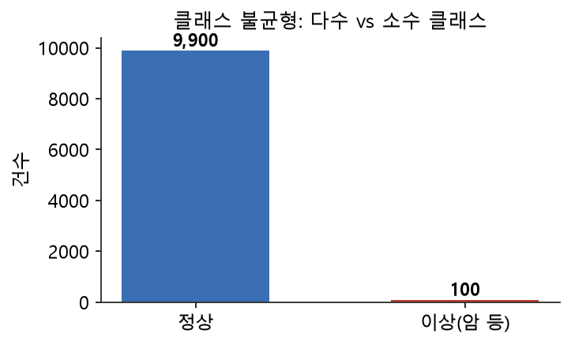
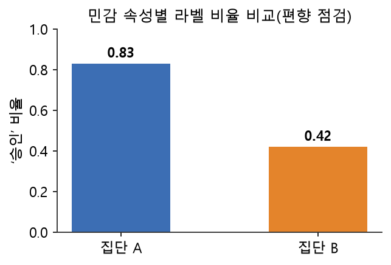

# 12주차 이론 — 데이터셋 검증과 편향 점검

## 라벨을 붙였다고 끝이 아닙니다 {#sec-w12t-intro}

9주차부터 11주차까지 이미지·텍스트·시계열에 라벨을 붙였습니다. 그런데 라벨을 붙였다고 데이터셋이 완성되는 것은 아닙니다. 그 라벨이 믿을 만한지, 그리고 데이터셋이 한쪽으로 치우치지 않았는지를 검증해야 비로소 학습에 쓸 수 있습니다. 이번 주는 라벨링의 마지막 관문인 검증과 편향 점검을 다룹니다.

이것은 시험 채점에 비유할 수 있습니다. 여러 조교가 같은 답안을 채점했는데 점수가 제각각이라면, 그 채점 기준 자체를 신뢰할 수 없습니다. 또 시험 문제가 특정 단원에서만 나왔다면, 그 시험은 학생의 실력을 공정하게 재지 못합니다. 데이터 라벨링도 똑같습니다. 작업자마다 라벨이 다르면 라벨을 믿을 수 없고, 데이터가 특정 집단에 쏠려 있으면 모델이 불공정해집니다.

NIA 가이드라인은 이 두 가지를 각각 품질검증(정확성)과 다양성 지표로 관리합니다 [@nia2026guide]. 라벨링이 데이터에 정답을 붙이는 작업이었다면, 검증은 그 정답이 정말 믿을 만한지를 따지는 작업입니다. 붙이는 것과 따지는 것은 다른 능력이며, 좋은 데이터셋은 이 두 가지가 모두 갖추어질 때 완성됩니다. 이번 주에는 라벨의 신뢰성을 재는 작업자 간 일치도, 데이터의 균형을 보는 클래스 분포, 그리고 데이터의 공정성을 보는 편향 점검을 배우고, 이 모든 것을 SQL로 측정합니다. 라벨링을 신뢰할 수 있는 데이터셋으로 완성하는 것이 이번 주의 목표입니다.

## 작업자 간 일치도 — 라벨을 믿을 수 있는가 {#sec-w12t-agreement}

같은 데이터를 여러 작업자가 라벨링하게 한 뒤, 그들의 판단이 얼마나 일치하는지를 재는 것이 **작업자 간 일치도(IAA, Inter-Annotator Agreement)**입니다. 일치도가 높으면 "누가 봐도 같은 답이 나온다"는 뜻이므로 라벨을 신뢰할 수 있습니다. 일치도가 낮으면 가이드라인이 모호하거나 작업이 너무 주관적이라는 신호입니다 [@artstein2008inter].

일치도는 왜 중요할까요? 9주차에서 배웠듯 라벨은 사람의 판단이 담긴 것이고, 사람마다 판단이 다를 수 있습니다. 만약 같은 데이터에 대해 작업자들이 전혀 다른 라벨을 붙인다면, 그 라벨을 정답으로 믿을 수 없습니다. 반대로 작업자들이 대체로 같은 라벨을 붙인다면, 그 라벨은 개인의 주관이 아니라 어느 정도 객관적인 판단이라고 볼 수 있습니다. 그래서 일치도는 라벨의 신뢰성을 재는 척도가 됩니다.

여기서 한 가지 짚어 둘 것은, 낮은 일치도가 반드시 작업자의 잘못은 아니라는 점입니다. 일치도가 낮다는 것은 그 작업 자체가 어렵거나 애매하다는 신호일 수 있습니다. 예를 들어 어떤 문장이 비꼬는 것인지 진심인지는 원래 판단이 갈리는 문제이므로, 일치도가 낮게 나오는 것이 당연합니다. 그래서 일치도를 해석할 때는 "작업자가 부주의했는가"뿐 아니라 "이 작업이 본래 어려운가"도 함께 생각해야 합니다. 낮은 일치도가 나오는 데이터는, 그 자체로 "이 문제는 사람도 판단하기 어렵다"는 귀중한 정보를 담고 있습니다.

일치도가 낮게 나오면 여러 조치를 취합니다. 가이드라인이 애매한 부분을 보완하거나, 작업자를 재교육하거나, 판단이 특히 어려운 데이터는 전문가가 다시 검토합니다. 이렇게 일치도를 재고 개선하는 과정을 통해 라벨의 품질이 높아집니다. 일치도 측정은 단순한 평가가 아니라, 라벨링을 개선하는 나침반 역할을 합니다.

## 단순 일치율의 함정과 카파 {#sec-w12t-kappa}

일치도를 재는 가장 단순한 지표는 **단순 일치율(percent agreement)**입니다. 두 작업자가 같은 라벨을 붙인 비율입니다. 예를 들어 10건 중 8건에서 두 사람의 라벨이 같으면 단순 일치율은 80%입니다. 간단하고 직관적이지만, 이 지표에는 함정이 있습니다. 바로 우연히 맞을 수도 있다는 점입니다.

예를 들어 두 작업자가 모두 아무 생각 없이 '긍정'만 찍는다고 해 봅시다. 그러면 둘의 라벨은 항상 같으므로 단순 일치율은 100%가 됩니다. 하지만 이 100%는 두 사람이 진짜로 일치해서가 아니라, 그저 둘 다 같은 것만 찍었기 때문입니다. 이런 우연에 의한 일치를 걸러 내지 못하면, 일치도를 과대평가하게 됩니다.

그래서 우연에 의한 일치를 걷어낸 지표가 필요합니다. 그것이 **코헨의 카파(Cohen's Kappa)**입니다 [@cohen1960coefficient].

코헨의 카파는 관측 일치율 $p_o$와 우연 일치율 $p_e$로부터 다음과 같이 정의됩니다.

$$
\kappa = \frac{p_o - p_e}{1 - p_e}
$$ {#eq-kappa}

::: {.eqnote}
- $p_o$: **관측 일치율** — 실제로 두 작업자의 라벨이 같았던 비율
- $p_e$: **우연 일치율** — 두 사람이 순전히 우연으로 같은 라벨을 붙일 확률
- 분자 $p_o - p_e$는 "우연을 넘어선 일치", 분모 $1 - p_e$는 "우연을 넘어설 수 있는 최대치"입니다. 그 비율이 카파입니다.
:::

@eq-kappa 에서 $p_o$는 실제로 두 작업자의 라벨이 같은 비율이고, $p_e$는 두 작업자가 순전히 우연으로 같은 라벨을 붙일 확률입니다. 카파 값은 보통 다음과 같이 해석합니다: $\kappa < 0.2$ 미약, $0.2\text{–}0.4$ 보통, $0.4\text{–}0.6$ 중간, $0.6\text{–}0.8$ 상당, $0.8\text{–}1.0$ 거의 완벽.

## 카파를 이해하기 {#sec-w12t-kappa2}

코헨의 카파는 "관측된 일치율에서 우연히 일치할 확률을 뺀 뒤, 그것을 우연을 넘어설 수 있는 최대치로 나눈" 값입니다. 공식으로는 카파 = (관측 일치율 − 우연 일치율) / (1 − 우연 일치율)입니다. 여기서 관측 일치율은 실제로 두 사람의 라벨이 같은 비율이고, 우연 일치율은 두 사람이 순전히 우연으로 같은 라벨을 붙일 확률입니다.

카파 값의 의미는 이렇습니다. 카파가 1이면 두 사람이 완벽하게 일치한 것이고, 0이면 우연 수준으로만 일치한 것이며, 음수면 우연보다도 못하게 어긋난 것입니다. 보통 카파가 0.6 이상이면 쓸 만한 라벨로 봅니다 [@artstein2008inter]. 카파를 해석하는 구간(미약·보통·중간·상당·거의 완벽)이 있어, 라벨의 신뢰 수준을 판단하는 기준이 됩니다.

카파의 핵심 발상은 "쉬운 문제에서의 일치는 덜 쳐주고, 어려운 문제에서의 일치를 더 쳐준다"는 것입니다. 라벨이 두 종류뿐이면 아무렇게나 찍어도 절반은 우연히 맞으므로, 이런 상황에서의 80% 일치는 그리 대단하지 않습니다. 카파는 이 우연의 몫을 빼줌으로써, 진짜 실력 있는 일치만을 측정합니다. 그래서 단순 일치율보다 카파가 라벨의 신뢰성을 더 공정하게 평가합니다.

## 최종 라벨을 정하기 {#sec-w12t-final}

여러 작업자가 붙인 라벨에서 하나의 최종 라벨을 어떻게 정할까요? 9주차에서도 언급한 **다수결(majority vote)**이 흔히 쓰입니다. 같은 데이터에 대해 여러 작업자가 붙인 라벨 중 가장 많은 것을 최종 라벨로 삼는 것입니다. 다수결은 개별 작업자의 실수나 편향을 상쇄해, 한 사람의 판단보다 신뢰할 만한 결과를 만듭니다.

하지만 다수결에도 한계가 있습니다. 다수가 같은 오해를 하는 경우에는 다수결도 틀립니다. 또한 판단이 팽팽하게 갈리는 데이터는 다수결로도 결정하기 어렵습니다. 이런 경우에는 전문가가 **판정(adjudication)**을 합니다. 전문가가 여러 라벨을 검토해 최종 판단을 내리는 것입니다. 판단이 크게 갈리는 데이터일수록 이런 신중한 판정이 필요합니다.

여기서 9주차에서 배운 "단일 정답은 환상"이라는 통찰이 실천됩니다 [@aroyo2015truth]. 하나의 절대적 정답을 억지로 만드는 것이 아니라, 여러 판단을 종합하고 신중히 조율해 신뢰할 만한 라벨을 만들어 가는 것입니다. 그리고 판단이 크게 갈린다는 것 자체가 그 데이터가 어렵거나 애매하다는 정보이므로, 이를 기록해 두면 나중에 모델이 그 데이터에서 어려움을 겪을 것을 예측할 수 있습니다.

## 클래스 균형 — 데이터가 골고루 있는가 {#sec-w12t-balance}

라벨 검증의 두 번째 축은 **클래스 균형(class balance)**입니다. 각 라벨(클래스)의 데이터 수가 심하게 차이 나는 것을 **클래스 불균형(class imbalance)**이라고 합니다. 예를 들어 암 진단 데이터에서 정상이 9,900건, 암이 100건이라면, 두 클래스의 비율이 99대 1로 크게 치우쳐 있습니다.

{#fig-w12-imb width=66%}

클래스 불균형이 왜 문제일까요? @fig-w12-imb 처럼 극심하게 치우친 데이터로 학습한 모델은 무조건 "정상"이라고만 답해도 99%의 정확도를 얻습니다. 하지만 정작 중요한 암은 하나도 못 잡습니다. 모델이 다수 클래스에만 치우쳐, 소수 클래스를 무시하게 되는 것입니다. 그런데 많은 경우 우리가 정말 찾고 싶은 것은 그 드문 소수 클래스입니다. 암, 부정 거래, 설비 고장은 모두 드물지만 놓치면 안 되는 것들입니다 [@geron2022hands].

불균형을 진단하는 것은 간단합니다. 9주차에서 배운 라벨 분포 집계, 즉 `GROUP BY`로 각 클래스의 개수를 세는 것이 바로 그것입니다. 이렇게 분포를 보면 어느 클래스가 지나치게 적은지 한눈에 알 수 있습니다. 불균형을 완화하는 방법은 13주차에서 다룰 오버샘플링·언더샘플링과 연결됩니다. 검증 단계에서는 우선 불균형이 있는지, 얼마나 심한지를 파악하는 것이 목표입니다.

## 편향 점검 — 데이터가 공정한가 {#sec-w12t-bias}

라벨 검증의 세 번째 축은 **편향(bias)** 점검입니다. 편향은 데이터가 특정 집단(성별·연령·지역 등)에 치우쳐, 모델이 일부 집단에게 불리하게 작동하는 문제입니다. 이는 1주차의 다양성 지표와 직결됩니다.

편향의 위험은 실제 사례로 잘 드러납니다. 얼굴 인식 데이터의 대부분이 특정 인종·연령이면, 다른 집단의 얼굴은 잘 인식하지 못합니다. 실제로 이런 편향이 상용 시스템에서 특정 집단에 대한 심각한 성능 격차를 낳는다는 것이 여러 연구로 밝혀졌습니다 [@sambasivan2021everyone]. 채용 모델이 특정 성별을 불리하게 평가하거나, 대출 심사 모델이 특정 지역을 차별하는 것도 편향된 데이터에서 비롯됩니다. 이런 편향은 실제 사람들의 삶에 부당한 영향을 미치므로, 반드시 점검하고 바로잡아야 합니다.

편향 점검도 결국 "민감한 속성별로 데이터 분포를 집계하는 것"입니다. 성별·연령대별로 데이터가 얼마나 있는지, 그리고 각 집단의 라벨 분포가 비슷한지를 `GROUP BY`로 확인합니다. @fig-w12-bias 처럼 집단별로 특정 라벨의 비율을 나란히 비교하면, 편향을 한눈에 발견할 수 있습니다.

{#fig-w12-bias width=60%} 특히 유용한 것이 "집단별로 특정 라벨의 비율"을 비교하는 것입니다. 예를 들어 남성의 합격 비율과 여성의 합격 비율이 크게 다르다면, 데이터나 라벨에 성별 편향이 있는지 의심해야 합니다. SQL에서는 조건을 만족하는 비율을 구하는 방법으로 이를 계산할 수 있습니다.

## 편향은 발견이 먼저입니다 {#sec-w12t-note}

편향 점검에서 중요한 태도가 하나 있습니다. 편향을 없앴다고 선언하는 것보다, 편향이 어디에 얼마나 있는지 투명하게 드러내는 것이 먼저라는 점입니다. 사실 모든 데이터에는 어느 정도의 편향이 있습니다. 세상 자체가 균형 잡혀 있지 않으므로, 그것을 담은 데이터도 완벽히 균형 잡히기는 어렵습니다.

중요한 것은 그 편향을 숨기지 않고 문서로 남겨, 데이터를 쓰는 사람이 한계를 알고 판단하게 하는 것입니다 [@gebru2021datasheets]. "이 데이터는 20대에 편중되어 있으므로, 노년층에 대한 성능은 낮을 수 있다"는 것을 밝히면, 그 데이터를 쓰는 사람이 이를 감안해 사용할 수 있습니다. 반대로 편향을 숨기면, 그것을 모르는 사람이 부적절한 곳에 데이터를 써서 문제를 일으킵니다.

이것이 2주차에서 배운 데이터시트와 15주차에서 배울 모델 카드의 정신입니다 [@mitchell2019model]. 데이터와 모델의 편향과 한계를 투명하게 기록하는 것입니다. 편향을 완전히 없애는 것은 어렵지만, 편향을 인식하고 드러내고 관리하는 것은 할 수 있습니다. 이것이 책임 있는 데이터 구축의 자세이며, 신뢰할 수 있는 인공지능을 위한 필수 과제입니다.

## 여러 작업자와 여러 데이터 유형의 일치도 {#sec-w12t-multi}

지금까지는 두 작업자 사이의 일치도를 이야기했지만, 실제로는 세 명 이상의 작업자가 참여하는 경우가 많습니다. 여러 작업자 사이의 일치도를 재는 지표도 있습니다. 이는 두 사람의 카파를 여러 사람으로 확장한 것으로, 여러 명이 얼마나 고르게 일치하는지를 하나의 숫자로 나타냅니다. 작업자가 많을수록 개인의 편향이 상쇄되지만, 그만큼 일치도를 관리하기도 복잡해집니다.

일치도의 개념은 분류 라벨을 넘어 다른 데이터 유형에도 적용됩니다. 10주차에서 배운 이미지 바운딩 박스의 경우, 두 작업자가 같은 대상에 그린 박스의 IoU가 곧 그들의 일치도입니다. IoU가 높으면 두 사람이 대상의 위치를 비슷하게 본 것이고, 낮으면 다르게 본 것입니다. 11주차에서 배운 텍스트 구간의 경우도, 두 작업자가 표시한 구간이 얼마나 겹치는지로 일치도를 잽니다.

이처럼 일치도는 라벨의 종류에 따라 다른 방식으로 측정되지만, 그 정신은 하나입니다. "여러 사람이 같은 데이터를 보고 얼마나 비슷하게 판단하는가"입니다. 이 일치도가 높아야 라벨을 믿을 수 있습니다. 그래서 어떤 종류의 라벨링을 하든, 여러 작업자의 결과를 비교해 일치도를 재는 것이 라벨 품질 검증의 기본입니다. 일치도가 낮은 부분은 가이드라인을 손보아야 할 신호입니다.

## 라벨 오류를 찾아내기 {#sec-w12t-error}

일치도가 라벨 전반의 신뢰성을 재는 것이라면, 개별 라벨의 오류를 찾아내는 것도 중요한 검증입니다. 9주차에서 보았듯 유명한 데이터셋에도 라벨 오류가 있으며, 이런 오류는 모델 성능과 평가를 왜곡합니다 [@northcutt2021pervasive]. 그래서 라벨 오류를 체계적으로 찾아내는 방법이 필요합니다.

라벨 오류를 찾는 한 방법은 작업자 간 불일치를 살펴보는 것입니다. 여러 작업자의 판단이 크게 갈리는 데이터는 오류일 가능성이 높으므로, 이런 데이터를 우선 검토합니다. 다른 방법은 앞서 배운 유효성 검증입니다. 정의되지 않은 라벨, 범위를 벗어난 값, 오프셋 불일치 같은 명백한 오류를 SQL로 걸러 냅니다. 또한 모델을 활용하기도 합니다. 학습한 모델이 특정 라벨을 강하게 반박한다면, 그 라벨이 틀렸을 수 있으니 검토 대상이 됩니다.

라벨 오류를 완전히 없애기는 어렵지만, 이런 방법들로 오류를 줄일 수 있습니다. 중요한 것은 라벨을 붙이고 나서 그것을 그대로 믿는 것이 아니라, 오류가 있을 수 있다는 전제 아래 검토하는 태도입니다. 특히 모델 학습과 평가에 쓰는 중요한 라벨은 더욱 꼼꼼히 검증해야 합니다. 라벨의 오류 하나가 모델 전체를 흔들 수 있기 때문입니다.

## 편향의 여러 종류 {#sec-w12t-biastypes}

편향은 한 가지가 아니라 여러 형태로 나타납니다. 이를 구분해 이해하면 편향을 더 잘 점검할 수 있습니다. 하나는 선택 편향입니다. 데이터를 모으는 과정에서 특정 집단이 과도하게 많이 또는 적게 포함되는 것으로, 2주차에서 배운 표본 편향이 여기에 해당합니다. 낮 시간에만 데이터를 모으거나 특정 지역에서만 모으면 선택 편향이 생깁니다.

다른 하나는 라벨 편향입니다. 라벨링 과정에서 작업자의 편견이 스며들어, 같은 대상을 집단에 따라 다르게 라벨링하는 것입니다. 9주차에서 배운 것처럼, 무의식적 편견이 라벨에 반영되면 라벨 편향이 됩니다. 또 다른 하나는 역사적 편향입니다. 데이터 자체는 정확하지만 그 데이터가 담은 현실에 이미 불공정이 존재하는 경우입니다. 과거의 채용이 특정 집단에 불리했다면, 그 기록으로 학습한 모델은 그 불공정을 재현합니다.

이렇게 편향은 데이터 수집, 라벨링, 그리고 데이터가 담은 현실 자체 등 여러 지점에서 생깁니다. 그래서 편향 점검은 한 곳만 보아서는 안 되고, 여러 각도에서 살펴야 합니다. 어떤 종류의 편향인지에 따라 대응도 달라집니다. 선택 편향은 더 다양하게 데이터를 모아 완화하고, 라벨 편향은 작업자 교육과 다양한 작업자 구성으로 줄이며, 역사적 편향은 그 존재를 인식하고 신중히 다루어야 합니다. 편향의 종류를 아는 것이 편향에 대응하는 첫걸음입니다.

## 데이터셋 검증의 실무 절차 {#sec-w12t-process}

실무에서 데이터셋 검증은 체계적인 절차로 이루어집니다. 먼저 검증 계획을 세웁니다. 어떤 지표로 무엇을 점검할지, 목표 수준은 얼마인지를 정합니다. 일치도는 얼마 이상이어야 하는지, 클래스 균형은 어느 정도까지 허용하는지, 편향은 어떤 속성에 대해 점검할지를 미리 정합니다. 이는 8주차에서 배운 검증 프레임워크를 라벨 데이터에 적용하는 것입니다.

다음으로 검증을 실행합니다. 여러 작업자의 라벨을 모아 일치도를 계산하고, 클래스 분포를 집계하고, 민감 속성별 분포를 비교합니다. 이 모든 것을 SQL로 측정할 수 있다는 것이 이 과목에서 강조하는 점입니다. 검증 결과가 목표에 미치지 못하면, 그 원인을 찾아 개선합니다. 일치도가 낮으면 가이드라인을 보완하고, 클래스가 불균형하면 부족한 클래스의 데이터를 더 모으거나 13주차의 방법으로 균형을 맞추며, 편향이 발견되면 그 원인에 맞게 대응합니다.

마지막으로 검증 결과를 문서로 남깁니다. 어떤 지표가 어떤 수준이었는지, 어떤 편향이 발견되었는지, 어떻게 대응했는지를 기록합니다. 이 문서가 데이터셋의 품질을 증명하는 근거가 되고, 데이터를 쓰는 사람에게 그 특성과 한계를 알려 줍니다. 이 검증 절차는 NIA 가이드라인의 제3자 품질검증, 그리고 8주차의 1-Cycle 자가점검과 같은 정신을 담고 있습니다. 라벨을 붙이는 것만큼, 그것을 검증하고 기록하는 것이 데이터 구축의 중요한 부분입니다.

## 검증 결과를 어떻게 활용하는가 {#sec-w12t-use}

검증은 그 자체가 목적이 아니라 데이터를 개선하기 위한 것입니다. 그래서 검증 결과를 어떻게 활용하는지가 중요합니다. 일치도 측정 결과는 가이드라인을 개선하는 데 씁니다. 특히 일치도가 낮은 종류의 데이터를 살펴보면, 가이드라인의 어느 부분이 모호한지 알 수 있습니다. 그 부분을 명확히 하면 다음 라벨링의 일치도가 높아집니다.

클래스 균형 점검 결과는 데이터 수집과 증강 계획에 반영합니다. 부족한 클래스를 파악해 그 데이터를 더 모으거나, 13주차의 오버샘플링으로 균형을 맞춥니다. 편향 점검 결과는 데이터의 한계를 문서화하고, 필요하면 부족한 집단의 데이터를 보강하는 데 씁니다. 이렇게 검증 결과가 구체적인 개선 행동으로 이어져야, 검증이 의미가 있습니다.

또한 검증 결과는 데이터셋을 언제 완성으로 볼지 판단하는 기준이 됩니다. 목표한 일치도와 균형과 공정성에 도달하면 데이터셋을 완성으로 보고, 그렇지 않으면 개선을 반복합니다. 이렇게 검증은 라벨링을 "언제 끝내야 하는가"에 대한 답도 제공합니다. 완벽한 데이터는 없지만, 목표한 품질 수준에 도달한 데이터는 만들 수 있습니다. 검증은 그 도달 여부를 판단하는 잣대입니다.

## 불균형이 생기는 이유와 대응의 원칙 {#sec-w12t-imbalance}

클래스 불균형은 왜 생길까요? 근본 원인은 세상 자체가 불균형하기 때문입니다. 대부분의 거래는 정상이고 부정 거래는 드물며, 대부분의 사람은 건강하고 특정 질병에 걸린 사람은 소수입니다. 그래서 현실을 그대로 담은 데이터는 자연히 불균형해집니다. 이것은 데이터를 잘못 모아서가 아니라, 현실의 반영입니다.

문제는 모델이 이 불균형에 휘둘린다는 것입니다. 모델은 정확도를 높이려 하는데, 불균형 데이터에서는 다수 클래스만 맞혀도 정확도가 높으므로 소수 클래스를 무시하게 됩니다. 그래서 불균형에 대응하려면 두 방향이 있습니다. 하나는 데이터 차원에서 균형을 맞추는 것으로, 소수 클래스를 늘리거나 다수 클래스를 줄이는 것입니다(13주차). 다른 하나는 평가 차원에서 정확도가 아닌 다른 지표를 쓰는 것으로, 소수 클래스를 얼마나 잘 잡는지 보는 지표를 함께 쓰는 것입니다(14주차).

검증 단계에서 중요한 것은, 불균형이 있다는 사실 자체를 명확히 인식하고 기록하는 것입니다. 불균형을 모른 채 모델을 만들면, 높은 정확도에 속아 정작 중요한 소수 클래스를 놓치는 모델을 만들게 됩니다. 반대로 불균형을 알면, 그에 맞는 대응을 할 수 있습니다. 그래서 클래스 분포를 집계해 불균형을 파악하는 것은, 이후 모델링의 방향을 정하는 중요한 정보가 됩니다.

## 편향 완화의 어려움 {#sec-w12t-tradeoff}

편향을 완화하는 것은 생각보다 어렵고 미묘한 문제입니다. 우선 무엇이 "공정한가"에 대한 정의가 하나로 정해져 있지 않습니다. 모든 집단이 같은 비율로 포함되는 것이 공정한지, 각 집단에서 같은 성능을 내는 것이 공정한지, 개인을 집단과 무관하게 대하는 것이 공정한지에 따라 서로 다른 답이 나옵니다. 그리고 이 여러 공정성이 동시에 만족되지 못하는 경우도 있습니다.

또한 편향을 줄이려는 조치가 다른 문제를 낳을 수 있습니다. 특정 집단의 데이터를 억지로 늘리면 데이터가 왜곡되고, 민감한 속성을 아예 무시하면 오히려 그 속성과 관련된 불공정을 발견하지 못할 수 있습니다. 그래서 편향 완화는 단순한 기술적 조작이 아니라, 무엇이 공정한지에 대한 신중한 판단이 필요한 문제입니다. 이는 데이터 구축자만의 문제가 아니라, 그 데이터가 쓰이는 사회 전체가 함께 고민해야 할 문제입니다.

그럼에도 데이터 구축자가 할 수 있고 해야 하는 일은 분명합니다. 편향을 측정하고, 드러내고, 기록하는 것입니다. 편향을 완전히 없애지는 못하더라도, 그것을 투명하게 밝히면 데이터를 쓰는 사람이 신중히 판단할 수 있습니다. 편향 문제에서 가장 나쁜 것은 편향이 있다는 것이 아니라, 편향이 있는데도 그것을 모르거나 숨기는 것입니다. 그래서 편향 점검의 첫 번째 목표는 완벽한 공정이 아니라 정직한 투명입니다.

## 검증과 데이터 중심 인공지능 {#sec-w12t-datacentric}

이번 주에 배운 라벨 검증은 데이터 중심 인공지능의 핵심 실천입니다. 모델을 개선하는 데 집중하는 대신, 데이터와 라벨의 품질을 높이는 데 집중하는 관점입니다. 라벨의 일치도를 재고, 오류를 찾고, 불균형과 편향을 점검하는 것은 모두 데이터의 품질을 높이는 활동입니다.

여러 연구가 보여 주듯, 많은 경우 모델을 바꾸는 것보다 데이터의 품질을 높이는 것이 성능을 더 크게 개선합니다 [@northcutt2021pervasive]. 잘못된 라벨을 바로잡고, 불균형을 완화하고, 편향을 줄이면, 같은 모델로도 훨씬 나은 결과를 얻습니다. 그래서 검증은 단순히 문제를 찾는 소극적인 활동이 아니라, 데이터의 가치를 높이는 적극적인 활동입니다.

이 관점은 14주차와도 이어집니다. 14주차에서 우리가 만든 데이터로 모델을 학습해 성능을 볼 때, 성능이 낮으면 모델을 탓하기 전에 데이터를 의심하게 됩니다. 그때 이번 주에 배운 검증이 그 의심에 답을 줍니다. 라벨이 믿을 만한가, 클래스가 균형 잡혀 있는가, 편향은 없는가를 점검함으로써, 성능 문제의 원인을 데이터에서 찾을 수 있습니다. 그래서 라벨 검증은 좋은 모델을 만드는 여정에서 없어서는 안 될 단계입니다.

## SQL로 검증하는 것의 의미 {#sec-w12t-sqlmeaning}

이번 주의 모든 검증, 즉 일치도·균형·편향 점검을 우리는 SQL로 수행합니다. 이것이 왜 중요할까요? 검증이 결국 데이터를 집계하고 비교하는 일이기 때문입니다. 일치도는 두 라벨이 같은 비율을 세는 것이고, 균형은 클래스별 개수를 세는 것이며, 편향은 집단별 비율을 비교하는 것입니다. 이 모든 것이 SQL의 집계와 조건 조회로 표현됩니다.

SQL로 검증을 하면 몇 가지 이점이 있습니다. 데이터가 저장된 곳에서 바로 검증할 수 있어 효율적이고, 검증 쿼리를 저장해 두면 새 데이터에도 반복 적용할 수 있으며, 검증 과정이 코드로 남아 투명합니다. 이는 7주차에서 배운 검증 프레임워크의 정신을 라벨 검증에 적용한 것입니다. "문제를 세는 쿼리"라는 발상이 라벨의 품질을 재는 데도 그대로 쓰이는 것입니다.

그래서 라벨 검증을 SQL로 배우는 것은, 화려한 도구 없이도 데이터의 품질을 스스로 점검할 수 있는 능력을 기르는 것입니다. 어떤 라벨링 도구를 쓰든 그 결과는 결국 구조화된 데이터로 저장되고, 그것을 SQL로 검증할 수 있습니다. 이 능력은 데이터 구축자가 데이터의 품질을 책임지는 데 필요한 핵심 역량입니다. 라벨을 만드는 것에서 나아가 그 라벨의 품질을 스스로 증명할 수 있어야, 비로소 그 데이터를 세상에 내놓을 수 있습니다.

## 정리 — 라벨링을 완성하는 세 가지 검증 {#sec-w12t-summary}

12주차에서는 완성한 라벨 데이터를 세 가지 관점으로 검증했습니다. 첫째, 작업자 간 일치도(IAA)로 라벨을 신뢰할 수 있는지 봅니다. 단순 일치율은 우연을 걸러내지 못하므로 코헨의 카파를 씁니다. 둘째, 클래스 균형을 집계로 점검해 불균형의 위험을 진단합니다. 셋째, 민감 속성별 분포로 편향을 점검하며, 집단별 라벨 비율을 비교합니다.

이 검증들은 라벨링을 신뢰할 수 있는 데이터셋으로 완성하는 마지막 관문입니다. 그리고 그 결과는 데이터시트와 모델 카드로 투명하게 기록되어야 합니다. 편향은 완전히 없애기 어렵지만, 발견하고 드러내고 관리하는 것이 책임 있는 태도입니다. 라벨을 붙이는 것에서 그 라벨을 검증하고 그 한계를 밝히는 것까지 나아가야, 비로소 신뢰할 수 있는 학습 데이터셋이 완성됩니다. 검증받지 않은 라벨은 겉보기에 완성되어 보여도 실은 미완성이며, 검증을 거쳐 그 품질이 증명된 라벨만이 안심하고 모델 학습에 쓸 수 있는 진짜 완성품입니다.

## 참고문헌 {#sec-w12t-refs}

1. Cohen, J. (1960). A Coefficient of Agreement for Nominal Scales. *Educational and Psychological Measurement*, 20(1), 37–46.
2. Artstein, R., & Poesio, M. (2008). Inter-Coder Agreement for Computational Linguistics. *Computational Linguistics*, 34(4), 555–596.
3. Fleiss, J. L. (1971). Measuring Nominal Scale Agreement Among Many Raters. *Psychological Bulletin*, 76(5).
4. Landis, J. R., & Koch, G. G. (1977). The Measurement of Observer Agreement for Categorical Data. *Biometrics*, 33(1), 159–174.
5. Krippendorff, K. (2018). *Content Analysis: An Introduction to Its Methodology* (4th ed.). SAGE.
6. Aroyo, L., & Welty, C. (2015). Truth Is a Lie. *AI Magazine*, 36(1).
7. Sambasivan, N., et al. (2021). Data Cascades in High-Stakes AI. *ACM CHI*.
8. Buolamwini, J., & Gebru, T. (2018). Gender Shades. *ACM FAT\**.
9. Mehrabi, N., et al. (2021). A Survey on Bias and Fairness in Machine Learning. *ACM Computing Surveys*, 54(6).
10. Barocas, S., Hardt, M., & Narayanan, A. (2019). *Fairness and Machine Learning*. fairmlbook.org.
11. Suresh, H., & Guttag, J. (2021). A Framework for Understanding Sources of Harm Throughout the ML Life Cycle. *ACM EAAMO*.
12. Mitchell, M., et al. (2019). Model Cards for Model Reporting. *ACM FAT\**.
13. Gebru, T., et al. (2021). Datasheets for Datasets. *Communications of the ACM*, 64(12).
14. He, H., & Garcia, E. A. (2009). Learning from Imbalanced Data. *IEEE TKDE*, 21(9), 1263–1284.
15. Chawla, N. V., et al. (2002). SMOTE: Synthetic Minority Over-sampling Technique. *JAIR*, 16, 321–357.
16. Japkowicz, N., & Stephen, S. (2002). The Class Imbalance Problem. *Intelligent Data Analysis*, 6(5).
17. Géron, A. (2022). *Hands-On Machine Learning* (3rd ed.). O'Reilly Media.
18. 한국지능정보사회진흥원(NIA). (2026). *인공지능 학습용 데이터 품질관리 가이드 v4.0 — 제1권*.
19. Hripcsak, G., & Rothschild, A. S. (2005). Agreement, the F-Measure, and Reliability. *JAMIA*, 12(3).
20. Passonneau, R. J., & Carpenter, B. (2014). The Benefits of a Model of Annotation. *TACL*, 2.
21. Northcutt, C. G., et al. (2021). Pervasive Label Errors in Test Sets. *NeurIPS Datasets and Benchmarks*.
22. Paullada, A., et al. (2021). Data and Its (Dis)contents. *Patterns*, 2(11).
23. scikit-learn developers. *sklearn.metrics.cohen_kappa_score*. <https://scikit-learn.org>
