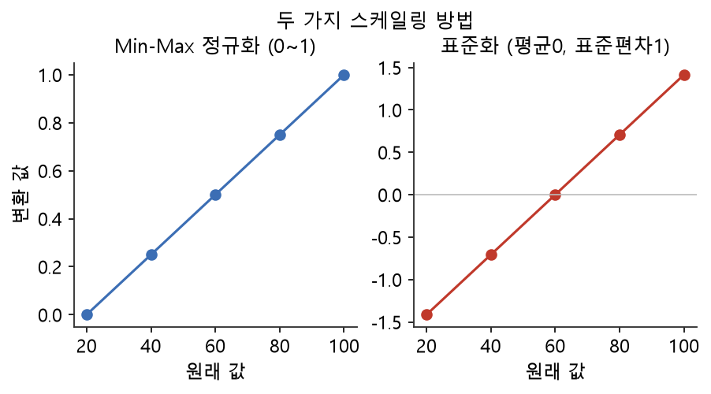
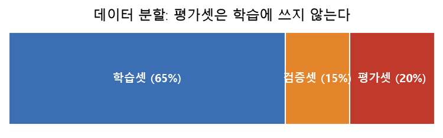

# 13주차 이론 — 모델링 준비 (인코딩·스케일링·특성공학)

## 데이터를 모델이 먹기 좋게 손질합니다 {#sec-w13t-intro}

12주차까지 우리는 신뢰할 수 있는 라벨 데이터셋을 완성했습니다. 이제 이 데이터를 모델에게 먹이기 직전의 마지막 손질을 합니다. 아무리 좋은 재료라도 통째로는 조리할 수 없듯이, 데이터도 모델이 이해할 수 있는 형태로 다듬어야 합니다. 이번 주에는 네 가지 손질법을 배웁니다. 인코딩, 스케일링, 특성 공학, 데이터 증강입니다. 이 과정을 통틀어 특성 준비 또는 넓게 전처리(preprocessing)라고 부릅니다.

이 손질이 왜 필요한지 이해하려면, 모델이 데이터를 어떻게 받아들이는지 알아야 합니다. 중요한 사실이 하나 있습니다. 머신러닝 모델은 대부분 숫자만 먹습니다. "서울", "남성", "긍정" 같은 글자는 그대로 넣을 수 없습니다. 모델은 숫자를 계산해 규칙을 배우는 기계이므로, 모든 입력이 숫자여야 합니다. 그래서 글자로 된 데이터를 숫자로 바꾸는 작업이 필요합니다.

또 하나 중요한 사실은, 모델이 값의 크기 차이에 민감하다는 것입니다. 나이(0~100)와 연봉(0~1억)이 한 데이터에 섞여 있으면, 숫자가 훨씬 큰 연봉에만 모델이 휘둘려 나이의 영향을 무시합니다. 그래서 값들의 크기 범위를 비슷하게 맞추는 작업도 필요합니다. 이 두 가지 문제, 즉 글자를 숫자로 바꾸는 것과 크기를 맞추는 것을 푸는 것이 인코딩과 스케일링입니다. 여기에 더해, 데이터에서 더 유용한 정보를 뽑아내는 특성 공학과, 데이터를 보강하는 증강까지 합쳐 네 가지 손질을 이번 주에 배웁니다. 이 손질들은 모두 하나의 목표를 향합니다. 라벨까지 완성된 데이터를 모델이 가장 잘 배울 수 있는 형태로 바꾸는 것입니다.

```{mermaid}
flowchart LR
    R["라벨 완료 데이터"] --> E["① 인코딩<br/>범주→숫자"]
    E --> S["② 스케일링<br/>크기 통일"]
    S --> F["③ 특성 공학<br/>새 변수 생성"]
    F --> A["④ 증강·균형<br/>데이터 보강"]
    A --> M["모델 학습 입력"]
    style M fill:#e8f5e9
```

## 인코딩 — 글자를 숫자로 {#sec-w13t-encoding}

범주형(글자) 데이터를 숫자로 바꾸는 것을 **인코딩(encoding)**이라고 합니다. 대표적인 두 가지 방법이 있습니다.

**라벨 인코딩(label encoding)**은 각 범주에 번호를 매기는 방법입니다. 예를 들어 서울은 0, 부산은 1, 대구는 2로 바꿉니다. 간단하고 직관적입니다. 하지만 이 방법에는 함정이 있습니다. 모델이 "대구(2)가 서울(0)의 두 배"라거나 "부산(1)이 서울과 대구의 중간"이라고 오해할 수 있습니다. 원래 도시 이름에는 크기나 순서가 없는데, 번호를 매기면 마치 순서가 있는 것처럼 보이기 때문입니다. 그래서 라벨 인코딩은 순서가 없는 범주에는 부적합합니다.

**원-핫 인코딩(one-hot encoding)**은 각 범주마다 별도의 0/1 열을 만드는 방법입니다. 예를 들어 도시가 서울·부산·대구 세 종류라면, `서울인가`, `부산인가`, `대구인가`라는 세 개의 열을 만들고, 서울이면 `(1, 0, 0)`, 부산이면 `(0, 1, 0)`으로 표시합니다. 이렇게 하면 각 범주가 독립된 열이 되어, 순서 오해가 생기지 않습니다. 그래서 순서가 없는 범주에는 원-핫 인코딩이 널리 쓰입니다.

| 원본 city | 라벨 인코딩 | 원-핫 (서울, 부산, 대구) |
|---|---|---|
| 서울 | 0 | (1, 0, 0) |
| 부산 | 1 | (0, 1, 0) |
| 대구 | 2 | (0, 0, 1) |

: 두 인코딩 방식 비교 {#tbl-w13-encoding}

SQL에서 원-핫 인코딩은 6주차에서 배운 `CASE WHEN`으로 각 범주의 0/1 열을 만들어 구현합니다. "도시가 서울이면 1, 아니면 0"인 열을 만드는 식입니다.

```sql
-- 원-핫 인코딩: 범주마다 0/1 열을 만든다
SELECT
  CASE WHEN city='서울' THEN 1 ELSE 0 END AS is_seoul,
  CASE WHEN city='부산' THEN 1 ELSE 0 END AS is_busan,
  CASE WHEN city='대구' THEN 1 ELSE 0 END AS is_daegu
FROM customers;
``` 다만 원-핫 인코딩에는 주의점이 있습니다. 범주의 종류가 아주 많으면 열이 그만큼 많아져 데이터가 커집니다. 5주차에서 배운 고유값 개수가 많은 열은 원-핫 인코딩에 부적합하며, 다른 방법을 고민해야 합니다.

## 스케일링 — 크기를 통일하기 {#sec-w13t-scaling}

숫자 열들의 크기 범위를 비슷하게 맞추는 것을 **스케일링(scaling)**이라고 합니다. 대표적인 두 방법이 있습니다.

**최소-최대 정규화(Min-Max)**는 모든 값을 0에서 1 사이로 밀어 넣는 방법입니다. 어떤 값 $x$는 다음과 같이 변환됩니다.

$$
x' = \frac{x - x_{\min}}{x_{\max} - x_{\min}}
$$ {#eq-minmax}

@eq-minmax 에서 가장 작은 값은 0, 가장 큰 값은 1이 되고, 나머지는 그 사이에 놓입니다. 예를 들어 나이가 20, 40, 60이라면 Min-Max로는 각각 0, 0.5, 1이 됩니다. 가장 직관적이고 이해하기 쉬운 방법입니다.

**표준화(Standardization, Z-점수)**는 평균 $\mu$를 0, 표준편차 $\sigma$를 1로 맞추는 방법입니다.

$$
z = \frac{x - \mu}{\sigma}
$$ {#eq-zscore}

::: {.eqnote}
- $x$: 원래 값 · $x_{\min}, x_{\max}$: 그 열의 최솟값·최댓값
- $\mu$: 평균 · $\sigma$: 표준편차(퍼진 정도)
- Min-Max는 최소·최대에 맞춰 0~1로, 표준화는 평균·표준편차에 맞춰 "평균에서 몇 표준편차 떨어졌는가"로 바꿉니다.
:::

@eq-zscore 는 각 값이 평균에서 표준편차 몇 배만큼 떨어져 있는지를 나타냅니다. 표준화는 이상값의 영향을 덜 받는다는 장점이 있어, 이상값이 있는 데이터에서 자주 쓰입니다. @fig-w13-scaling 은 같은 값들이 두 방법으로 각각 어떻게 변환되는지 보여 줍니다.

{#fig-w13-scaling width=88%} Min-Max는 최댓값과 최솟값에 좌우되므로 이상값이 하나 있으면 크게 흔들리지만, 표준화는 평균과 표준편차를 쓰므로 상대적으로 안정적입니다.

스케일링이 왜 필요한지 다시 강조하면, 크기가 다른 변수들을 공평하게 다루기 위해서입니다. 나이와 연봉을 그대로 쓰면 모델이 연봉에만 휘둘리지만, 둘 다 비슷한 범위로 맞추면 각 변수가 공평하게 반영됩니다. SQL에서는 5주차에서 배운 것처럼 서브쿼리로 최솟값·최댓값·평균을 구해 스케일링을 계산할 수 있습니다.

## 특성 공학 — 데이터에서 지혜를 뽑기 {#sec-w13t-fe}

**특성 공학(feature engineering)**은 기존 데이터로부터 모델에 도움이 되는 새로운 변수(특성)를 만들어 내는 작업입니다. 종종 "모델보다 특성이 성능을 더 좌우한다"고 할 만큼 중요합니다. 좋은 특성은 데이터에 숨은 패턴을 모델이 쉽게 배우도록 도와줍니다.

특성 공학의 예를 들어 보겠습니다. 생년월일이라는 원본에서 나이를 계산하면, 모델이 쓰기 좋은 새 특성이 됩니다. 키와 몸무게에서 체질량지수(BMI)를 계산하면, 두 값을 합친 새로운 통찰이 담깁니다. 주문일과 가입일에서 가입 후 경과일을 계산하면, 고객의 활동 기간을 나타내는 특성이 됩니다. 총액과 수량에서 단가를 계산하면, 개별 상품의 가격 정보가 드러납니다. 이런 파생 변수는 원본에 없던 통찰을 담습니다.

특성 공학이 강력한 이유는, 사람의 지혜가 데이터에 반영되기 때문입니다. 그 분야를 잘 아는 사람은 "이런 특성이 예측에 도움이 될 것"이라는 직관을 가지고 있고, 그것을 특성으로 만들어 모델에 넣습니다. 예를 들어 부동산 전문가는 "역과의 거리"가 집값에 중요하다는 것을 알고, 그 특성을 만듭니다. 이렇게 특성 공학은 도메인 지식을 모델의 입력으로 옮기는 작업이며, 6주차에서 강조한 도메인 이해가 여기서도 핵심입니다. 흥미로운 점은, 좋은 특성 하나가 복잡한 모델보다 성능을 더 크게 끌어올리는 경우가 많다는 것입니다. 예를 들어 날짜 데이터를 그대로 두면 모델이 활용하기 어렵지만, 거기서 "요일"과 "주말 여부"라는 특성을 뽑아 주면 모델이 요일에 따른 패턴을 쉽게 배웁니다. 사람이 데이터를 이해하고 의미 있는 형태로 가공해 주는 이 작업이, 데이터 구축자가 모델의 성능에 직접 기여하는 중요한 지점입니다. SQL에서는 열끼리 계산하는 표현식으로 이런 파생 변수를 손쉽게 만들 수 있습니다.

## 데이터 증강과 균형 맞추기 {#sec-w13t-augment}

12주차에서 본 클래스 불균형을 완화하는 방법이 여기서 등장합니다. 크게 세 가지가 있습니다.

**오버샘플링(oversampling)**은 적은 클래스의 데이터를 복제하거나 새로 생성해 늘리는 방법입니다. 소수 클래스가 100건이고 다수 클래스가 9,900건이라면, 소수 클래스를 늘려 균형을 맞춥니다. 대표적인 기법으로 소수 클래스의 데이터 사이를 채워 새 데이터를 만드는 방법이 있습니다. **언더샘플링(undersampling)**은 반대로 많은 클래스의 데이터를 줄이는 방법입니다. 다수 클래스에서 일부만 뽑아 소수 클래스와 균형을 맞춥니다. 데이터가 줄어드는 단점이 있지만, 데이터가 충분히 많을 때 유용합니다.

**데이터 증강(data augmentation)**은 원본을 조금씩 변형해 새 데이터를 만드는 방법입니다. 10주차에서 언급했듯 이미지는 회전·좌우반전·밝기 변경으로, 텍스트는 동의어 치환 등으로 변형합니다. 이렇게 하면 적은 원본으로도 다양한 학습 데이터를 얻을 수 있습니다. 증강은 불균형 완화뿐 아니라 데이터의 다양성을 높이는 데도 쓰입니다. 다만 10주차에서 강조했듯, 이미지를 변형할 때는 그 안의 라벨도 함께 변형해야 합니다.

## 학습·검증·평가용으로 나누기 {#sec-w13t-split}

준비된 데이터는 세 덩어리로 나눕니다. 이는 14~15주차 모델링의 필수 전제입니다.

{#fig-w13-split width=88%}

**학습셋(train)**은 모델이 실제로 배우는 데이터입니다. 모델은 이 데이터를 보고 규칙을 익힙니다. **검증셋(validation)**은 모델을 튜닝하고 여러 모델을 비교하는 데 쓰는 데이터입니다. 학습에 직접 쓰지는 않지만, 어떤 설정이 좋은지 고르는 데 씁니다. **평가셋(test)**은 최종 성능을 측정하는 데이터입니다. 학습과 튜닝이 모두 끝난 뒤, 모델이 처음 보는 데이터로 성능을 재는 것입니다.

핵심 원칙은 평가셋을 학습에 절대 쓰지 않는 것입니다. 시험 문제를 미리 보고 공부하면 실력을 정확히 잴 수 없듯이, 모델도 평가셋을 미리 보면 성능이 과대평가됩니다. 이 원칙을 어기는 것을 **데이터 누수(data leakage)**라고 하며, 반드시 피해야 합니다. 데이터 누수는 실무에서 흔한 실수이며, 이것이 있으면 평가 결과를 전혀 믿을 수 없습니다. 그래서 데이터를 나눌 때부터 평가셋을 철저히 격리하는 것이 중요합니다.

## 전처리의 순서와 누수 방지 {#sec-w13t-order}

전처리에서 특히 조심해야 할 것이 데이터 누수입니다. 앞서 배운 스케일링을 예로 들어 보겠습니다. Min-Max 스케일링을 하려면 최솟값과 최댓값이 필요한데, 이 값을 전체 데이터에서 구하면 평가셋의 정보가 학습에 새어 들어갑니다. 평가셋의 최댓값이 스케일링에 반영되면, 모델이 평가셋을 간접적으로 엿본 셈이 되기 때문입니다.

그래서 올바른 순서는 이렇습니다. 먼저 데이터를 학습셋과 평가셋으로 나눕니다. 그다음 스케일링에 필요한 최솟값·최댓값·평균은 오직 학습셋에서만 구합니다. 그리고 그 값을 학습셋과 평가셋 모두에 적용합니다. 이렇게 하면 평가셋의 정보가 학습에 새어 들어가지 않습니다. 인코딩이나 결측 대치도 마찬가지로, 필요한 정보는 학습셋에서만 구해야 합니다.

이 순서의 원칙은 간단하지만 놓치기 쉽습니다. "전체 데이터를 먼저 전처리하고 나중에 나눈다"는 자연스러워 보이는 순서가 사실은 누수를 일으킵니다. 올바른 순서는 "먼저 나누고, 학습셋 기준으로 전처리한다"입니다. 이 원칙을 지켜야 평가 결과를 믿을 수 있습니다. 우리 실습에서는 데이터가 작아 단순하게 다루지만, 이 원칙만은 정확히 이해해 두어야 합니다.

## 특성 선택 — 무엇을 넣고 무엇을 뺄 것인가 {#sec-w13t-selection}

특성 공학이 새로운 특성을 만드는 것이라면, **특성 선택(feature selection)**은 여러 특성 중 무엇을 모델에 넣을지 고르는 것입니다. 특성이 많다고 무조건 좋은 것은 아닙니다. 쓸모없는 특성이 많으면 모델이 그것들에 휘둘려 오히려 성능이 떨어질 수 있고, 학습이 느려지며, 과적합의 위험도 커집니다.

좋은 특성을 고르는 몇 가지 기준이 있습니다. 예측하려는 대상과 관련이 깊은 특성을 고르고, 서로 중복된 정보를 담은 특성은 하나만 남깁니다. 5주차에서 배운 상관 분석이 여기서 쓰입니다. 예측 대상과 상관이 높은 특성은 유용할 가능성이 크고, 서로 강하게 상관된 두 특성은 하나가 다른 하나를 대체할 수 있습니다. 또한 거의 모든 값이 같아 구별 정보가 없는 특성은 제외합니다.

특성 선택은 "많을수록 좋다"는 생각을 버리게 합니다. 정말 필요한 특성만 골라 넣는 것이, 불필요한 것까지 다 넣는 것보다 나은 모델을 만듭니다. 이것은 간결함의 미덕입니다. 특성 공학과 특성 선택은 함께 갑니다. 도움이 될 만한 특성을 만들어 보되, 실제로 도움이 되는 것만 남기는 것입니다. 이 균형을 잘 잡는 것이 전처리의 중요한 기술입니다.

## 결측과 이상값의 최종 처리 {#sec-w13t-missing}

모델에 넣기 전에 결측과 이상값을 반드시 처리해야 합니다. 대부분의 모델은 결측값이 있으면 학습하지 못하기 때문입니다. 5주차와 6주차에서 배운 결측 처리가 여기서 마무리됩니다. 결측을 삭제하거나 대치해, 모든 값이 채워진 상태로 만듭니다.

이상값도 다시 살펴야 합니다. 스케일링을 하기 전에 명백한 이상값을 처리하지 않으면, 그 이상값이 스케일링을 왜곡합니다. 예를 들어 나이에 999 같은 값이 남아 있으면, Min-Max 스케일링에서 그 값이 최댓값이 되어 나머지 값들이 모두 0 근처로 몰립니다. 그래서 이상값을 먼저 처리한 뒤 스케일링하는 순서가 중요합니다. 이는 6주차에서 배운 정제 순서의 연장입니다.

이렇게 전처리는 앞서 배운 정제와 이어지면서도, 모델링을 위한 특별한 요구를 더합니다. 정제가 "데이터를 깨끗하게" 만드는 것이었다면, 전처리는 "모델이 먹을 수 있게" 만드는 것입니다. 깨끗한 데이터라도 글자가 남아 있거나 크기가 제각각이면 모델에 넣을 수 없으므로, 전처리라는 마지막 손질이 필요한 것입니다. 정제와 전처리를 함께 이해하면, 데이터가 원본에서 모델 입력까지 어떻게 변모하는지 전체 흐름이 보입니다.

## 텍스트와 이미지는 어떻게 숫자가 되는가 {#sec-w13t-embed}

지금까지는 주로 표 형태의 데이터를 이야기했지만, 텍스트와 이미지 같은 비정형 데이터도 결국 숫자로 바꿔야 모델에 넣을 수 있습니다. 이 변환은 표 데이터의 인코딩보다 복잡합니다.

텍스트를 숫자로 바꾸는 가장 단순한 방법은 각 단어가 몇 번 나오는지를 세는 것입니다. 문서마다 단어의 등장 횟수를 세어 숫자 벡터로 만드는 것입니다. 더 발전된 방법은 단어나 문장을 의미를 담은 숫자 벡터로 바꾸는 것으로, 비슷한 뜻의 단어가 비슷한 숫자로 표현되게 합니다. 이미지도 마찬가지로, 픽셀 값 자체를 쓰거나 이미지의 특징을 추출한 숫자로 바꿔 모델에 넣습니다.

이런 변환은 이 과목의 범위를 넘어서지만, 그 원리는 우리가 배운 것과 이어집니다. 어떤 데이터든 결국 숫자로 바꿔야 모델이 먹을 수 있다는 것입니다. 표 데이터는 인코딩과 스케일링으로, 텍스트와 이미지는 더 복잡한 변환으로 숫자가 됩니다. 하지만 "모델은 숫자만 먹는다"는 근본 원리는 모든 데이터에 공통입니다. 그래서 표 데이터의 전처리를 정확히 이해하면, 더 복잡한 데이터의 변환도 그 연장선에서 이해할 수 있습니다.

## 데이터를 어떻게 나눌 것인가 {#sec-w13t-splitmethod}

데이터를 학습·검증·평가셋으로 나누는 방법에도 여러 가지가 있습니다. 가장 기본은 무작위로 나누는 것입니다. 전체 데이터를 뒤섞어 정해진 비율로 나눕니다. 이 방법은 간단하고 대부분의 경우에 잘 작동합니다.

하지만 12주차에서 배운 클래스 불균형이 있으면 무작위 분할이 문제가 될 수 있습니다. 소수 클래스가 우연히 평가셋에만 몰리거나 학습셋에서 빠질 수 있기 때문입니다. 이를 막으려면 2주차에서 배운 층화 추출을 씁니다. 각 클래스의 비율이 학습셋과 평가셋에서 같도록 나누는 것입니다. 이렇게 하면 모든 클래스가 각 셋에 고르게 들어갑니다.

시계열 데이터는 또 다릅니다. 11주차에서 배웠듯 시계열은 순서가 중요하므로, 무작위로 섞으면 안 됩니다. 미래의 데이터로 학습해 과거를 예측하는 것은 현실에서 불가능하기 때문입니다. 그래서 시계열은 시간 순서대로 나눕니다. 과거 데이터로 학습하고 미래 데이터로 평가하는 것입니다. 이렇게 데이터의 성격에 따라 분할 방법이 달라지므로, 데이터를 나눌 때도 그 데이터의 특성을 고려해야 합니다.

## 전처리를 재현 가능하게 만들기 {#sec-w13t-repro}

전처리도 6주차에서 배운 정제처럼 재현 가능해야 합니다. 전처리 과정이 코드로 명확히 남아, 같은 데이터에 같은 전처리를 적용하면 항상 같은 결과가 나와야 합니다. 이것이 왜 중요할까요? 새 데이터가 들어왔을 때 같은 전처리를 적용해야 하고, 모델을 실제로 쓸 때 들어오는 데이터에도 학습 때와 똑같은 전처리를 해야 하기 때문입니다.

특히 스케일링과 인코딩은 학습 때 정한 기준을 그대로 저장해 두어야 합니다. 앞서 배웠듯 스케일링에 쓴 최솟값·최댓값은 학습셋에서 구한 것인데, 새 데이터에도 이 같은 값을 써야 합니다. 새 데이터에서 다시 최솟값·최댓값을 구하면, 학습 때와 다른 기준으로 스케일링되어 모델이 혼란스러워합니다. 그래서 전처리의 기준값을 저장하고, 새 데이터에 그것을 재사용하는 것이 중요합니다.

이 재현성은 전처리를 하나의 명확한 절차로 만드는 데서 나옵니다. 각 단계를 코드로 정의하고, 필요한 기준값을 저장하고, 그 절차를 새 데이터에 그대로 적용하는 것입니다. 이는 4주차의 파이프라인, 6주차의 재현 가능한 정제와 같은 정신입니다. 전처리를 즉흥적으로 하지 않고 반복 가능한 절차로 만드는 것이, 학습한 모델을 실제로 쓸 수 있게 하는 조건입니다.

## SQL로 전처리하는 것의 의미 {#sec-w13t-sql}

이 과목에서는 전처리를 주로 SQL로 합니다. 원-핫 인코딩은 `CASE WHEN`으로, 스케일링은 서브쿼리로, 특성 공학은 열끼리의 연산으로 구현합니다. 이것이 가능한 이유는, 전처리의 많은 부분이 데이터를 변환하고 계산하는 일이고, 그것이 바로 SQL이 잘하는 일이기 때문입니다.

SQL로 전처리를 하면 몇 가지 이점이 있습니다. 데이터가 저장된 곳에서 바로 변환할 수 있어 효율적이고, 변환 과정이 쿼리로 남아 재현 가능하며, 대량의 데이터를 한 번에 처리할 수 있습니다. 물론 더 복잡한 전처리는 파이썬의 전용 도구가 편리합니다. 실무에서는 SQL로 기본 변환을 하고, 파이썬으로 정교한 처리를 하는 식으로 둘을 함께 씁니다.

중요한 것은 도구가 아니라 원리를 이해하는 것입니다. 인코딩이 무엇이고 왜 필요한지, 스케일링이 어떻게 작동하는지, 데이터 누수를 어떻게 막는지를 이해하면, 어떤 도구로도 전처리를 할 수 있습니다. SQL로 전처리를 직접 구현해 보면, 그 안에서 실제로 무슨 일이 일어나는지가 손에 잡힙니다. 화려한 도구가 자동으로 해 주는 전처리도, 그 속을 들여다보면 우리가 SQL로 하는 것과 같은 계산입니다. 이 원리를 아는 것이, 전처리를 제대로 다루는 힘입니다.

## 순서가 있는 범주의 인코딩 {#sec-w13t-ordinal}

앞서 라벨 인코딩이 순서 없는 범주에 부적합하다고 했습니다. 그런데 어떤 범주는 실제로 순서가 있습니다. 예를 들어 학점 등급(A, B, C), 만족도(매우 만족, 만족, 보통, 불만족), 크기(대, 중, 소)는 순서가 있는 범주입니다. 이런 범주에는 오히려 순서를 담은 인코딩이 적합합니다.

순서가 있는 범주를 인코딩할 때는 그 순서대로 번호를 매깁니다. "매우 만족=4, 만족=3, 보통=2, 불만족=1"처럼 순서를 반영하는 것입니다. 이렇게 하면 모델이 "매우 만족이 만족보다 크다"는 순서 정보를 활용할 수 있습니다. 순서 없는 범주에 라벨 인코딩을 쓰면 잘못된 순서를 만들지만, 순서 있는 범주에는 순서를 담은 인코딩이 오히려 유용한 것입니다.

그래서 인코딩 방법을 고를 때는 그 범주에 순서가 있는지를 먼저 판단해야 합니다. 순서가 없으면 원-핫 인코딩을, 순서가 있으면 순서를 담은 인코딩을 씁니다. 이 판단은 그 데이터가 무엇을 뜻하는지 알아야 내릴 수 있습니다. 여기서도 6주차에서 강조한 도메인 이해가 중요합니다. 데이터의 의미를 알아야 올바른 전처리를 할 수 있는 것입니다.

## 전처리와 모델의 궁합 {#sec-w13t-modelfit}

어떤 전처리가 필요한지는 어떤 모델을 쓸지에 따라 달라지기도 합니다. 모델마다 데이터를 받아들이는 방식이 다르기 때문입니다. 어떤 모델은 값의 크기에 민감해 스케일링이 꼭 필요하지만, 어떤 모델은 크기에 둔감해 스케일링이 없어도 됩니다. 어떤 모델은 범주를 원-핫 인코딩으로 넣어야 하지만, 어떤 모델은 다른 방식을 선호합니다.

그래서 전처리는 모델과 짝을 이루어 생각해야 합니다. 크기에 민감한 모델을 쓴다면 스케일링을 반드시 하고, 그렇지 않은 모델을 쓴다면 스케일링을 생략할 수도 있습니다. 이런 판단은 모델에 대한 이해가 있어야 내릴 수 있습니다. 이 과목은 데이터 구축에 집중하므로 모델의 세부는 깊이 다루지 않지만, 전처리와 모델이 서로 맞물린다는 점은 알아 두는 것이 좋습니다.

다만 어떤 모델을 쓰든 공통으로 필요한 전처리가 있습니다. 결측 처리, 글자를 숫자로 바꾸는 인코딩, 데이터 누수 방지는 거의 모든 경우에 필요합니다. 이런 기본 전처리를 확실히 익혀 두면, 어떤 모델을 만나도 데이터를 준비할 수 있습니다. 그리고 모델별로 필요한 추가 전처리는, 그 모델을 배울 때 함께 익히면 됩니다. 이 과목에서 배우는 전처리는 이 모든 것의 튼튼한 바탕이 됩니다.

## 전처리에서 흔한 실수 {#sec-w13t-mistakes}

전처리에서 초보자가 자주 저지르는 실수를 짚어 두겠습니다. 가장 흔하고 위험한 실수는 앞서 강조한 데이터 누수입니다. 전체 데이터로 스케일링 기준을 구하거나, 평가셋을 보고 전처리를 결정하면 누수가 생깁니다. 이 실수는 성능을 실제보다 좋게 보이게 만들어, 모델을 실제로 썼을 때 기대에 못 미치는 결과를 낳습니다.

두 번째 실수는 순서 없는 범주에 라벨 인코딩을 쓰는 것입니다. 도시나 색깔처럼 순서 없는 범주에 번호를 매기면, 모델이 없는 순서를 만들어 잘못 배웁니다. 세 번째 실수는 학습 때와 실제 사용 때 전처리를 다르게 하는 것입니다. 학습 때 스케일링했는데 실제 사용 때 안 하거나 다른 기준으로 하면, 모델이 엉뚱한 입력을 받아 제대로 작동하지 않습니다.

이런 실수들은 모두 전처리의 원리를 정확히 이해하지 못해서 생깁니다. 특히 "학습과 평가와 실제 사용에서 일관된 전처리를 해야 한다"는 원칙과 "평가셋 정보가 학습에 새어 들어가면 안 된다"는 원칙을 확실히 이해하면 대부분의 실수를 막을 수 있습니다. 전처리는 단순한 작업처럼 보이지만, 이런 원칙을 놓치면 그동안의 모든 노력이 물거품이 됩니다. 그래서 전처리를 할 때는 늘 이 원칙들을 되새기며 신중히 진행해야 합니다.

## 전처리 과정도 기록으로 남긴다 {#sec-w13t-doc}

전처리 과정도 문서로 남겨야 합니다. 어떤 특성을 어떻게 인코딩했는지, 어떤 방법으로 스케일링했는지, 어떤 파생 특성을 만들었는지, 데이터를 어떻게 나눴는지를 기록합니다. 이 기록은 여러모로 중요합니다. 나중에 모델의 성능을 이해하고, 문제가 생겼을 때 원인을 추적하고, 다른 사람이 같은 전처리를 재현하는 데 쓰입니다.

특히 데이터 중심 인공지능의 관점에서, 전처리 기록은 데이터셋 문서의 중요한 부분입니다. 2주차에서 배운 데이터시트에 전처리 정보를 담으면, 그 데이터를 쓰는 사람이 데이터가 어떻게 준비되었는지 이해할 수 있습니다. 같은 원본이라도 전처리에 따라 전혀 다른 데이터가 되므로, 전처리 정보 없이는 데이터를 온전히 이해할 수 없습니다.

이렇게 전처리는 데이터 구축의 마지막 단계이면서, 그 자체가 하나의 중요한 판단과 기록의 과정입니다. 어떤 전처리를 왜 했는지가 데이터의 성격을 결정하고, 그것을 문서로 남기는 것이 데이터를 신뢰할 수 있게 만듭니다. 라벨을 완성한 데이터에 이 마지막 손질을 더하고 그 과정을 기록하면, 비로소 모델 학습에 쓸 수 있는 완전한 데이터셋이 됩니다. 이것이 데이터 구축의 긴 여정의 마지막 다듬기입니다.

## 정리 — 모델이 먹을 수 있는 데이터로 {#sec-w13t-summary}

13주차에서는 라벨 데이터를 모델이 먹기 좋게 손질했습니다. 모델은 숫자만 먹으므로 범주는 인코딩(라벨/원-핫)으로 숫자화하고, 크기 차이에 민감하므로 스케일링(Min-Max/표준화)으로 범위를 통일합니다. 특성 공학으로 단가·BMI·경과일 같은 새로운 변수를 만들어 도메인 지식을 모델에 담고, 오버·언더샘플링과 증강으로 클래스 균형과 다양성을 높입니다.

마지막으로 데이터를 학습·검증·평가셋으로 나누되, 평가셋을 학습에 쓰지 않는 데이터 누수 방지 원칙을 지킵니다. 스케일링에 필요한 값도 학습셋에서만 구해야 합니다. 이 모든 손질을 SQL의 `CASE WHEN`·서브쿼리·연산 표현식으로 구현할 수 있습니다. 이렇게 손질을 마친 데이터는 모두 숫자로 이루어져, 다음 주에 곧바로 모델에 넣을 수 있습니다. 좋은 전처리는 좋은 모델의 필수 조건이며, 데이터 구축의 마지막 다듬기입니다. 지금까지의 모든 노력, 즉 정성껏 수집하고 깨끗이 정제하고 정확히 라벨링한 데이터도, 이 마지막 손질이 잘못되면 모델에 제대로 전달되지 못합니다. 반대로 전처리가 올바르면, 그동안 쌓은 데이터의 가치가 온전히 모델로 전해집니다. 그래서 전처리는 화려하지 않지만, 데이터와 모델을 잇는 마지막 다리로서 결코 소홀히 할 수 없는 단계입니다.
