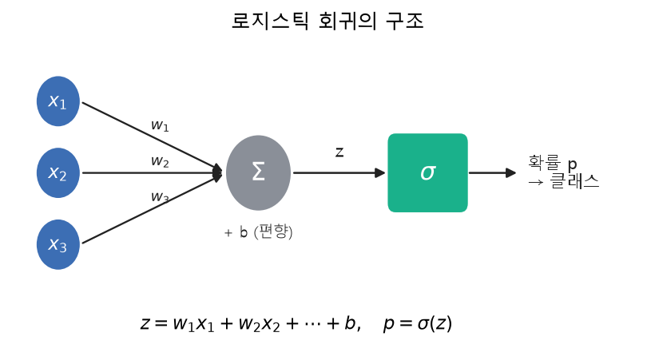
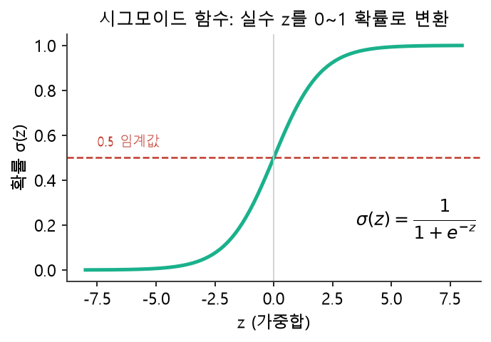
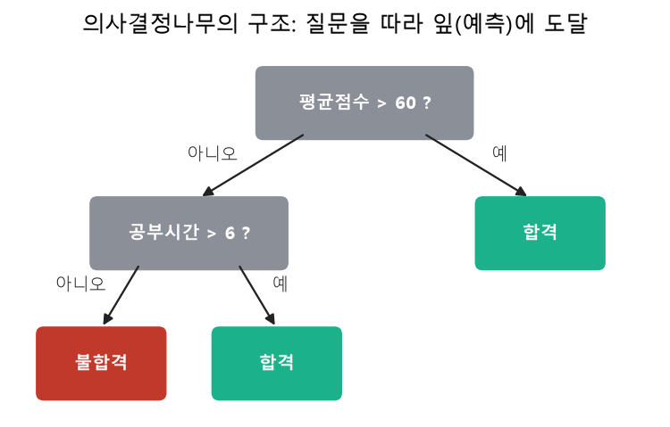
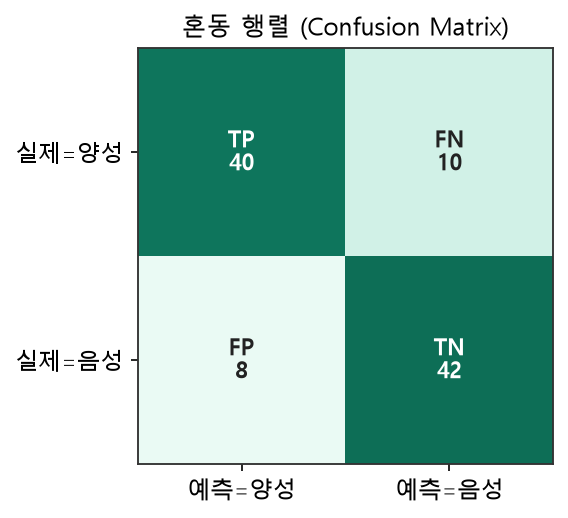
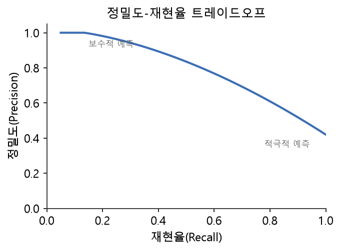
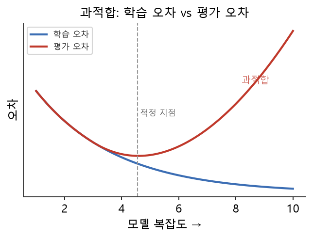

# 14주차 이론 — Baseline 모델링과 성능 평가

## 드디어 우리가 만든 데이터로 모델을 학습합니다 {#sec-w14t-intro}

지난 13주 동안 우리는 데이터를 수집하고, 정제하고, 검증하고, 라벨링하고, 모델이 먹기 좋게 손질했습니다. 이번 주에는 그 데이터로 실제 모델을 학습시켜 봅니다. 이 과목의 목표는 정교한 모델을 만드는 것이 아니라 좋은 데이터를 만드는 것이었음을 기억하세요. 그래서 우리가 만들 모델은 가장 단순한 **베이스라인 모델(baseline model)**입니다.

베이스라인 모델이란 "이보다 못하면 안 된다"는 최소 기준선이 되는 단순한 모델입니다 [@geron2022hands]. 마라톤에 비유하면, 베이스라인은 "일단 완주하는 것"입니다. 기록 단축은 그다음 문제입니다. 베이스라인의 진짜 목적은 우리가 만든 데이터가 학습에 쓸 만한지를 확인하는 것입니다. 데이터가 좋으면 단순한 모델로도 그럴듯한 성능이 나오고, 데이터가 나쁘면 아무리 좋은 모델도 헤맵니다. 즉, 베이스라인 모델링은 데이터 품질의 최종 시험입니다. 이 시험을 통해 우리는 그동안의 데이터 구축이 제대로 되었는지를 처음으로 객관적인 숫자로 확인하게 됩니다. 지금까지는 "이 데이터가 좋을 것"이라는 기대였다면, 이제는 실제 성능이라는 증거로 그것을 검증하는 것입니다. 그래서 이번 주는 한 학기 동안 쌓아 온 노력의 결과를 마주하는 중요한 순간입니다.

이번 주에 우리는 SQLite에 저장된 데이터를 꺼내, scikit-learn이라는 도구로 모델을 학습하고, 그 성능을 평가하고, 결과를 다시 SQLite에 저장합니다. SQLite가 데이터 저장소, scikit-learn이 모델 도구입니다. 이 전체 흐름을 통해, 우리가 13주 동안 공들여 만든 데이터가 실제로 어떻게 모델이 되는지를 눈으로 확인합니다.

```{mermaid}
flowchart LR
    DB[("SQLite<br/>model_input")] -->|SELECT| X["특성 X, 라벨 y<br/>train/test 분리"]
    X --> T["모델 학습<br/>train으로 fit"]
    T --> P["예측<br/>test로 predict"]
    P --> E["성능 평가<br/>정확도·정밀도·재현율·F1"]
    E -->|결과 저장| DB2[("SQLite<br/>predictions, metrics")]
```

## 모델은 데이터에서 규칙을 배웁니다 {#sec-w14t-learn}

모델이 학습한다는 것이 무슨 뜻인지 짚어 보겠습니다. 지도학습 모델은 학습셋의 특성과 라벨을 보고, "이런 특성을 가진 데이터는 이런 라벨"이라는 규칙을 스스로 찾아냅니다. 예를 들어 이탈 예측 모델은 "연봉이 높고 가입 기간이 짧은 고객이 이탈하는 경향이 있다" 같은 규칙을, 데이터로부터 배웁니다. 사람이 규칙을 일일이 알려 주는 것이 아니라, 모델이 데이터에서 패턴을 발견하는 것입니다.

학습이 끝나면 모델은 이 규칙을 이용해, 처음 보는 데이터의 라벨을 예측합니다. 새 고객의 특성을 보고 "이 고객은 이탈할 것"이라고 예측하는 것입니다. 이 예측이 얼마나 정확한지가 모델의 성능입니다. 그리고 그 성능은 결국 학습에 쓴 데이터의 질에 달려 있습니다. 데이터가 실제 패턴을 잘 담고 있으면 모델이 좋은 규칙을 배우고, 데이터가 부실하면 잘못된 규칙을 배웁니다.

여기서 우리가 13주 동안 한 일의 의미가 드러납니다. 좋은 데이터를 만드는 모든 과정, 즉 대표성 있게 수집하고, 깨끗하게 정제하고, 정확하게 라벨링하고, 편향 없이 검증하고, 적절히 전처리한 그 모든 노력이, 이 학습 단계에서 좋은 규칙으로 결실을 맺습니다. 그래서 베이스라인 모델의 성능은 우리 데이터의 성적표와 같습니다. 이 성적표를 겸허히 받아들이는 것이 중요합니다. 성능이 좋으면 우리 데이터 구축이 잘된 것이고, 성능이 나쁘면 어딘가 개선할 점이 있다는 뜻입니다. 어느 쪽이든 이 성적표는 우리에게 다음에 무엇을 해야 할지를 알려 줍니다. 좋으면 그대로 나아가고, 나쁘면 데이터로 돌아가 문제를 찾습니다. 이렇게 모델의 성능을 데이터의 피드백으로 받아들이는 태도가, 데이터를 계속 개선해 나가는 힘이 됩니다.

## 두 가지 베이스라인 모델의 구조 {#sec-w14t-arch}

이 과목에서 쓰는 베이스라인 모델은 **로지스틱 회귀**와 **의사결정나무** 두 가지입니다. 데이터 구축자도 자신이 만든 데이터가 어떤 구조의 모델에 들어가는지 알아 두면, 데이터를 어떻게 준비해야 할지 더 잘 판단할 수 있습니다. 두 모델의 정확한 구조를 그림과 함께 살펴보겠습니다.

**로지스틱 회귀(Logistic Regression)**는 이름에 "회귀"가 들어가지만 실제로는 분류에 쓰는 모델입니다. 구조는 @fig-w14-logreg 와 같습니다. 각 입력 특성 $x_1, x_2, \ldots$에 [가중치]{.imp} $w_1, w_2, \ldots$를 곱해 모두 더하고, 편향 $b$를 더한 값 $z$를 구합니다. 그다음 이 $z$를 [시그모이드 함수]{.imp} $\sigma$에 통과시켜 0과 1 사이의 확률 $p$로 바꿉니다.

{#fig-w14-logreg width=88%}

$$
z = w_1 x_1 + w_2 x_2 + \cdots + w_n x_n + b, \qquad p = \sigma(z) = \frac{1}{1 + e^{-z}}
$$ {#eq-logreg}

::: {.eqnote}
- $x_i$: 입력 특성(13주차에서 인코딩·스케일링을 마친 숫자 값)
- $w_i$: 각 특성의 **가중치**. 학습으로 정해지며, 클수록 그 특성이 예측에 크게 기여합니다.
- $b$: **편향(bias)**. 전체를 위아래로 조정하는 상수항입니다.
- $z$: 가중합. 값이 클수록 양성일 가능성이 높습니다.
- $p = \sigma(z)$: 최종 확률. 보통 $p \ge 0.5$이면 양성(1), 아니면 음성(0)으로 판정합니다.
:::

@eq-logreg 의 시그모이드 함수는 어떤 실수든 0과 1 사이로 눌러 담아 "확률"로 해석할 수 있게 해 줍니다(@fig-w14-sigmoid). $z$가 0이면 정확히 0.5가 되고, $z$가 커지면 1에, 작아지면 0에 가까워집니다.

{#fig-w14-sigmoid width=62%}

로지스틱 회귀의 학습이란 결국 데이터에 가장 잘 맞는 가중치 $w_i$와 편향 $b$를 찾는 것입니다. scikit-learn에서는 이 과정을 단 몇 줄로 실행합니다.

```python
from sklearn.linear_model import LogisticRegression
model = LogisticRegression()
model.fit(X_train, y_train)      # 가중치 w와 편향 b를 학습
p = model.predict(X_test)        # 학습된 w, b로 새 데이터의 클래스 예측
```

**의사결정나무(Decision Tree)**는 전혀 다른 구조입니다. @fig-w14-tree 처럼, 데이터를 질문에 따라 가지를 뻗어 나누며, 잎(leaf)에 도달하면 그것이 예측 결과가 됩니다. "평균점수가 60을 넘는가?", "공부시간이 6을 넘는가?" 같은 질문을 차례로 던져 최종 판정에 이릅니다. 로지스틱 회귀가 하나의 수식으로 판단한다면, 의사결정나무는 [규칙의 흐름]{.imp}으로 판단합니다.

{#fig-w14-tree width=78%}

의사결정나무의 큰 장점은 [해석 가능성]{.imp}입니다. 왜 그런 예측을 했는지 "이 학생은 평균점수가 60 이하이고 공부시간도 6 이하라 불합격으로 판정" 하는 식으로 사람이 따라갈 수 있습니다. 이 모델도 scikit-learn에서 같은 방식으로 쓰며, 모델 종류만 바꾸면 됩니다.

```python
from sklearn.tree import DecisionTreeClassifier
model = DecisionTreeClassifier(random_state=0)
model.fit(X_train, y_train)
```

두 모델은 구조가 다르지만, 우리 관점에서 중요한 것은 하나입니다. **어떤 모델이든 좋은 데이터가 있어야 좋은 규칙을 배운다는 것**입니다. 로지스틱 회귀는 좋은 가중치를, 의사결정나무는 좋은 질문을, 모두 데이터로부터 배우기 때문입니다.

## 분류 성능을 재는 혼동 행렬 {#sec-w14t-confusion}

모델이 얼마나 잘 맞히는지를 재려면 지표가 필요합니다. 분류 문제에서 가장 기본이 되는 것은 **혼동 행렬(confusion matrix)**입니다. 혼동 행렬은 예측과 실제를 교차한 표로, 모델이 무엇을 맞히고 무엇을 틀렸는지를 한눈에 보여 줍니다.

이탈 예측을 예로 들면, 혼동 행렬은 네 칸으로 이루어집니다. 실제로 이탈인데 이탈로 맞힌 경우(TP, True Positive), 실제로 정상인데 정상으로 맞힌 경우(TN, True Negative), 실제로 정상인데 이탈로 잘못 본 경우(FP, False Positive, 거짓 경보), 실제로 이탈인데 정상으로 놓친 경우(FN, False Negative, 놓친 위험)입니다. 이 네 가지가 모델의 모든 예측 결과를 분류합니다(@fig-w14-cm).

{#fig-w14-cm width=58%}

이 네 값을 구분하는 것이 중요한 이유는, 오류에도 종류가 있기 때문입니다. FP는 거짓 경보로, 정상 고객을 이탈로 오해하는 것입니다. FN은 놓친 위험으로, 이탈할 고객을 정상으로 여겨 놓치는 것입니다. 상황에 따라 어느 오류가 더 심각한지 다릅니다. 암 진단에서는 FN(암을 놓침)이 FP(오진)보다 훨씬 위험합니다. 그래서 단순히 "몇 개 맞혔나"가 아니라, 어떤 종류의 오류를 얼마나 냈는지를 봐야 합니다.

## 네 가지 성능 지표 {#sec-w14t-metrics}

혼동 행렬의 네 값으로 네 가지 지표를 계산합니다 [@geron2022hands].

| 지표 | 의미 | 공식 |
|---|---|---|
| **정확도(Accuracy)** | 전체 중 맞힌 비율 | (TP+TN) / 전체 |
| **정밀도(Precision)** | 이탈이라 예측한 것 중 진짜 비율 | TP / (TP+FP) |
| **재현율(Recall)** | 실제 이탈 중 잡아낸 비율 | TP / (TP+FN) |
| **F1 점수** | 정밀도와 재현율의 조화평균 | 2·P·R / (P+R) |

: 분류 성능 지표 {#tbl-w14-metrics}

네 지표를 혼동 행렬의 값으로 쓰면 다음과 같습니다.

$$
\text{정확도} = \frac{TP + TN}{TP + TN + FP + FN}, \qquad
\text{정밀도} = \frac{TP}{TP + FP}, \qquad
\text{재현율} = \frac{TP}{TP + FN}
$$ {#eq-metrics}

$$
F_1 = 2 \cdot \frac{\text{정밀도} \times \text{재현율}}{\text{정밀도} + \text{재현율}}
$$ {#eq-f1}

::: {.eqnote}
- $TP$(참양성): 양성을 양성으로 맞힘 · $TN$(참음성): 음성을 음성으로 맞힘
- $FP$(거짓양성): 음성인데 양성으로 잘못 봄(거짓 경보) · $FN$(거짓음성): 양성인데 음성으로 놓침
- 분모를 보면 뜻이 보입니다. **정밀도**는 "양성이라 *예측*한 것" 중($TP+FP$) 진짜 비율, **재현율**은 "실제 양성" 중($TP+FN$) 잡아낸 비율입니다.
- $F_1$은 정밀도·재현율의 조화평균으로, 둘 중 하나라도 낮으면 함께 낮아집니다.
:::

**정확도**는 가장 직관적인 지표로, 전체 예측 중 맞힌 비율입니다. 하지만 정확도만으로는 부족합니다. **정밀도**는 "이탈이라고 예측한 것 중 실제로 이탈인 비율"로, 거짓 경보가 적을수록 높습니다. **재현율**은 "실제 이탈 중 모델이 잡아낸 비율"로, 놓친 위험이 적을수록 높습니다. **F1 점수**는 정밀도와 재현율을 함께 반영한 지표로, 둘의 균형을 봅니다.

왜 정확도 하나로는 부족할까요? 12주차의 클래스 불균형을 떠올려 보세요. "정상 99%, 암 1%" 데이터에서 무조건 정상이라 하면 정확도는 99%지만 암은 하나도 못 잡습니다. 이때 재현율은 0%가 되어 문제를 드러냅니다. 정확도는 다수 클래스만 맞혀도 높게 나오므로, 정작 중요한 소수 클래스를 놓치는 것을 숨깁니다. 그래서 특히 불균형 데이터에서는 정밀도·재현율·F1을 함께 봐야 합니다. 이것이 12주차에서 배운 불균형 점검이 왜 중요한지를 다시 보여 줍니다. 정확도라는 하나의 숫자에 속지 않으려면, 그 숫자 뒤에 숨은 혼동 행렬을 들여다봐야 합니다. 90%의 정확도가 다수 클래스만 맞힌 것인지, 모든 클래스를 고르게 맞힌 것인지는 혼동 행렬을 봐야 알 수 있습니다. 그래서 성능을 평가할 때는 하나의 지표가 아니라 여러 지표를 종합해, 모델이 정말로 무엇을 잘하고 무엇을 못하는지를 온전히 파악해야 합니다.

## 정밀도와 재현율의 트레이드오프 {#sec-w14t-tradeoff}

정밀도와 재현율은 종종 서로 반대 방향으로 움직입니다. 하나를 높이면 다른 하나가 낮아지는 경향이 있는데, 이를 **트레이드오프**라고 합니다(@fig-w14-pr).

{#fig-w14-pr width=62%} 모델이 조금이라도 의심스러우면 모두 "이탈"이라고 예측하면, 실제 이탈을 놓치지 않아 재현율은 높아지지만, 정상 고객까지 이탈로 오해해 정밀도는 낮아집니다. 반대로 아주 확실할 때만 "이탈"이라고 예측하면 정밀도는 높아지지만 재현율은 낮아집니다.

그래서 어느 지표를 중시할지는 문제의 성격에 달려 있습니다. 암 진단처럼 놓치면 안 되는 경우에는 재현율을 중시합니다. 놓친 암(FN)이 오진(FP)보다 훨씬 위험하기 때문입니다. 반대로 스팸 필터처럼 정상 메일을 스팸으로 잘못 거르면 안 되는 경우에는 정밀도를 중시합니다. 이렇게 문제에 따라 중요한 지표가 다르므로, 여러 지표를 함께 보고 상황에 맞게 판단해야 합니다.

F1 점수는 이 둘의 균형을 하나의 숫자로 나타냅니다. 정밀도와 재현율이 모두 높아야 F1도 높아지므로, 두 지표를 함께 고려하고 싶을 때 유용합니다. 다만 F1이 모든 상황에 맞는 것은 아니며, 문제에 따라 정밀도나 재현율을 따로 중시해야 할 때도 있습니다. 성능 지표를 이해하는 것은 단순히 공식을 외우는 것이 아니라, 각 지표가 무엇을 말하는지, 어떤 상황에서 무엇을 봐야 하는지를 아는 것입니다.

## 예측 결과를 저장하고 활용하기 {#sec-w14t-store}

모델이 예측한 결과는 다시 데이터베이스에 저장하는 것이 실무에서 흔한 패턴입니다. 각 데이터에 대해 실제 라벨이 무엇이었고, 모델이 무엇을 예측했으며, 맞았는지 틀렸는지를 저장합니다. 이렇게 저장하면 여러 가지를 할 수 있습니다.

먼저 저장된 예측으로 성능을 SQL로 집계할 수 있습니다. 맞힌 개수를 세거나, 어떤 종류의 데이터에서 많이 틀리는지 분석할 수 있습니다. 4주차부터 배운 집계가 여기서 성능 분석의 도구로 쓰입니다. 또한 틀린 예측을 모아 보면, 모델이 어떤 데이터에서 어려움을 겪는지 알 수 있습니다. 특정 집단에서 유독 많이 틀린다면, 12주차에서 배운 편향을 의심할 수 있습니다.

예측 결과의 저장은 데이터 파이프라인의 마무리이기도 합니다. 데이터가 수집되고, 정제되고, 라벨링되고, 모델의 입력이 되어, 마침내 예측 결과가 되어 다시 데이터베이스에 쌓이는 것입니다. 이 결과는 이후 대시보드나 리포트로 이어져, 사람이 의사결정에 활용합니다. 이렇게 데이터의 여정은 예측 결과를 저장하는 것으로 한 바퀴를 완성합니다.

## 결과를 어떻게 해석할까 {#sec-w14t-interpret}

성능 지표가 나왔다면, 그것을 해석하는 안목이 필요합니다. 몇 가지 전형적인 상황과 그 해석을 살펴보겠습니다.

정확도가 높은데 재현율이 낮다면, 모델이 다수 클래스만 잘 맞히고 소수 클래스(중요한 위험)를 놓치고 있는 것입니다. 12주차의 불균형을 의심하고, 13주차의 오버샘플링을 검토합니다. 학습 데이터에선 완벽한데 평가에선 나쁘다면, 모델이 학습 데이터를 통째로 외운 **과적합(overfitting)**입니다 [@geron2022hands]. 이는 모델이 일반적인 규칙을 배운 것이 아니라 학습 데이터의 세부까지 암기해, 새 데이터에 대응하지 못하는 상태입니다.

두 지표가 모두 낮고 학습과 평가 성능이 비슷하게 나쁘다면, 이는 과소적합이거나 데이터에 배울 만한 패턴이 부족한 경우입니다. 이때는 더 유용한 특성을 만들거나(13주차), 더 많은 데이터를 모으는 것이 도움이 됩니다. 이처럼 성능 지표의 조합을 읽으면, 지금 무엇이 문제이고 무엇을 개선해야 하는지에 대한 단서를 얻을 수 있습니다. 성능 평가는 끝이 아니라, 다음 개선을 위한 진단입니다.

베이스라인 성능이 형편없다면, 모델을 탓하기 전에 데이터를 의심합니다. 라벨이 잘못됐거나(9·12주차), 특성이 부실하거나(13주차), 데이터가 편향됐을(12주차) 수 있습니다. 이 마지막 태도가 이 과목의 핵심 메시지입니다.

::: {.keybox}
[모델의 성능은 데이터의 거울입니다.]{.imp} 성능이 낮으면 모델을 복잡하게 만들기 전에, 데이터 구축 과정으로 돌아가 무엇이 잘못됐는지 점검하는 것이 데이터 중심 인공지능(data-centric AI)의 자세입니다 [@sambasivan2021everyone].
:::

## 왜 SQLite와 scikit-learn을 함께 쓰는가 {#sec-w14t-why}

이번 주 실습은 SQLite와 scikit-learn을 오갑니다. 데이터는 SQLite에 저장되어 있고, 모델 학습은 scikit-learn으로 합니다. 이 조합이 실무의 전형적인 모습입니다. 데이터는 데이터베이스에 관리되고, 학습이 필요할 때 그것을 꺼내 머신러닝 도구로 넘깁니다.

이 흐름을 이해하는 것이 중요합니다. 데이터베이스에서 특성과 라벨을 SQL로 꺼내고, 그것을 모델 도구가 이해하는 형태로 넘기고, 학습과 예측을 한 뒤, 결과를 다시 데이터베이스에 저장하는 것입니다. 이 각 단계가 매끄럽게 이어져야 파이프라인이 완성됩니다. 우리가 13주 동안 SQLite로 데이터를 다룬 것이, 이 마지막 단계에서 모델과 연결되는 것입니다.

scikit-learn을 쓰는 방식은 놀랄 만큼 단순합니다. 모델을 하나 만들고, 학습셋으로 학습시키고, 평가셋으로 예측한 뒤, 예측과 실제를 비교해 성능을 구합니다. 이 몇 단계가 대부분의 머신러닝 작업의 뼈대입니다. 복잡해 보이는 머신러닝도, 그 핵심 흐름은 "학습하고, 예측하고, 평가한다"는 단순한 절차입니다. 이 흐름을 이해하면, 우리가 만든 데이터를 어떤 모델에도 연결할 수 있습니다.

scikit-learn은 파이썬의 대표적인 머신러닝 도구로, 다양한 모델과 성능 평가 기능을 제공합니다 [@geron2022hands]. 이 과목은 모델의 세부를 깊이 다루지 않지만, 데이터를 모델에 연결하는 이 흐름만은 손으로 익힙니다. 데이터 구축자가 모델링을 직접 하지 않더라도, 자신이 만든 데이터가 어떻게 모델이 되는지를 이해하는 것은 매우 중요합니다. 그래야 좋은 데이터가 무엇인지, 모델을 위해 데이터를 어떻게 준비해야 하는지를 제대로 알 수 있기 때문입니다.

## 과적합과 과소적합 {#sec-w14t-overfit}

모델 학습에서 반드시 이해해야 할 두 가지 문제가 **과적합(overfitting)**과 **과소적합(underfitting)**입니다. 과적합은 모델이 학습 데이터를 지나치게 잘 맞춰, 그 데이터의 세부와 잡음까지 외워 버린 상태입니다. 이런 모델은 학습 데이터에서는 완벽하지만, 처음 보는 데이터에서는 형편없습니다. 학습 데이터만 암기해 일반적인 규칙을 배우지 못한 것입니다.

과소적합은 반대로, 모델이 데이터의 패턴을 충분히 배우지 못한 상태입니다. 너무 단순한 모델을 쓰거나 학습이 부족하면 과소적합이 생깁니다. 이런 모델은 학습 데이터에서도, 평가 데이터에서도 성능이 낮습니다. 좋은 모델은 이 둘 사이의 균형점에 있습니다. 학습 데이터의 패턴은 잘 배우되, 세부에 얽매이지 않고 일반적인 규칙을 배운 상태입니다.

과적합을 발견하는 방법은 학습 성능과 평가 성능을 비교하는 것입니다. 학습에서는 좋은데 평가에서 나쁘면 과적합입니다. @fig-w14-overfit 처럼, 모델이 복잡해질수록 학습 오차는 계속 줄지만 평가 오차는 어느 지점을 지나 다시 커지는데, 그 지점이 과적합의 시작입니다.

{#fig-w14-overfit width=68%} 그래서 13주차에서 배운 학습·평가 분할이 중요합니다. 두 성능을 비교해야 과적합 여부를 알 수 있기 때문입니다. 과적합이 발견되면 모델을 단순하게 하거나, 데이터를 더 모으거나, 13주차의 증강으로 데이터를 늘려 대응합니다. 흥미롭게도 과적합의 해결책 중 상당수가 모델이 아니라 데이터에 관한 것입니다. 여기서도 데이터의 중요성이 드러납니다.

## 여러 모델을 비교하기 {#sec-w14t-compare}

실무에서는 하나의 모델만 쓰지 않고 여러 모델을 시도해 비교합니다. 같은 데이터라도 어떤 모델은 잘 맞고 어떤 모델은 잘 안 맞기 때문입니다. 로지스틱 회귀처럼 단순하고 해석하기 쉬운 모델도 있고, 의사결정나무처럼 규칙을 눈으로 볼 수 있는 모델도 있으며, 더 복잡한 모델도 있습니다. 각 모델의 성능을 비교해 가장 나은 것을 고릅니다.

여러 모델을 비교할 때는 반드시 같은 데이터와 같은 지표로 비교해야 공정합니다. 한 모델은 쉬운 데이터로, 다른 모델은 어려운 데이터로 평가하면 비교가 의미 없습니다. 그래서 13주차에서 나눈 같은 학습셋으로 모든 모델을 학습하고, 같은 평가셋으로 성능을 잽니다. 이렇게 공정하게 비교해야 어느 모델이 정말 나은지 알 수 있습니다.

그런데 여기서 중요한 통찰이 있습니다. 여러 모델을 비교했을 때 성능 차이가 크지 않다면, 그것은 데이터가 성능의 한계를 결정하고 있다는 신호일 수 있습니다. 모델을 바꿔도 성능이 비슷하다면, 더 나은 성능을 얻는 길은 모델이 아니라 데이터를 개선하는 데 있습니다. 그래서 모델 비교는 단지 좋은 모델을 고르는 것을 넘어, 성능의 한계가 모델에 있는지 데이터에 있는지를 파악하는 데도 쓰입니다. 이 판단이 데이터 중심 인공지능의 출발점입니다.

## 성능 평가의 함정 {#sec-w14t-pitfalls}

성능 평가에는 여러 함정이 있어 주의해야 합니다. 첫 번째 함정은 앞서 강조한 정확도의 함정입니다. 불균형 데이터에서 정확도만 보면 소수 클래스를 못 잡는 모델을 좋다고 착각합니다. 그래서 정밀도·재현율·F1을 함께 봐야 합니다.

두 번째 함정은 13주차에서 배운 데이터 누수입니다. 평가셋 정보가 학습에 새어 들어가면, 평가 성능이 실제보다 높게 나옵니다. 이런 성능은 실제로 모델을 썼을 때 재현되지 않습니다. 그래서 평가 결과가 지나치게 좋으면, 오히려 데이터 누수를 의심해 봐야 합니다. 세 번째 함정은 우연에 의한 성능입니다. 데이터가 적으면 데이터를 어떻게 나누느냐에 따라 성능이 우연히 좋거나 나쁘게 나올 수 있습니다. 이 함정은 15주차에서 배울 교차 검증으로 완화합니다.

이런 함정들을 알아야 성능 평가를 올바르게 해석할 수 있습니다. 성능 숫자 하나를 보고 성급히 결론을 내리면 안 됩니다. 그 숫자가 어떻게 나왔는지, 어떤 데이터로 어떤 지표로 쟀는지, 데이터 누수는 없었는지를 함께 따져야 합니다. 성능 평가는 단순히 숫자를 구하는 것이 아니라, 그 숫자를 신중히 해석하는 능력을 요구합니다. 이 신중함이 없으면 좋아 보이는 성능에 속아 실제로는 쓸 수 없는 모델을 만들게 됩니다.

## 성능을 넘어서 — 공정성과 해석 가능성 {#sec-w14t-beyond}

모델을 평가할 때 성능만 보는 것으로는 충분하지 않습니다. 성능이 좋아도, 특정 집단에게 불공정하거나 왜 그런 판단을 내렸는지 설명할 수 없다면 문제가 됩니다. 그래서 성능과 함께 공정성과 해석 가능성도 봐야 합니다.

공정성은 12주차에서 배운 편향과 이어집니다. 모델 전체의 성능이 높아도, 특정 집단에서만 성능이 낮으면 그 집단에게 불공정한 것입니다. 그래서 성능을 집단별로 나누어 보아야 합니다. 남성과 여성에서, 지역별로, 연령대별로 성능이 고른지 확인하는 것입니다. 특정 집단에서 성능이 크게 낮다면, 12주차의 편향 점검으로 돌아가 데이터를 살펴야 합니다.

해석 가능성은 모델이 왜 그런 판단을 내렸는지 이해할 수 있는 정도입니다. 대출 심사나 의료 진단처럼 중요한 결정에서는, 모델의 판단 근거를 설명할 수 있어야 합니다. "왜 대출이 거절되었는가"를 설명하지 못하면, 그 결정을 신뢰하기도 어렵고 문제가 생겨도 원인을 찾기 어렵습니다. 그래서 이런 분야에서는 성능이 조금 낮더라도 해석 가능한 모델을 선호하기도 합니다. 모델을 평가한다는 것은 성능·공정성·해석 가능성을 두루 살피는 종합적인 판단입니다.

## 데이터 중심 인공지능이라는 관점 {#sec-w14t-datacentric}

이 과목이 처음부터 강조해 온 관점이 있습니다. 바로 데이터 중심 인공지능(data-centric AI)입니다. 이는 모델을 개선하는 데 집중하는 전통적인 관점(모델 중심)과 대비되는 것으로, 모델은 그대로 두고 데이터의 품질을 높여 성능을 개선하는 관점입니다.

이 관점이 힘을 얻는 이유는 분명합니다. 오늘날 좋은 모델은 누구나 가져다 쓸 수 있습니다. 잘 만들어진 모델들이 공개되어 있어, 최신 기술을 적용하는 것은 어렵지 않습니다. 반면 좋은 데이터는 그렇지 않습니다. 각 문제에 맞는 좋은 데이터는 오직 정성 들인 구축에서만 나옵니다. 그래서 모델보다 데이터에서 차별화가 이루어지고, 성능의 차이도 대개 데이터에서 갈립니다.

베이스라인 모델링은 이 관점을 실천하는 자리입니다. 단순한 모델로 성능을 재는 이유가, 바로 데이터의 품질을 확인하기 위해서입니다. 성능이 낮으면 모델을 복잡하게 만드는 대신, 데이터를 개선합니다. 라벨을 다시 검토하고, 특성을 보강하고, 편향을 바로잡습니다. 그리고 개선된 데이터로 같은 모델을 다시 학습하면, 성능이 오릅니다. 이렇게 데이터를 반복적으로 개선하며 성능을 높이는 것이 데이터 중심 인공지능의 방식이며, 이 과목이 15주 동안 기른 능력이 바로 이 데이터 개선 능력입니다.

## 분류가 아닌 문제의 평가 {#sec-w14t-regression}

지금까지는 이탈·합격처럼 범주를 예측하는 분류 문제를 다뤘습니다. 하지만 예측 문제에는 다른 종류도 있습니다. 집값이나 온도처럼 숫자 자체를 예측하는 문제를 회귀라고 합니다. 회귀는 분류와 평가 방법이 다릅니다. 분류는 "맞았는가 틀렸는가"로 평가하지만, 회귀는 "얼마나 가까운가"로 평가합니다.

회귀의 성능은 예측한 값과 실제 값의 차이로 잽니다. 차이가 작을수록 좋은 예측입니다. 예측값이 실제값에서 평균적으로 얼마나 벗어나는지를 재는 지표들이 쓰입니다. 예를 들어 집값을 예측하는데 평균적으로 실제와 천만 원씩 차이 난다면, 그 천만 원이 성능의 척도가 됩니다. 이렇게 회귀는 오차의 크기로 성능을 평가합니다.

문제의 종류에 따라 평가 방법이 다르다는 것을 이해하는 것이 중요합니다. 우리가 만든 데이터가 분류에 쓰일지 회귀에 쓰일지에 따라, 라벨의 형태도 평가 방법도 달라집니다. 이 과목은 주로 분류를 다루지만, 회귀라는 다른 종류가 있다는 것과 그 평가가 오차 기반이라는 것을 알아 두면, 다양한 문제에 대응할 수 있습니다. 어떤 문제든 "예측이 정답에 얼마나 가까운가"를 재는 것이 평가의 본질입니다.

## 성능의 기준선을 세우기 {#sec-w14t-baseline2}

성능이 좋은지 나쁜지는 무엇과 비교하느냐에 달려 있습니다. 정확도 80%가 좋은 것일까요? 그것은 상황에 따라 다릅니다. 그래서 성능을 평가할 때는 기준선이 필요합니다. 가장 단순한 기준선은 "아무 규칙 없이 가장 흔한 답만 하는" 모델입니다. 이탈 예측에서 데이터의 90%가 정상이라면, 무조건 정상이라고만 해도 정확도 90%가 나옵니다. 그렇다면 우리 모델은 최소한 90%보다는 나아야 의미가 있습니다.

베이스라인 모델이 바로 이 기준선 역할을 합니다. 단순한 모델의 성능을 먼저 재고, 그것을 기준으로 이후의 개선을 평가합니다. 더 복잡한 모델이나 개선된 데이터가 이 베이스라인보다 나아야, 그 노력이 가치 있는 것입니다. 만약 복잡한 모델이 베이스라인과 비슷하다면, 그 복잡함은 불필요한 것입니다. 이렇게 베이스라인은 이후 모든 개선의 잣대가 됩니다.

이 발상은 이 과목이 왜 베이스라인 모델링을 하는지를 다시 설명해 줍니다. 우리는 최고의 모델을 만들려는 것이 아니라, 우리 데이터로 어느 수준의 성능이 나오는지 기준선을 확인하려는 것입니다. 이 기준선이 있어야, 데이터를 개선했을 때 그것이 정말 나아졌는지 판단할 수 있습니다. 기준선 없이는 개선이 개선인지도 알 수 없습니다. 그래서 베이스라인은 데이터 개선 여정의 출발점이자 잣대입니다.

## 예측 결과를 SQL로 분석하기 {#sec-w14t-sqlanalysis}

예측 결과를 데이터베이스에 저장하면, 4주차부터 배운 SQL로 성능을 깊이 분석할 수 있습니다. 단순히 전체 정확도만 보는 것이 아니라, 여러 각도에서 모델의 강점과 약점을 파악할 수 있습니다.

예를 들어 예측 결과를 집단별로 나누어 정확도를 집계하면, 어떤 집단에서 모델이 잘 맞고 어떤 집단에서 못 맞는지 알 수 있습니다. 이는 앞서 말한 공정성 점검입니다. 또한 틀린 예측만 모아 그 특징을 살펴보면, 모델이 어떤 종류의 데이터에서 어려움을 겪는지 알 수 있습니다. 특정 특성값을 가진 데이터에서 많이 틀린다면, 그 부분의 데이터를 보강해야 할 신호입니다.

이렇게 SQL로 예측 결과를 분석하는 것은, 성능 개선의 방향을 찾는 강력한 방법입니다. 전체 성능 숫자 하나로는 무엇을 개선해야 할지 알 수 없지만, 세밀하게 나누어 분석하면 구체적인 개선점이 보입니다. 그리고 그 개선점은 대개 데이터에 관한 것입니다. 어떤 집단의 데이터가 부족한지, 어떤 라벨이 잘못되었는지가 드러납니다. 이 분석 능력이 데이터 구축자가 모델 성능에 기여하는 방법이며, 우리가 배운 SQL이 여기서 성능 진단의 도구로 쓰입니다.

## 정리 — 데이터의 성적표를 확인하다 {#sec-w14t-summary}

14주차에서는 우리가 구축한 데이터로 베이스라인 모델을 학습하고 평가했습니다. 베이스라인의 목적은 성능 경쟁이 아니라 데이터가 학습에 쓸 만한지 확인하는 데 있습니다. 분류 성능은 혼동 행렬(TP·TN·FP·FN)에서 나오는 정확도·정밀도·재현율·F1으로 평가하며, 특히 불균형 데이터에서는 정확도만 봐서는 안 됩니다.

정밀도와 재현율은 종종 트레이드오프 관계이므로, 문제의 성격에 맞게 중시할 지표를 고릅니다. 예측 결과는 다시 SQLite에 저장해 성능을 분석하고 활용합니다. 무엇보다 중요한 것은, 성능이 낮으면 모델이 아니라 데이터를 의심하는 태도입니다. 모델의 성능은 데이터의 거울이며, 우리가 13주 동안 만든 좋은 데이터가 이 학습 단계에서 좋은 성능으로 결실을 맺습니다. 그동안 눈에 잘 띄지 않던 수집·정제·라벨링·검증의 모든 노력이, 마침내 모델의 성능이라는 눈에 보이는 결과로 나타나는 것입니다. 그래서 베이스라인 모델링은 단순히 모델을 만드는 것이 아니라, 우리가 걸어온 긴 데이터 구축의 여정을 되돌아보고 그 성과를 확인하는 자리이기도 합니다. 이것이 이 과목이 전하는 데이터 중심의 자세입니다. 화려한 모델에 눈이 팔리기 쉬운 시대에, "내 데이터는 믿을 만한가"를 먼저 묻는 것이야말로 좋은 인공지능을 만드는 지름길입니다.

## 참고문헌 {#sec-w14t-refs}

1. Géron, A. (2022). *Hands-On Machine Learning with Scikit-Learn, Keras, and TensorFlow* (3rd ed.). O'Reilly Media.
2. Pedregosa, F., et al. (2011). Scikit-learn: Machine Learning in Python. *JMLR*, 12, 2825–2830.
3. Hastie, T., Tibshirani, R., & Friedman, J. (2009). *The Elements of Statistical Learning* (2nd ed.). Springer.
4. James, G., et al. (2021). *An Introduction to Statistical Learning* (2nd ed.). Springer.
5. Powers, D. M. W. (2011). Evaluation: From Precision, Recall and F-Measure to ROC. *Journal of ML Technologies*, 2(1).
6. Sokolova, M., & Lapalme, G. (2009). A Systematic Analysis of Performance Measures for Classification. *Information Processing & Management*, 45(4).
7. Saito, T., & Rehmsmeier, M. (2015). The Precision-Recall Plot Is More Informative than ROC on Imbalanced Datasets. *PLOS ONE*, 10(3).
8. Kohavi, R. (1995). A Study of Cross-Validation and Bootstrap. *IJCAI*.
9. Dietterich, T. G. (1998). Approximate Statistical Tests for Comparing Classifiers. *Neural Computation*, 10(7).
10. Ng, A. (2021). *From Model-centric to Data-centric AI*. DeepLearning.AI.
11. Sambasivan, N., et al. (2021). Data Cascades in High-Stakes AI. *ACM CHI*.
12. Bishop, C. M. (2006). *Pattern Recognition and Machine Learning*. Springer.
13. Breiman, L., et al. (1984). *Classification and Regression Trees*. Wadsworth.
14. Cox, D. R. (1958). The Regression Analysis of Binary Sequences. *JRSS B*, 20(2).
15. Provost, F., & Fawcett, T. (2013). *Data Science for Business*. O'Reilly Media.
16. Fawcett, T. (2006). An Introduction to ROC Analysis. *Pattern Recognition Letters*, 27(8).
17. He, H., & Garcia, E. A. (2009). Learning from Imbalanced Data. *IEEE TKDE*, 21(9).
18. Kuhn, M., & Johnson, K. (2013). *Applied Predictive Modeling*. Springer.
19. 한국지능정보사회진흥원(NIA). (2026). *인공지능 학습용 데이터 구축 가이드 v4.0 — 제2권*.
20. Mitchell, M., et al. (2019). Model Cards for Model Reporting. *ACM FAT\**.
21. Raschka, S. (2018). Model Evaluation, Model Selection, and Algorithm Selection in ML. arXiv:1811.12808.
22. Domingos, P. (2012). A Few Useful Things to Know About Machine Learning. *Communications of the ACM*, 55(10).
23. scikit-learn developers. *Metrics and scoring*. <https://scikit-learn.org/stable/modules/model_evaluation.html>
