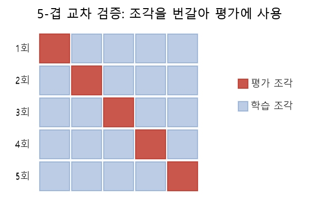
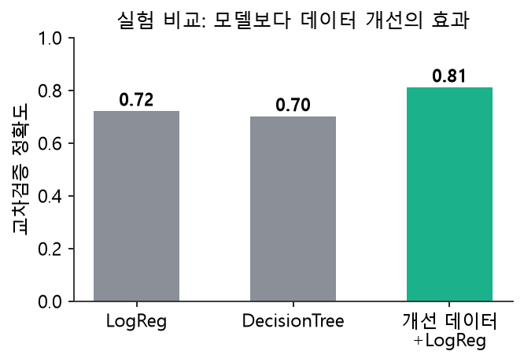

# 15주차 이론 — 최종 모델 평가와 데이터셋 완성

## 한 학기의 여정을 마무리합니다 {#sec-w15t-intro}

드디어 마지막 주입니다. 우리는 1주차에서 "인공지능의 성패는 데이터에서 갈린다"는 명제로 출발해, 데이터를 수집하고, 적재하고, 진단하고, 정제하고, 통합하고, 라벨링하고, 검증하고, 손질하여, 마침내 베이스라인 모델을 학습하는 데까지 왔습니다. 이번 주에는 이 모든 것을 하나의 완결된 데이터셋과 모델로 마무리합니다. 그리고 우리가 만든 결과물을 세상에 내놓을 수 있도록 문서화하는 법을 배웁니다.

15주차의 핵심 질문은 이것입니다. "우리가 만든 데이터셋을 남이 믿고 쓸 수 있는가?" 데이터 구축의 진짜 완성은 좋은 숫자가 아니라, 그 데이터를 어떻게 만들었고 어떤 한계가 있는지를 투명하게 밝힌 문서까지 갖추는 것입니다. 아무리 좋은 데이터라도 그 내력과 한계가 밝혀지지 않으면, 다른 사람이 안심하고 쓸 수 없습니다. 데이터를 만드는 것과 그것을 남이 믿고 쓸 수 있게 하는 것은 다른 일입니다. 전자가 기술의 문제라면, 후자는 투명성과 소통의 문제입니다. 이 마지막 주에는 그 후자, 즉 우리가 만든 데이터의 신뢰를 세우는 방법에 초점을 맞춥니다.

이번 주에는 더 믿을 수 있는 평가 방법인 교차 검증, 여러 실험을 기록하는 실험 추적, 그리고 데이터셋과 모델을 설명하는 데이터시트와 모델 카드를 배웁니다. 이 모든 것을 SQLite로 관리하며, 한 학기 동안 배운 것을 하나로 엮어 완성합니다.

## 더 믿을 수 있는 평가 — 교차 검증 {#sec-w15t-cv}

14주차에서 데이터를 학습셋과 평가셋으로 한 번 나누어 평가했습니다. 그런데 이 방법에는 한계가 있습니다. 데이터를 어떻게 나누느냐에 따라 성능이 우연히 좋거나 나쁘게 나올 수 있다는 것입니다. 특히 데이터가 적으면, 운 좋게 쉬운 데이터가 평가셋에 몰리면 성능이 실제보다 좋게 나오고, 어려운 데이터가 몰리면 나쁘게 나옵니다. 이 우연을 줄이는 방법이 **교차 검증(cross-validation)**입니다.

{#fig-w15-cv width=82%}

**K-겹 교차 검증(K-fold cross-validation)**은 데이터를 K개의 조각으로 나눈 뒤, 각 조각을 한 번씩 평가셋으로 쓰고 나머지로 학습하는 것을 K번 반복해 평균을 냅니다. 예를 들어 5-겹 교차 검증은 데이터를 다섯 조각으로 나누고, 다섯 번에 걸쳐 각기 다른 조각을 평가셋으로 삼아 성능을 재고, 그 다섯 성능의 평균을 구합니다.

교차 검증은 데이터를 아껴 쓰는 방법이기도 합니다. 단순 분할에서는 평가셋으로 떼어 둔 데이터가 학습에 쓰이지 못하지만, 교차 검증에서는 모든 데이터가 어느 회차에서는 학습에, 다른 회차에서는 평가에 쓰입니다. 그래서 데이터가 적을 때 특히 유용합니다. 적은 데이터를 최대한 활용하면서도, 여러 번 평가해 신뢰할 만한 성능을 얻을 수 있기 때문입니다.

이렇게 하면 "운 좋게 나온 성능"이 아니라 "평균적으로 기대할 수 있는 성능"을 알 수 있습니다. 모든 데이터가 한 번씩 평가에 쓰이므로, 특정 분할에 의한 우연이 상쇄됩니다. 또한 다섯 성능이 얼마나 들쭉날쭉한지를 보면, 성능이 안정적인지도 알 수 있습니다. 성능 편차가 크면 모델이나 데이터가 불안정하다는 신호입니다. 다만 데이터가 매우 적으면 각 조각도 작아지므로, 데이터 크기에 맞게 K를 정합니다.

## 여러 실험을 기록하기 {#sec-w15t-tracking}

실무에서는 하나의 실험으로 끝나지 않습니다. 여러 모델을 시도하고, 여러 설정을 바꿔 가며 실험합니다. "어제 실험은 F1이 0.72였는데 오늘은 0.75"처럼 결과가 계속 쌓입니다. 이 실험 기록을 체계적으로 남기는 것을 **실험 추적(experiment tracking)**이라고 합니다.

실험을 추적하지 않으면 어떻게 될까요? 어떤 설정에서 가장 좋은 성능이 나왔는지 잊어버리고, 같은 실험을 반복하고, 개선의 방향을 잃습니다. 반대로 실험을 잘 기록하면, 무엇이 성능을 높였고 무엇이 낮췄는지 파악해 체계적으로 개선할 수 있습니다. 그래서 실험 추적은 데이터와 모델을 개선하는 여정에서 필수적입니다.

우리는 이 실험 기록을 SQLite 테이블에 저장합니다. 각 실험의 모델 이름, 성능, 실행 시각 등을 기록하는 것입니다. 이렇게 하면 4주차부터 배운 SQL로 "가장 성능이 좋았던 실험"을 손쉽게 찾을 수 있습니다. @fig-w15-exp 는 이런 실험 비교의 한 예로, 모델을 바꾸는 것보다 데이터를 개선하는 것이 성능을 더 크게 끌어올린 경우를 보여 줍니다.

{#fig-w15-exp width=64%} 실험 결과를 데이터로 다루는 것입니다. 이는 7주차의 검증 결과 기록, 8주차의 산출물 리포트와 같은 정신입니다. 무엇을 했고 어떤 결과가 나왔는지를 데이터로 남겨, 그것을 분석하고 활용하는 것입니다.

## 데이터셋의 신분증 — 데이터시트 {#sec-w15t-datasheet}

데이터 구축의 마지막 산출물은 데이터를 설명하는 문서입니다. 그 대표적인 형식이 **데이터시트(Datasheet for Datasets)**입니다. 데이터시트는 데이터셋의 신분증과 같습니다. 전자 부품에 그 사양과 특성을 적은 사양서(datasheet)가 붙듯이, 데이터셋에도 그 내력과 특성을 적은 문서를 붙이자는 발상입니다.

데이터시트에는 여러 가지가 담깁니다. 무엇을 위해, 왜 이 데이터를 만들었는가. 어떤 원천에서, 어떻게 수집했는가. 어떻게 정제하고 라벨링했는가. 어떤 편향과 한계가 있는가. 어떤 용도에 적합하고 어떤 용도에는 부적합한가. 이런 정보들이 데이터를 쓰는 사람에게 필수적입니다. 특히 편향과 한계를 밝히는 것이 중요합니다. 12주차에서 배웠듯, 모든 데이터에는 편향이 있으므로 그것을 투명하게 드러내야 합니다.

데이터시트가 왜 중요한지는 이렇게 생각하면 됩니다. 데이터를 만든 사람은 그 데이터를 잘 알지만, 그것을 받아 쓰는 사람은 아무것도 모릅니다. 데이터시트가 없으면, 쓰는 사람이 데이터의 한계를 모른 채 부적절한 곳에 써서 문제를 일으킵니다. 데이터시트는 이 지식의 격차를 메워, 데이터가 올바르게 쓰이도록 돕습니다. 좋은 데이터시트는 데이터를 재현 가능하고 책임 있게 만듭니다.

## 모델의 신분증 — 모델 카드 {#sec-w15t-modelcard}

데이터시트가 데이터의 신분증이라면, **모델 카드(Model Card)**는 모델의 신분증입니다. 모델 카드는 모델에 대해 알아야 할 것들을 정리한 문서입니다.

모델 카드에는 이런 것들이 담깁니다. 이 모델은 무엇을 하는가. 어떤 데이터로 학습했는가. 어떤 상황에서 어떤 성능을 내는가. 집단별로 성능이 어떻게 다른가. 어떤 상황에서 쓰면 안 되는가. 특히 14주차에서 배운 것처럼 집단별 성능을 밝히는 것이 중요합니다. 전체 성능이 좋아도 특정 집단에서 낮다면, 그것을 모델 카드에 명시해 그 집단에 대한 사용에 주의를 주어야 합니다.

모델 카드는 모델을 책임 있게 쓰기 위한 것입니다. 모델의 성능만 알고 그 한계를 모르면, 모델을 부적절한 곳에 써서 해를 끼칠 수 있습니다. 예를 들어 특정 집단에서 성능이 낮은 모델을 그 집단에 대한 중요한 결정에 쓰면 불공정한 결과가 나옵니다. 모델 카드는 이런 오용을 막고, 모델을 그 능력과 한계에 맞게 쓰도록 안내합니다. 데이터시트와 모델 카드는 함께, 인공지능을 투명하고 책임 있게 만드는 문서화의 두 축입니다. 이 두 문서의 공통된 철학은 "숨기지 않는다"는 것입니다. 좋은 점만 내세우는 것이 아니라, 한계와 위험까지 정직하게 밝히는 것입니다. 이런 정직한 문서화가 쌓일 때, 인공지능 전체에 대한 사회의 신뢰가 자랍니다. 반대로 좋은 점만 부풀리고 한계를 숨기는 문화가 퍼지면, 인공지능은 신뢰를 잃습니다. 그래서 데이터시트와 모델 카드를 성실히 작성하는 것은, 자신의 데이터와 모델을 넘어 인공지능 생태계 전체의 신뢰에 기여하는 일입니다.

## NIA 가이드라인의 산출물 {#sec-w15t-nia}

NIA 가이드라인도 데이터 구축의 마지막에 상세한 산출물을 제출하도록 요구합니다. 데이터셋 개요, 구성 내역, 설계기준과 분포 현황, 구축 과정, 검수 및 품질 활동 내역을 담은 문서입니다. 이는 데이터시트와 정확히 같은 정신입니다. 데이터가 어떻게 만들어졌고 어떤 상태인지를 밝히는 것입니다.

이런 산출물이 요구되는 이유는, 데이터가 공공재로 쓰이기 때문입니다. NIA가 지원하는 인공지능 학습용 데이터는 구축된 뒤 민간에 개방되어 수많은 사람이 활용합니다. 그래서 그 데이터의 품질과 특성을 명확히 문서화하는 것이, 데이터를 신뢰하고 활용하는 바탕이 됩니다. 문서가 부실하면, 아무리 좋은 데이터라도 그 가치를 제대로 발휘하지 못합니다.

우리가 실습에서 만드는 데이터셋 리포트는 이 산출물의 축소판입니다. 데이터의 규모, 특성, 클래스 분포, 편향, 한계를 정리한 간단한 리포트입니다. 규모는 작지만, "데이터를 만드는 것을 넘어 그것을 잘 설명하는 데까지 나아간다"는 정신은 똑같습니다. 이 리포트가 우리가 한 학기 동안 만든 데이터셋의 신분증이 됩니다.

## 한 학기를 관통한 하나의 메시지 {#sec-w15t-message}

이 과목이 처음부터 끝까지 전한 메시지는 단순합니다. **좋은 인공지능은 좋은 데이터에서 나옵니다.** 우리는 그 "좋은 데이터"를 만드는 전 과정을 손으로 익혔습니다. 이 여정을 관통한 원칙들을 다시 정리해 보겠습니다.

수집할 때는 목적을 먼저 정하고, 법과 윤리를 지키며, 편향 없이 대표성 있게 모았습니다. 적재할 때는 원본을 보존하고, 멱등하게 쌓았습니다. 정제할 때는 진단을 먼저 하고, 원본을 지키며 다듬었습니다. 검증할 때는 일찍 자주 점검하고, 우연과 편향을 걸러냈습니다. 라벨링할 때는 가이드라인으로 일관성을 확보하고, 여러 판단을 모아 신뢰도를 높였습니다. 그리고 모든 과정을 문서로 남겨 책임 있게 공개했습니다. 이것이 데이터 구축 전문가의 자세입니다.

여러분이 앞으로 어떤 인공지능 프로젝트를 하든, 화려한 모델에 눈이 팔리기 전에 이렇게 자문하기를 바랍니다. **"내 데이터는 믿을 만한가?"** 그 질문에 자신 있게 답할 수 있다면, 이 과목의 목표는 달성된 것입니다. 데이터를 믿을 수 있게 만드는 능력, 그리고 그것을 투명하게 증명하는 능력이야말로, 인공지능 시대에 점점 더 귀해지는 역량입니다. 이 능력은 특정 도구나 유행에 매이지 않습니다. 어떤 새로운 기술이 나와도, 그 밑에는 언제나 데이터가 있고, 그 데이터를 신뢰할 수 있게 만드는 원리는 변하지 않기 때문입니다. 그래서 이 과목에서 배운 것은 한 학기짜리 지식이 아니라, 앞으로의 긴 여정에서 계속 쓰일 평생의 기초입니다.

## 배운 것을 넘어 — 앞으로의 학습 {#sec-w15t-future}

이 과목은 데이터 구축의 기초를 다졌습니다. 하지만 데이터의 세계는 넓고, 배울 것이 많이 남아 있습니다. 앞으로 더 공부하고 싶다면 몇 가지 방향이 있습니다. 하나는 더 큰 규모의 데이터를 다루는 기술입니다. 이 과목에서는 SQLite로 작은 데이터를 다뤘지만, 실무에서는 훨씬 큰 데이터를 다루는 도구와 기술이 필요합니다.

다른 방향은 파이프라인 자동화입니다. 이 과목에서 배운 파이프라인의 원리를, 실무의 오케스트레이션 도구로 자동화하는 법을 익히는 것입니다. 또 다른 방향은 특정 데이터 유형의 심화입니다. 이미지, 텍스트, 음성 등 각 분야의 라벨링과 처리를 더 깊이 배우는 것입니다. 그리고 인공지능 윤리와 공정성도 중요한 학습 방향입니다. 데이터가 사회에 미치는 영향을 이해하고, 책임 있는 데이터 구축을 실천하는 것입니다.

무엇을 더 배우든, 이 과목에서 익힌 기본 원리는 변하지 않습니다. 목적을 먼저 정하고, 원본을 보존하고, 품질을 검증하고, 과정을 기록하는 원칙은 어떤 규모, 어떤 도구, 어떤 데이터에서도 통합니다. 도구와 기술은 계속 바뀌지만, "믿을 수 있는 데이터를 책임 있게 만든다"는 자세는 변하지 않는 전문가의 자질입니다. 이 자세를 몸에 새긴 것이, 이 과목이 여러분에게 남기는 가장 값진 것입니다.

## 데이터셋의 버전 관리 {#sec-w15t-version}

데이터셋은 한 번 만들고 끝나는 것이 아니라 계속 변합니다. 새 데이터가 추가되고, 라벨 오류가 발견되어 수정되고, 가이드라인이 개선되어 재라벨링되기도 합니다. 그래서 데이터셋에도 **버전 관리**가 필요합니다. 지금 쓰는 데이터가 어떤 버전인지, 이전 버전과 무엇이 다른지를 명확히 관리하는 것입니다.

버전 관리가 왜 중요할까요? 데이터셋이 바뀌면 그것으로 학습한 모델의 성능도 바뀝니다. 만약 어떤 버전의 데이터로 좋은 모델을 만들었는데 그 버전을 기록해 두지 않으면, 나중에 그 결과를 재현할 수 없습니다. 또한 데이터셋을 개선했을 때, 그것이 정말 나아졌는지 비교하려면 이전 버전이 남아 있어야 합니다. 그래서 데이터셋의 각 버전을 보존하고, 무엇이 바뀌었는지 기록하는 것이 중요합니다.

이는 4주차에서 배운 원본 보존, 6주차의 재현 가능한 정제와 이어집니다. 데이터의 이력을 관리하면, 언제든 특정 시점의 상태로 돌아갈 수 있고, 변화의 영향을 추적할 수 있습니다. 실무에서는 데이터셋의 버전을 관리하는 전용 도구를 쓰기도 하지만, 그 바탕에 있는 원리는 우리가 배운 것과 같습니다. 데이터를 시간의 흐름 속에서 관리하고, 각 상태를 재현 가능하게 남기는 것입니다.

## 데이터셋의 공개와 라이선스 {#sec-w15t-license}

데이터셋을 완성하면, 그것을 다른 사람이 쓸 수 있도록 공개하기도 합니다. 이때 반드시 정해야 할 것이 **라이선스**입니다. 라이선스는 "이 데이터를 누가, 어떤 조건으로 쓸 수 있는가"를 정한 것입니다. 자유롭게 쓸 수 있게 할지, 특정 조건에서만 쓸 수 있게 할지, 상업적 사용을 허용할지를 명확히 밝혀야 합니다.

라이선스가 명확해야 데이터를 안심하고 쓸 수 있습니다. 2주차에서 배웠듯, 라이선스가 불명확한 데이터는 법적 위험이 있어 함부로 쓸 수 없습니다. 그래서 데이터를 공개할 때는 라이선스를 분명히 하여, 쓰는 사람이 그 조건을 알고 지킬 수 있게 해야 합니다. 이는 우리가 데이터를 수집할 때 다른 사람의 라이선스를 존중했던 것과 같은 원칙입니다.

데이터를 공개할 때는 개인정보도 다시 한번 점검해야 합니다. 데이터 안에 개인을 식별할 수 있는 정보가 남아 있으면, 그것을 공개하는 것은 심각한 문제가 됩니다. 그래서 공개 전에 개인정보가 적절히 처리되었는지 확인하는 것이 필수입니다. 데이터를 세상에 내놓는다는 것은, 그것이 미칠 영향에 대한 책임을 지는 것입니다. 라이선스와 개인정보를 명확히 하는 것이, 그 책임을 다하는 방법입니다.

## 최종 검증 — 전체를 한 번 더 {#sec-w15t-finalcheck}

데이터셋을 완성으로 선언하기 전에, 전체를 한 번 더 점검하는 것이 좋습니다. 이는 8주차에서 배운 1-Cycle 자가점검을 마지막에 다시 하는 것입니다. 수집부터 라벨링까지 전 과정을 되짚으며, 각 단계가 제대로 되었는지, 최종 데이터가 목적에 부합하는지를 확인합니다.

이 최종 점검에서는 지금까지 배운 모든 검증을 종합합니다. 데이터에 결측이나 이상값이 남아 있지 않은지(5·6주차), 품질 기준을 통과하는지(7주차), 라벨이 신뢰할 만한지(12주차), 클래스가 균형 잡혀 있는지(12주차), 편향은 없는지(12주차), 그리고 베이스라인 성능이 기대 수준인지(14주차)를 두루 확인합니다. 이 종합 점검을 통과해야 데이터셋을 완성으로 볼 수 있습니다.

최종 점검이 중요한 이유는, 각 단계에서 놓친 문제가 있을 수 있기 때문입니다. 개별 단계에서는 괜찮아 보였는데, 전체를 놓고 보면 문제가 드러나기도 합니다. 그래서 완성 직전에 전체를 한 번 더 조망하는 것입니다. 이 점검을 통과한 데이터셋은 그 품질이 여러 각도에서 검증된 것이므로, 안심하고 학습에 쓸 수 있습니다. 완벽한 데이터는 없지만, 목표한 품질 수준에 도달했음을 확인한 데이터는 만들 수 있습니다. 최종 점검은 그 도달을 확인하는 마지막 관문입니다.

## 데이터 구축이라는 일 {#sec-w15t-career}

이 과목을 마치며, 데이터 구축이라는 일에 대해 생각해 보겠습니다. 데이터 구축은 인공지능 시대의 핵심 직무 중 하나입니다. 모델을 만드는 일이 주목받지만, 그 모델을 떠받치는 데이터를 만드는 일은 더 근본적이고 광범위합니다. 어떤 인공지능 프로젝트든 좋은 데이터가 필요하고, 그것을 만드는 것이 데이터 구축자의 몫입니다.

데이터 구축은 여러 능력을 요구합니다. 데이터를 다루는 기술, 그 데이터가 속한 분야에 대한 이해, 품질을 보는 안목, 그리고 윤리적 책임감입니다. 이 과목에서 우리는 이 능력들의 기초를 다졌습니다. SQL로 데이터를 다루는 기술, 여러 예제 데이터를 통한 다양한 분야의 경험, 품질 지표와 검증을 통한 안목, 그리고 법·윤리·편향에 대한 책임감입니다. 이 기초 위에서 각자의 관심 분야로 더 깊이 나아갈 수 있습니다.

무엇보다 데이터 구축은 보람 있는 일입니다. 눈에 잘 띄지 않지만, 좋은 인공지능의 뒤에는 항상 좋은 데이터가 있고, 그 데이터를 만든 사람의 정성이 있습니다. 인공지능이 사람을 돕고 세상을 나아지게 하려면, 그 바탕이 되는 데이터가 신뢰할 만하고 공정해야 합니다. 데이터 구축자는 그 바탕을 만드는 사람입니다. 이 일의 의미와 무게를 이해하고, 자부심을 가지고 임하기를 바랍니다.

## 개념들의 연결망 {#sec-w15t-network}

이 과목에서 배운 개념들은 따로 떨어진 것이 아니라 촘촘히 연결되어 있습니다. 마지막으로 그 연결망을 정리해 보겠습니다. 1주차의 품질 여섯 지표는 EDA·정제·검증·라벨 검증의 모든 단계에서 측정되고 관리됩니다. ELT의 원본 보존 원칙은 스테이징·재현 가능한 정제·데이터셋 버전 관리로 이어집니다. "일찍 자주 검증하라"는 원칙은 적재 검증·품질 검증·라벨 검증·모델 평가로 반복됩니다.

문서화의 정신은 데이터시트·모델 카드·산출물 리포트로 여러 주차에 걸쳐 나타납니다. 편향과 다양성에 대한 관심은 수집의 표본 설계에서 시작해, 라벨링의 작업자 구성, 검증의 편향 점검, 평가의 집단별 성능으로 이어집니다. 그리고 "데이터가 모델의 성능을 결정한다"는 데이터 중심의 관점이, 이 모든 것을 하나로 꿰는 큰 줄기입니다.

이 연결망을 이해하는 것이 이 과목을 진짜로 소화하는 것입니다. 개별 SQL 문법이나 지표 공식을 외우는 것을 넘어, 각 개념이 왜 필요하고 어떻게 서로 이어지는지를 아는 것입니다. 그러면 새로운 상황을 만나도, 배운 원리를 적용해 스스로 판단할 수 있습니다. 지식은 낱개로 있을 때보다 연결되어 있을 때 훨씬 강력합니다. 한 학기 동안 배운 조각들이 여러분의 머릿속에서 하나의 지도로 연결되기를 바랍니다.

## 팀 프로젝트로 종합하기 {#sec-w15t-project}

이 과목의 마무리는 팀 프로젝트 발표입니다. 한 학기 동안 배운 것을 하나의 프로젝트로 종합해, 데이터를 수집하고 정제하고 라벨링하고 검증하고 모델을 만드는 전 과정을 직접 수행하는 것입니다. 이 프로젝트가 이 과목의 진짜 시험입니다. 개별 개념을 아는 것과, 그것들을 엮어 실제 데이터셋을 만드는 것은 다른 능력이기 때문입니다.

팀 프로젝트에서 중요한 것은 완벽한 결과가 아니라 전 과정을 제대로 거치는 것입니다. 규모가 작더라도, 목적을 정하고, 데이터를 모으고, 다듬고, 라벨을 붙이고, 검증하고, 모델로 확인하고, 문서로 남기는 전 과정을 밟는 것이 핵심입니다. 이 과정을 한 번 온전히 경험하면, 데이터 구축이 무엇인지 몸으로 이해하게 됩니다. 그리고 각 단계에서 마주친 어려움과 그것을 해결한 경험이, 앞으로의 프로젝트에서 값진 자산이 됩니다.

발표에서는 무엇을 만들었는지뿐 아니라, 어떤 판단을 왜 내렸는지, 어떤 어려움을 어떻게 해결했는지를 함께 이야기하는 것이 좋습니다. 데이터 구축은 수많은 판단의 연속이므로, 그 판단의 과정을 돌아보는 것이 큰 배움이 됩니다. 또한 다른 팀의 발표를 들으며, 같은 문제를 다르게 접근한 방식을 배울 수 있습니다. 이렇게 서로의 경험을 나누는 것이, 한 학기의 배움을 넓히는 좋은 마무리입니다.

## 인공지능 시대에 데이터가 갖는 의미 {#sec-w15t-era}

이 과목을 마치며, 넓은 시각에서 데이터의 의미를 생각해 보겠습니다. 오늘날 인공지능은 우리 삶의 많은 부분에 들어와 있습니다. 추천, 번역, 진단, 자율주행 등 수많은 곳에서 인공지능이 작동합니다. 그리고 이 모든 인공지능은 데이터로부터 배웠습니다. 인공지능의 능력은 곧 그것이 학습한 데이터의 반영입니다.

이것은 중요한 함의를 갖습니다. 인공지능이 공정하고 신뢰할 만하려면, 그것이 학습한 데이터가 공정하고 신뢰할 만해야 합니다. 편향된 데이터로 학습한 인공지능은 편향된 결정을 내리고, 그것은 실제 사람들에게 영향을 미칩니다. 그래서 좋은 데이터를 만드는 일은 단순한 기술 작업이 아니라, 인공지능이 사회에 미칠 영향을 좌우하는 중요한 일입니다. 데이터 구축자는 이 책임의 최전선에 있습니다.

앞으로 인공지능은 더욱 강력해지고 널리 쓰일 것입니다. 그럴수록 그 바탕이 되는 데이터의 중요성도 커집니다. 최신 모델은 계속 나오지만, 각 문제에 맞는 좋은 데이터는 여전히 사람의 정성 어린 작업에서만 나옵니다. 그래서 데이터를 다루는 능력, 특히 신뢰할 수 있고 공정한 데이터를 만드는 능력은 앞으로 더욱 귀해질 것입니다. 이 과목에서 그 능력의 기초를 다진 여러분은, 인공지능 시대에 꼭 필요한 역량을 갖춘 셈입니다.

## 마지막 당부 {#sec-w15t-closing}

한 학기를 마치며 마지막으로 당부하고 싶은 것이 있습니다. 첫째, 겸손함을 잃지 마세요. 데이터에는 항상 우리가 놓친 문제가 있을 수 있고, 완벽한 데이터는 없습니다. 그래서 "이 데이터는 완벽하다"고 자만하기보다, "어떤 한계가 있을까"를 늘 물으며 겸손하게 데이터를 대하는 것이 좋은 데이터 구축자의 자세입니다.

둘째, 책임감을 가지세요. 우리가 만든 데이터가 어떤 인공지능이 되어 누구에게 영향을 미칠지를 늘 생각하세요. 데이터를 다루는 일은 사람에게 영향을 미치는 일이므로, 그 무게를 잊지 않는 것이 중요합니다. 셋째, 호기심을 지키세요. 데이터의 세계는 넓고 계속 변합니다. 새로운 도구와 기술을 배우고, 데이터가 말하는 이야기에 귀 기울이는 호기심이, 이 분야에서 계속 성장하는 힘이 됩니다.

이 과목이 여러분에게 데이터를 다루는 기술과 함께, 데이터를 대하는 자세를 심어 주었기를 바랍니다. 기술은 시간이 지나면 바뀌지만, 자세는 오래갑니다. "믿을 수 있는 데이터를 책임 있게 만든다"는 자세를 가지고, 각자의 자리에서 좋은 데이터를, 나아가 좋은 인공지능을 만드는 사람으로 성장하기를 진심으로 응원합니다. 한 학기 동안 수고 많았습니다.

## 정리 — 데이터 구축의 완성 {#sec-w15t-summary}

15주차에서는 한 학기의 여정을 완결했습니다. 교차 검증으로 우연을 줄인 더 믿을 수 있는 성능을 재고, 여러 모델의 실험 결과를 SQLite에 기록하여 SQL로 최고 모델을 찾았습니다. 그리고 데이터셋의 규모·특성·분포·편향·한계를 담은 리포트를 만들어, 데이터를 재현 가능하고 책임 있게 공개하는 데이터시트와 모델 카드의 정신을 실천했습니다.

데이터 구축의 완성은 좋은 숫자가 아니라 투명한 문서에 있으며, 좋은 인공지능은 결국 좋은 데이터에서 나온다는 것이 이 과목의 결론입니다. 우리는 데이터가 세상에서 태어나 신뢰할 수 있는 학습 데이터셋이 되기까지의 전 과정을 손으로 익혔습니다. 이제 여러분은 어떤 인공지능 프로젝트를 만나도, 그 성패를 좌우하는 데이터를 스스로 설계하고 구축하고 검증하고 문서화할 수 있습니다. 그 능력을 가지고, "내 데이터는 믿을 만한가"라는 질문에 늘 자신 있게 답하는 데이터 전문가로 성장하기를 바랍니다. 이 과목에서 다룬 예제들은 서점·카페·병원·중고차·뉴스·농장·심박수·대출 심사 등 다양한 분야에 걸쳐 있었습니다. 이렇게 여러 분야의 데이터를 다뤄 본 경험은, 앞으로 어떤 새로운 분야의 데이터를 만나도 그 본질을 파악하고 다룰 수 있는 밑거름이 됩니다. 분야는 달라도 데이터를 신뢰할 수 있게 만드는 원리는 하나이기 때문입니다. 그 하나의 원리를 손에 익힌 것이, 이 긴 여정의 가장 큰 수확입니다.
